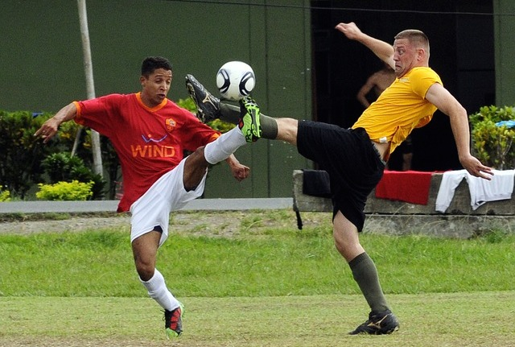

+++
date = 2014-06-27T07:34:23Z
description = ""
slug = "gamify"
tags = ["productology"]
title = "Геймифицируй это!"
+++

Сегодня — про то, как проектировать геймифицированные системы. Хайп по этой теме спал, так что можно поговорить серьезно.

По всем канонам, я должен был бы для начала расписать теоретические основы игрофикации. Разумеется, я этого делать не буду. Ненавижу, когда базовые определения, история развития, области применения, описание преимуществ, и прочая лабудень отжирает место у практики. Поэтому к делу.

Ну ладно, дам одно определение. *Геймификация* — это <del>ачивки, бейджи и левелапы</del> использование игровых элементов и техник проектирования игр в неигровом контексте.

Как подсказывает ваше богатое воображение, «неигровой конктекст» — это все, начиная от очередной унылой социальной сети и заканчивая развитием полезной привычки бегать по утрам, интенсивно закусывая живым йогуртом.

Умный дядька [Кевин Вербах](https://www.coursera.org/learn/gamification) предложил простую модель игрофикации любой системы из 6 шагов. Я проверил, она удобная и работает. Попробуйте и вы ツ

## 1. Определите бизнес-цели

Ответьте себе на простой вопрос: для чего вам геймификация? Какие положительные результаты она принесет в случае успеха?

Выделите все цели, которых хотите добиться. Обоснуйте их, определив, почему важна каждая (что, не можете ответить? ну тогда выкиньте ее).

Ранжируйте цели по степени важности. Все то, что является промежуточным шагом, а не целью — удалите.

## 2. Опишите целевое поведение

Какого поведения вы ожидаете от игроков? Как это поведение приближает вас к цели (прямо или косвенно)? Как вы будете оценивать — соответствует поведение ожидаемому или нет? Да, тут нужны количественные метрики.

Опишите желаемое поведение как можно конкретнее. Затем сформулируйте критерии достижения ваших целей в терминах поведения игроков.

Наконец, определите аналитические показатели, которые показывают прогресс в достижении целей. Например, объем внутриигровых транзакций в час или ежедневное количество активных игроков от общего их числа.

## 3. Опишите игроков

Кто эти люди, которые будут участвовать? Какое отношение они имеют к вам (клиенты, коллеги, профессиональные сообщества, друзья)?

Теперь классифицируйте их. Например так:

-   Демографический, географический, социальный профиль.
-   Классификация по [Бартлу](https://habr.com/ru/company/vk/blog/263839/).

По итогам классификации сегментируйте игроков и для каждой из групп определите подходящую мотивацию.

Назначьте персону (аватара) для каждой группы. Используйте их при проектировании, чтобы смоделировать реакции игроков.

<figure>
  
  <figcaption>Игроки демонстрируют ожидаемое поведение</figcaption>
</figure>

## 4. Разработайте циклы деятельности

Эти циклы описывают, как именно вы будете мотивировать игроков.

### Цикл вовлечения

Какую обратную связь вы будете использовать? За счет чего она будет мотивировать игроков?

Цикл вовлечения можно описать как последовательность _Мотивация_ → _Действие_ → _Обратная связь_ на уровне отдельного игрока.

Вы пытаетесь мотивировать человека на желаемое для вас поведение. Он выполняет те или иные действия и получает обратную связь, которая усиливает его мотивацию на выполнение новых поступков. И так далее.

### Цикл прогресса

Как будут прогрессировать игроки в вашей системе? Как вы будете поддерживать новых игроков на первоначальных этапах, чтобы не отпугнуть их? Как поддерживать интерес у более опытных, чтобы они не потеряли мотивацию?

## 5. Не забудьте про удовольствие

Скажите, а стали бы люди участвовать в вашей игре, если исключить всю внешнюю мотивацию? Нет? Ну тогда никакая игровая механика вам не поможет.

Вы должны очень четко ответить себе: какие аспекты игры могут мотивировать игроков даже без награды? Что сможет доставить им *подлинную* радость и удовольствие?

## 6. Используйте подходящий инструментарий

Это «техническая» составляющая геймификации. Обратили внимание, что она идет последней? Самая распространенная ошибка — начать с этого шага, и им же ограничиться. Не повторяйте ее, проработайте в деталях все предыдущие уровни!

Здесь вы решаете, какие элементы игры будете использовать (все эти бейджи, соревнования, ресурсы, подарки, уровни, очки, квесты, турнирные таблицы и виртуальные товары). И как эти элементы будут взаимодействовать в динамике для поддержания придуманных вами циклов деятельности.

Ну и здесь же определяются технологии реализации геймифицированной системы (веб, мобильные приложения, интеграция с соцсетями, использование носимых устройств, и тому подобное).

Продолжение:

<a href="/shares-for-rashmi">Геймификация в действии: дольки для Рашми</a>

