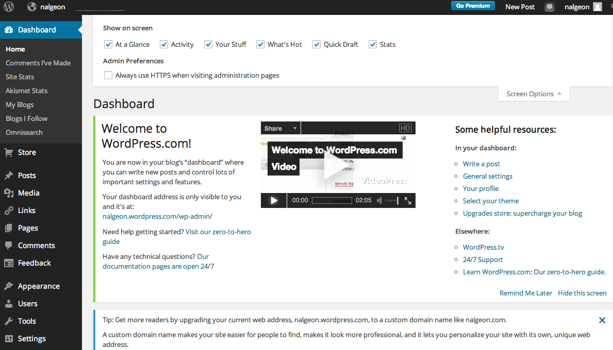

+++
date = 2014-04-08T21:57:41Z
description = ""
slug = "geek-as-a-human-being"
tags = ["interface"]
title = "Гик тоже хочет красиво"
+++

Давайте откровенно.

Мы, гики, как все нормальные люди любим простые и удобные интерфейсы. 

Культ командной строки — это не от хорошей жизни. Мы выбираем легкий путь и стараемся не оперировать визуальными образами, ведь гору невнятного текста проще выдать, чем напрячься на одну понятную картинку. Но это не значит, что мы не радуемся хорошему дизайну.

Так вот. Есть такой блоговый движок — Wordpress, вы, наверно, знаете. Он классный, поддерживает кучу фич, подходит под любой мыслимый сценарий использования. Вордпресс — это выбор сотен тысяч блогеров, и уж конечно, он достаточно хорош и для вас. Правда ведь?

А ничего подобного. Выглядит он вот так, просто и профессионально:

Я очень люблю такие интерфейсы. Когда вижу их, хочется обнять авторов и плакать, ведь у них такая трудная жизнь.

Только пользоваться Вордпрессом не хочется.

Конечно, я не один такой. В 2013 году [Джон О'Нолан](https://www.kickstarter.com/projects/johnonolan/ghost-just-a-blogging-platform) собрал на Кикстартере £200,000 на разработку блог-платформы Ghost, на 785% перевыполнив первоначальную цель инвестиций. А всего-то он обещал:

1. Удобный интерфейс, не перегруженный лишними функциями и идеально подходящий для автора.
2. Навороченный красивый дашборд с толково организованной информацией.

За два скриншота измученные ворпрессом гики заплатили 200 тысяч фунтов:

А все потому, что гик — тоже человек. И создатель Госта человек. А автор вордпресса — кальмар.

P.S. Осенью 2013 года Джон О'Нолан реализовал первый макет и запустил платформу [Ghost](https://ghost.org/). Все остальные фичи, включая дашборд, он радостно слил. Но это уже совсем другая история.

