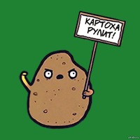

+++
date = 2014-05-15T20:44:26Z
description = ""
slug = "urls-state-potatoes"
tags = ["development"]
title = "Картоха, урлы и состояние"
+++

Если вы разрабатываете веб-приложение, то рано или поздно столкнетесь с проблемой сохранения текущего состояния системы для пользователя.

Например, вы продаете через интернет элитный картофель. Покупатель заходит на сайт и первым делом настраивает условия отбора картофелин: строго из Боливии или ЮАР, урожая 2013 года, размер клубня от 3 до 7 см, желательно в форме морского тюленя. Получает список из 300 позиций (да, в ЮАР очень популярна картоха в форме тюленя), нарезанный на 6 страниц из 50 элементов каждая. Переходит на 3 страницу, открывает карточку картофелины и застывает в немом восхищении на несколько секунд. А потом случайно нажимает на рефреш страницы. Как поступит ваше приложение?

## Весь мир насилья мы разрушим

Если вы не стали заморачиваться с состоянием, то текущий контекст благополучно потеряется, а пользователя перекинет на главную страницу, где он с негодованием уставится на аршинный заголовок **КАРТОХА ТУТ!**

Яркий представитель подобных приложений — гугл-календарь. Как бы вы не перемещались по календарю, какие бы фильтры не накладывали — урл всегда сохраняет свой изначальный вид:

    https://www.google.com/calendar/render

Обновляете страницу — и календарь радостно сбрасывает вас на текущую неделю. Скопировали урл и отправили другу как ссылку на событие? Ну да, ну да.

## Все понимаю, сказать не могу

Некоторые сервисы, которые помнят, что на дворе уже десятые годы XXI века, запоминают состояние на клиенте (в куках или локал-сторадже). Это решает проблему с рефрешем страницы, но поставить закладку у вас все равно не получится.

Плюс такой подход создает классическую проблему с конфликтующими изменениями состояния. Я открыл две вкладки браузера, зашел на ваш картофельный сайт, и в одной вкладке ищу «картофель молодой», а в другой — «ботва разлапистая». Какой из запросов сохраним?

## Что в урле тебе моем?

Еще со времен, когда динамическая природа веб-сайтов ограничивалась тегом BLINK, хорошим тоном считается хранить состояние в урле. Такой урл хоть в почту, хоть в закладки — восстановить контекст по нему не проблема.

Хороший пример — гугл-поиск. Посмотрите, как скурпулезно он сохранил все параметры расширенного поиска, которые я задал:

    https://www.google.com/search?
    q=allintext: +google+sucks&lr=lang_en&
    cr=countryUS&hl=en&tbs=qdr: y,lr: lang_1en,
    ctr: countryUS&ei=NsAIS_WATCin5youDAYANdnigh1&
    start=10&sa=N&biw=1090&bih=963&cad=cbv&
    sei=WtF_isThisS4iT

Кстти, обртите внмние, как пргрмсты в гугле озбочн крткстью: все эти «tbs», «qdr», «sa», «biw». Збс, првд? Буквы в интернете надо экономить, а то вон IP-адреса уже закончились.

Хранение состояния в урле делает каждую вкладку браузера полностью автономной — нет общих данных в куках или локальном хранилище. Это упрощает жизнь разработчику, а пользователю не срывает башню от загадочных глюков системы.

## Месье знает толк в извращениях

Иногда хранить контекст в урле — это слишком просто. Я встречал следующие вариации:

-   Список хранит свое состояние, но как только переходим к элементу списка — он открывается в отдельной вкладке (так не надо заморачиваться с возвратом к списку). Это гугл-документы.
-   Урл содержит все нужное состояние, но при попытке открыть его в другом браузере приложение падает с необработанным исключением (привет, Джира).
-   Все состояние в урле кодировано в Base64, чтобы враг не догадался.

## Итого

1. Умейте сохранять и восстанавливать контекст прозрачно для пользователя.
2. Храните состояние в урле и не морочьте мне голову.
3. КАРТОХА РУЛИТ.

