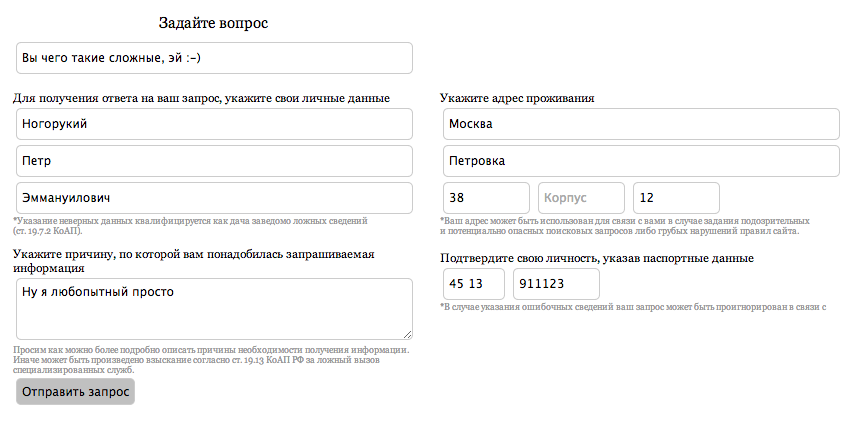

+++
date = 2014-04-18T16:35:31Z
description = ""
featured = true
slug = "your-anonymous-friend"
tags = ["productology"]
title = "Ваш лучший друг, анонимус"
+++

Вы только что запустили свой стартап. Он классный, всем нужен, решает самые насущные проблемы потенциальной аудитории (ну, вы так думаете), выглядит сногсшибательно и супер-удобен в использовании.

Проходит день, неделя, месяц, три… Да, посещаемость неплохая. Да, пользовательская база растет. Но хочется большего. Как понять, чего не хватает вашим пользователям? Какие их потребности сервис не охватывает? Что делать неудобно? А что наоборот, сделано здорово, и менять ни в коем случае не стоит?

Лучшее, что вы можете сделать прямо сейчас — это разрешить анонимную обратную связь (вопросы, идеи, багрепорты) от пользователей.

[подробности на Хабре](http://habrahabr.ru/post/219523/)

## Возражения

Два основых возражения от противников анонимного фидбека:

1. Сразу нападут боты-спамеры.
2. А как же связаться с пользователем, если он анонимный?!

Ну и ответы тоже понятны:

1. Проблемы ботов у маленьких проектов просто не существует.
2. Если пользователь захочет, чтобы вы с ним связались — уж он оставит свои контакты, не сомневайтесь.

А вообще жду, когда сервисы обратной связи додумаются, что отделение спама от нормальных сообщений — это их забота, а не клиента. Почтовики к этому пришли, придут и они.

