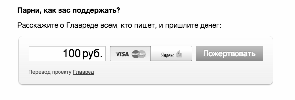
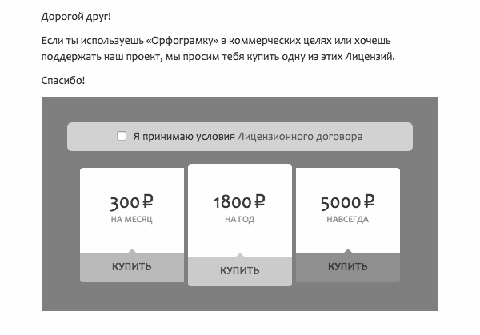
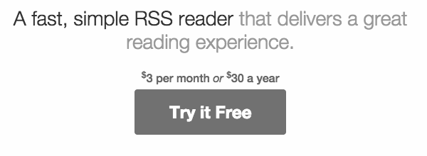

+++
date = 2015-04-28T08:37:20Z
description = "Есть секретный способ сделать отличный софт и при этом выглядеть нищебродом. Это донат. И вот почему."
image = "/donate/cover.jpg"
slug = "donate"
tags = ["productology"]
title = "Донат — зло"
+++

Есть секретный способ сделать отличный софт и при этом выглядеть нищебродом. Сейчас расскажу.

Используйте донат. Просите пожертвовать небольшую денюжку. Клянчите скромные суммы у пользователей. Разместите кнопку для пожертвований на сайте. Добавьте жалобную ссылку в письмо. Разместите личное обращение основателя. ~~Снимите шляпу и сделайте жалобные глаза.~~

Пойти этим путем легко. Некоторые люди сами предложат: «Вы такие клевые! Как бы вам помочь материально?» Но донат — это слезы:

-   часть людей просьба пожертвовать раздражает;
-   некоторые обещают себе заплатить позже, а потом забудут;
-   остальные снисходительно проигнорируют.

Ах да, еще 0,004% бросят-таки монетку:

<figure>
  
  <figcaption>800 тысяч загрузок, $8 чаевых</figcaption>
</figure>

Если программа создает ценность для пользователей — так сделайте ее платной! Или оставьте бесплатной, если это осознанное решение: вы хотите приносить пользу безвозмездно. Но не надо выпрашивать деньги «на поддержку проекта».

Плохо:

<figure class="image">
    
    <figcaption>Главред просит прислать денег</figcaption>
</figure>

Лучше:

<figure class="image">
    
    <figcaption>Орфограмка стеснительно предлагает платный тариф</figcaption>
</figure>

Хорошо:

<figure class="image">
    
    <figcaption>Фидбин обещает удовольствие от чтения за 30 баксов в год</figcaption>
</figure>

Платный сервис помогает потребителю осознать его ценность. Бесплатный греет душу халявой. Донат — ставит в положение прохожего, который подает милостыню убогому попрошайке. Не используйте донат.

P. S. Донат встречается еще в играх и в жизни (благотворительность). Но это другая история.

<em>Заметка из телеграм-канала <i class="far fa-star color-sin"></i> «<a href="https://t.me/dangry"><strong>Интерфейсы без шелухи</strong></a>»</em>

