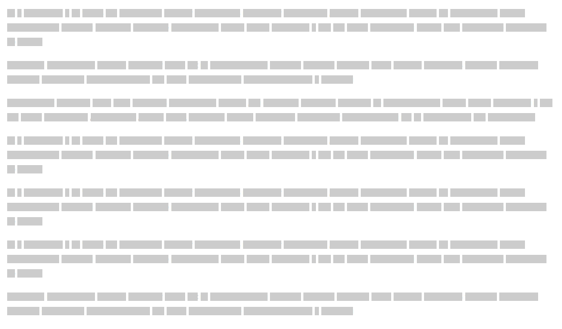
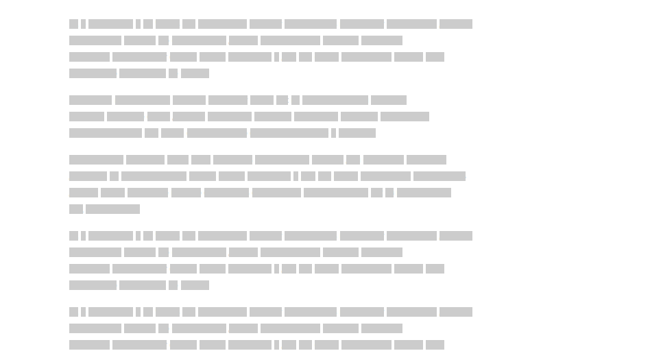
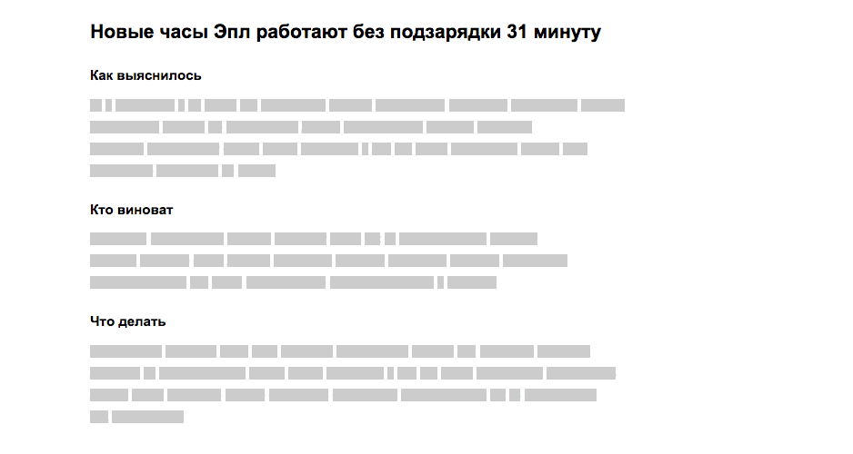
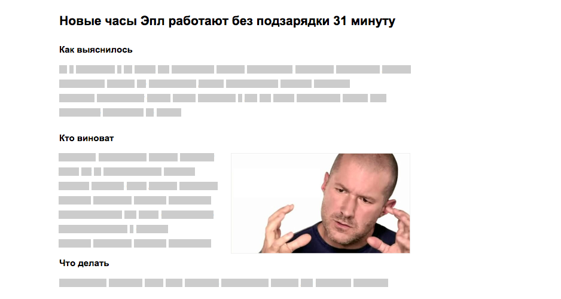
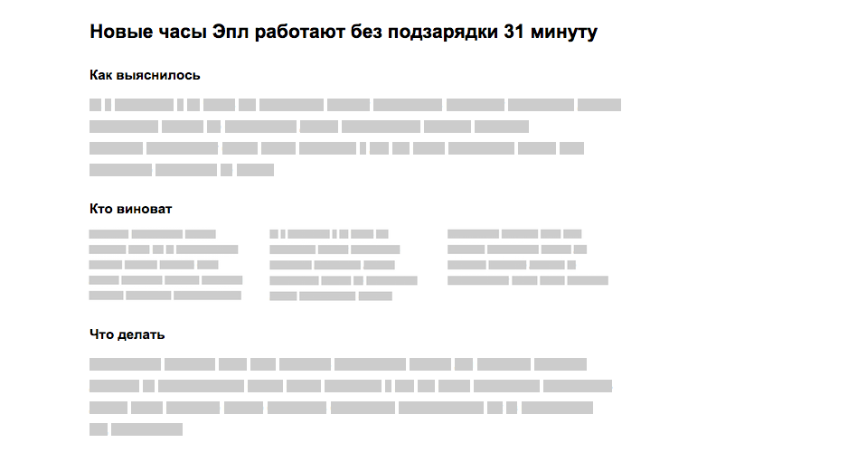
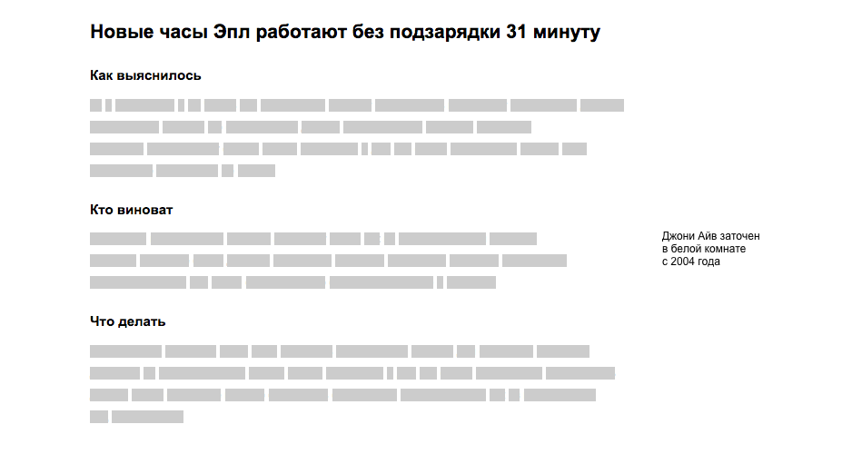
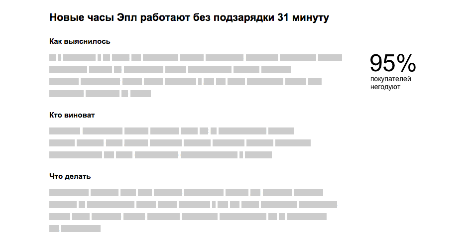
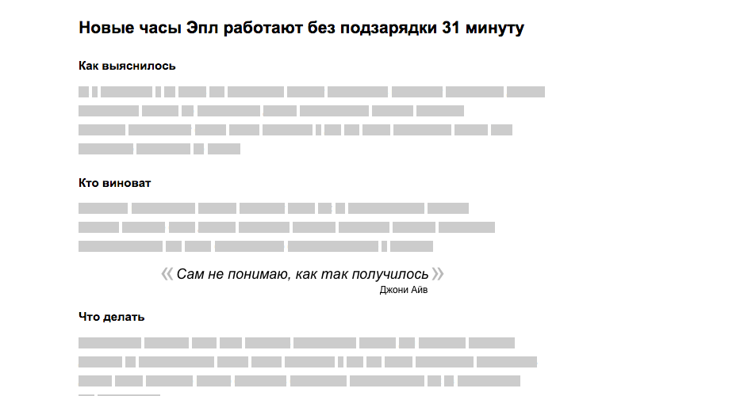
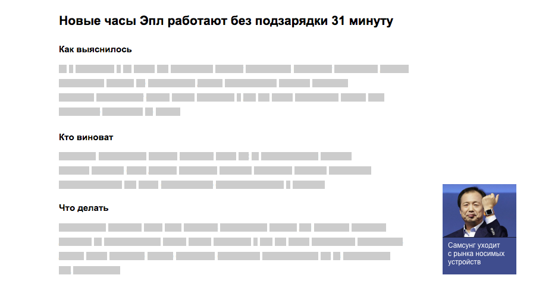

+++
date = 2015-04-01T11:43:53Z
description = "Чтобы читатель не зевал"
image = "/longread/cover.png"
slug = "longread"
tags = ["writing"]
title = "Как не написать простыню"
subscribe = "dangry"
+++

_По лекции Максима Ильяхова_

Если вы пишете статьи или тексты для сайтов, то наверняка сталкивались с эффектом «простыни» — равномерно залитой текстом страницы:

Простыня — это плохо. Стена текста угнетает, человеку неохота приниматься за чтение.

Задача редактора — визуально упростить текст и помочь читателю понять, чем он интересен. Прежде всего, редактор подключает _воздух_ (поля вокруг текста).

Статья выглядит намного легче, но о чем она? Составить быстрое представление о сути текста помогут _заголовки_:

В простейшем случае этим можно и ограничиться. Но иногда редактор хочет «оживить» статью и привлечь внимание читателя к отдельным фрагментам. Для этого хорошо использовать:

### Иллюстрации и подписи к ним

### Набор в несколько колонок

### Заметки на полях

### Фактоиды

Фактоиды — краткие количественные утверждения по теме абзаца.

### Цитаты героев текста и экспертов

### Отсылки к другим статьям

Чтобы «проложить мостик» к другому материалу по теме, редактор ставит его анонс на плашке рядом с основным текстом:

Аналогичным форматом можно пускать примечания, не связанные напрямую с текстом.

⌘ ⌘ ⌘

Внутри- и затекстовые элементы оформления хороши до тех пор, пока их не станет слишком много. Используйте не больше 4–5 приемов, иначе статья превращается в набор разобщенных блоков, которые борятся за внимание читателя.
