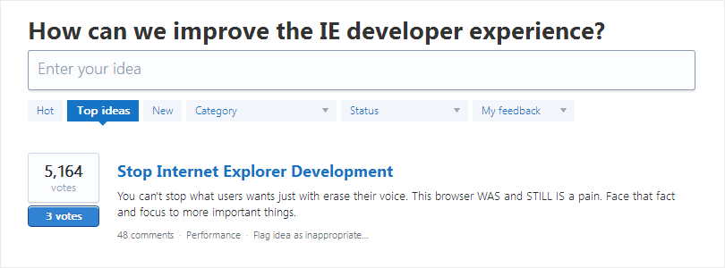

+++
date = 2015-07-03T05:55:03Z
description = "Слушайте пользователей, но остерегайтесь ловушек: крикунов и поднятия рук."
featured = true
image = "/users-not-backlog/cover.png"
slug = "users-not-backlog"
tags = ["productology"]
title = "Бэклогом управляют пользователи"
+++

Давным-давно, когда я только начал рулить проектами, попалась на глаза книга [Getting Real](https://basecamp.com/gettingreal). Книга о продуктовой разработке, а я занимался заказной, поэтому большая часть информации прошла мимо. Но одна вещь запомнилась.

> Что делать с этими запросами \[на новые фичи\]? Где хранить? Как управлять? Не надо ничего делать. Просто прочитайте и отбросьте их.

Все во мне протестовало против этого. Как это — отбрасывать? А записать в бэклог? А приоритизировать? А планировать и перепланировать каждый месяц?

Вот что ответили на это авторы:

> Пусть клиенты будут вашей памятью. Если это действительно стоящая функция, они будут напоминать, пока вы ее не сделаете.

Прошли годы. Я перешел в HFlabs и поработал над парой крупных продуктов: «[Единым клиентом](https://hflabs.ru/uniform-client/)» и «[Дадатой](https://dadata.ru/)». И на себе убедился, что авторы книги были правы: если пользователям действительно чего-то не хватает, они говорят об этом постоянно.

Но тут есть две ловушки.

## Первая ловушка: не тот человек

Пришел ИТ-архитектор и говорит: «Давайте встроим в CRM чат. Как удобно будет начальнику отдела продаж командовать в чате продавцами!» И так понравилась архитектору мысль, что приходит каждую неделю и рассказывает про этот чат. Стоит добавить фичу?

Я не знаю. Но если прогуляться до отдела продаж, то можно выяснить, что продавцы сидят в одной комнате вместе с начальником. И орут друг другу погромче, если что-то прям совсем срочное. А если не совсем, так у них есть скайп.

Штука в том, что ИТ-архитектор вне контекста, в котором будет использоваться фича. Поэтому его голос тут не решает.

## Вторая ловушка: голосование поднятием рук

В Дадате есть [форум](https://dadata.userecho.com/), куда люди пишут идеи новых фич. А другие за них голосуют. Чем больше за фичу голосов, тем она полезнее. А значит, хорошо бы поскорей реализовать. Да?

Не всегда. Иногда работает так:

- Зашел Валера на Дадату, ввел свой адрес и заметил, что сервис дом и квартиру-то нашел, а вот этаж не определил. Хорошо бы угадывать этаж! Завел идею на форум.

- Через неделю Валера снова зашел на форум. Что-то никто не голосует за идею. Написал коллегам: «помогите, проголосуйте «за». Пятеро соседей по кабинету зашли на форум и жмакнули «+1».

- Зашла на форум Маша. Видит среди идей «определять этаж». Хорошая фича? Ну вроде неплохая. И голосов много за нее. Вот и Маша проголосовала.

- Такими темпами через месяц фича в топе.

Видите, в чем подвох?

Голосование лайком ничего не говорит о пользе фичи для человека. Нужно определение этажа коллеге Валеры? Нет, просто друг попросил проголосовать «за». А Маше? Не особо, но почему не поставить плюсик.

Вот когда у человека есть жизненный сценарий, в котором фича принесет ощутимую пользу конкретно ему — тогда его голос имеет вес.

⌘ ⌘ ⌘

Чтобы не попасть в ловушку пользовательского управления разработкой, достаточно понять:

1. Пользователя. Кто он? Для чего использует продукт? Говорит за себя или за того парня?
2. Сценарий. Как человек использует продукт? Какую проблему не получается решить? Почему?

Хороший способ понять человека и сценарий использования — наблюдать и задавать вопросы. Хлопотно, не всегда результативно, плохо масштабируется. Но точно лучше, чем мерить только по головам или слушать самых громких.

Ещё почитать: глава [Forget Feature Requests](https://basecamp.com/gettingreal/05.7-forget-feature-requests) из книги Getting Real.

<em>Заметка из телеграм-канала <i class="far fa-star color-sin"></i> «<a href="tg://resolve?domain=dangry">Интерфейсы без шелухи</a>»</em>

