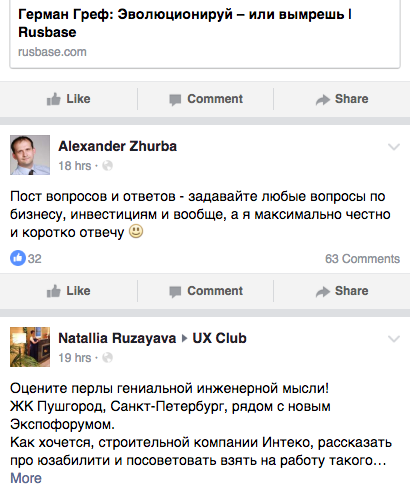
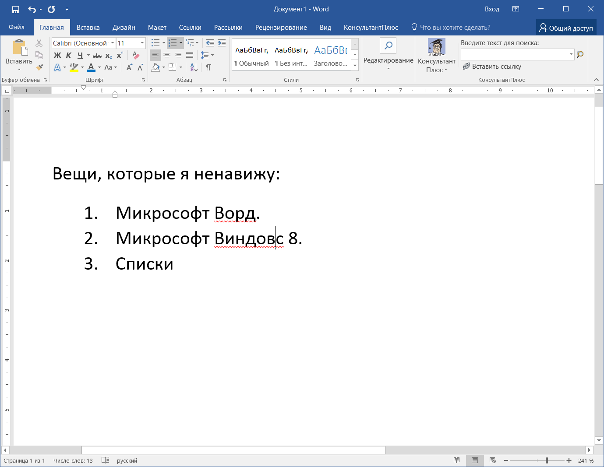
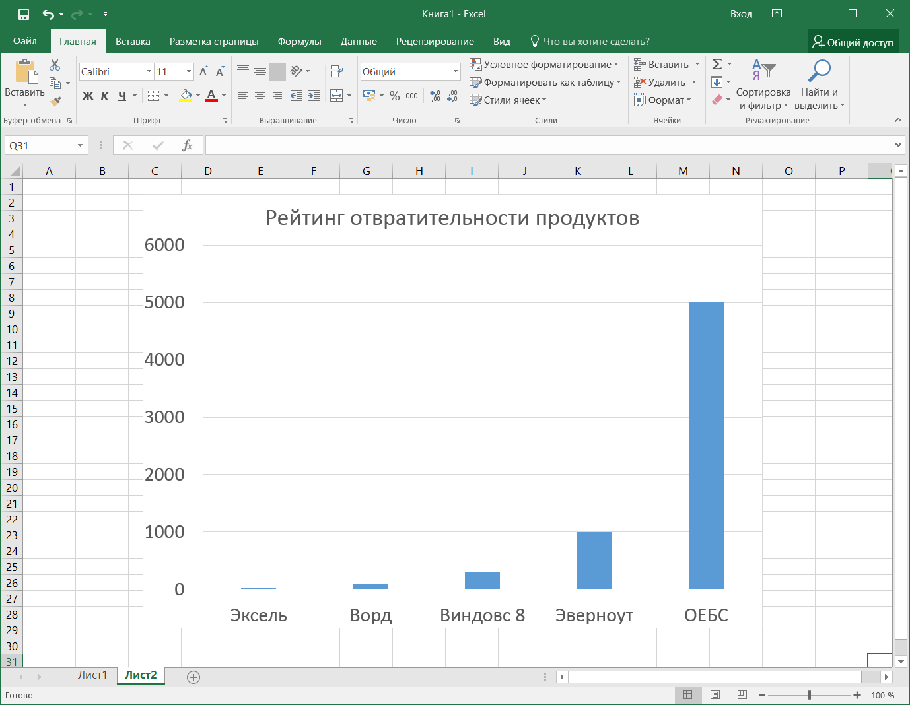
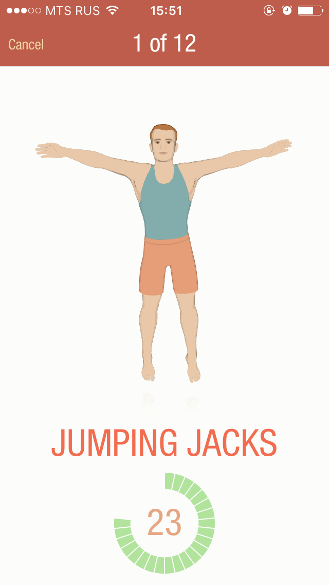
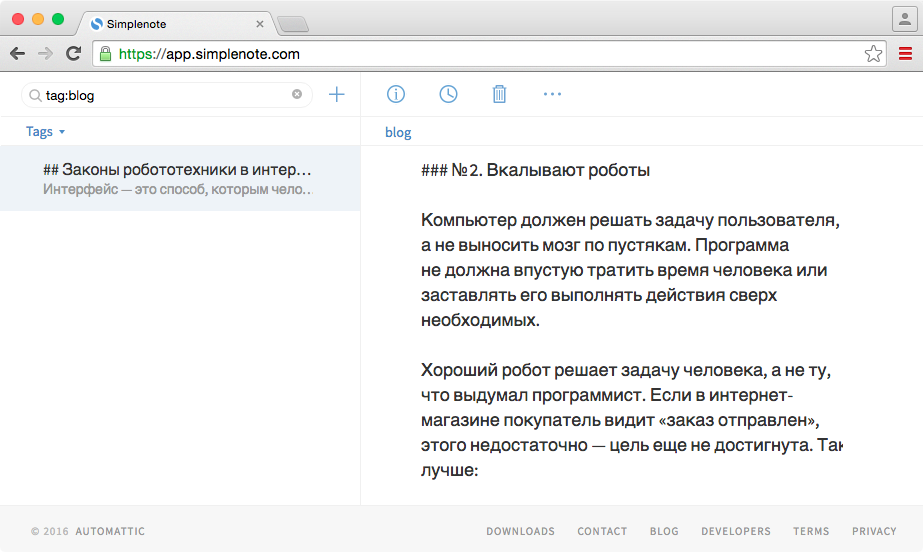
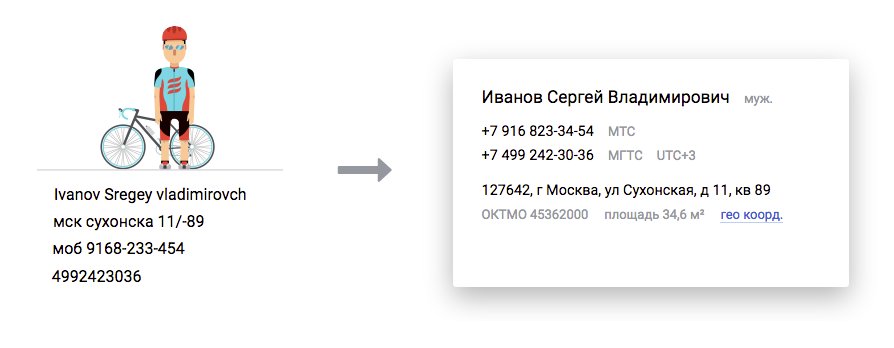

+++
date = 2016-05-23T09:38:09Z
description = "Вторая часть «обезжиренного» конспекта книги Алана Купера «Психбольница в руках пациентов». Я убрал очевидное и воду, оставил пользу и примеры."
image = "/asylum-2/cover.png"
slug = "asylum-2"
tags = ["interface", "book"]
title = "«Психбольница» Купера 20 лет спустя: цели и сценарии"
subscribe = "dangry"
+++

*Это вторая часть «обезжиренного» конспекта книги Алана Купера «Психбольница в руках пациентов». Я убрал очевидное и воду, оставил пользу и примеры, добавил домашнее задание.*

<h3>Краткое содержание <a href="/asylum/">первой части</a></h3>

Чтобы продукт получился по-настоящему классным, он должен быть человечным. «Модный» интерфейс ≠ человечный интерфейс. Необходимое условие привлекательного продукта — проектирование под реальных пользователей. Инструмент проектирования — персонажи.

У персонажа есть имя, биография, привычки, цели и навыки. Имя и биография — вымышленные, всё остальное — настоящее, от реальных пользователей.

Чтобы сделать интерфейс под персонажа, голого описания недостаточно. Понадобятся ещё цели (ради чего человек использует продукт) и сценарии (как он добивается целей с помощью продукта).

## Персонажи и цели

Сложно оценить, насколько хорош интерфейс, если не понять, ради чего люди будут его использовать. Лента фейсбука показывает не все посты в хронологическом порядке, а только избранные по хитрому алгоритму. Это хорошо или плохо?

Ответ зависит от целей пользователя:

— Зачем ему лента? 
— Чтобы прочитать что-нибудь интересное и быть в курсе, что там у знакомых новенького.

Тогда хронология не нужна, она не приближает к цели. Что нужно, так это влезть человеку в голову, понять, что прямо сейчас привлечет его внимание, и показать в ленте. Ровно это и пытается сделать фейсбук — значит, решение хорошее.

  <figure>
    
    <figcaption>Где мои котики, фейсбук?</figcaption>
  </figure>

Купер разделяет цели на личные и практические.

*Личные* цели всегда одни и те же, с каким бы интерфейсом человек ни работал:

- не чувствовать себя глупо;
- не ошибаться;
- не наработать лишнего;
- развлечься или хотя бы не страдать от скуки.

Если программа препятствует личным целям, она никогда не будет привлекать и радовать человека. Её потолок — унылая посредственность.

    <figure class="image">
        
        <figcaption>Ворд умеет все, что требуется. Но постоянно заставляет чувствовать себя идиотом. Не верите — поработайте со списками. </figcaption>
    </figure>

<figure class="image">
        
        <figcaption>На удивление, Эксель намного приятней. Простые диаграммы, быстрые фильтры, адекватно угадывает формулы.</figcaption>
    </figure>

*Практические* цели говорят о пользе для человека или компании, на которую он работает:

- больше продавать тем, кто раньше уже купил;
- спланировать проект так, чтобы не напортачить потом со сроками;
- сбросить лишний вес.

Практические цели — это мостик от персонажей к функциям программы. Определили персонажа и его цели → описали сценарии, которые к этим целям приводят → нарисовали под них интерфейс.

## Сценарии

Сценарии описывают, как человек использует продукт, чтобы добиться целей.

*Повседневные* сценарии пользователь проходит каждый день. Помните Мишу из первой части, который решил сбросить вес за 7 минут в день? Так вот:

<blockquote style="border: none; padding: 1em 2em; margin-left: 0; margin-bottom: 1em;">

Теперь каждое утро после подъема Миша, зевая, делает несколько махов руками и наклонов, для разминки. Затем открывает на айфоне приложение и одним тыком запускает тренировку. 
 
12 упражнений по 30 секунд на каждое. Отдых между упражнениями — 10 секунд. Чтобы Миша не запутался, приложение ему помогает: на экране анимированный человечек показывает технику упражнения, а из динамика тренер отсчитывает время и свистит в свисток. 
 
Первые дни Миша поглядывает на экран, а потом ориентируется уже только на слух. К концу тренировки сердце ощущается где-то в районе ушей, так что Миша доволен: методика действует. Через месяц делает ремень туже на одну дырку и рекомендует воркаут друзьям и знакомым.

</blockquote>

Повседневных сценариев у персонажа обычно один или два. Проектировщик уделяет им больше всего внимания и оптимизирует интерфейс, чтобы сценарии проходили с минимальным количеством телодвижений.

Повседневные сценарии часто поддерживают «короткие пути»: клавиатурные шорткаты, хитрые жесты на телефонах, шаблоны действий, значения по умолчанию из «вчера».

<blockquote class="big">Фокус — на повседневных сценариях</blockquote>

Кроме повседневных сценариев, Купер еще выделяет обязательные и экзотические.

*Обязательные* сценарии выполняют редко, но неукоснительно: сдать квартальный отчет, настроить переадресацию почты на время отпуска, продлить банковский депозит еще на год. Поскольку сценарии редкие, дизайнер не оптимизирует их по количеству действий и не «вылизывает» мельчайшие детали. Но закладывает больше подсказок и следит, чтобы человек понимал последствия каждого действия — ведь в прошлый раз он проходил сценарий давно и уже забыл, что к чему.

*Экзотические* сценарии выполняют единицы процентов пользователей: купить книгу за биткоины, восстановить сайт из резервной копии месячной давности, временно разблокировать банковскую карту, чтобы в чужой стране не остаться совсем без денег. Интерфейс такие сценарии поддерживает, и ладно — сильно заботиться об удобстве не обязательно. Совсем экзотику можно вовсе не выносить в интерфейс, а отдать на откуп техподдержке: пользователю проще решить вопрос с живым человеком, а разработчикам не придется тащить лишнюю функциональность.

## Человечность

Проектирование через персонажей, цели и сценарии — необходимое, но не достаточное условие привлекательного продукта. Чтобы радовать людей, интерфейсу придется стать *человечным*.

Люди склонны наделять программы человеческими качествами. Глючный и тормозной интернет-магазин покупатель воспринимает как вонючего и тупого продавца в магазине офлайновом. Напротив, человек ответит добром, если чувствует: программа делает все, чтобы ему было хорошо. Пользователь простит баги и недочеты, даст обратную связь, рекомендует друзьям.

<figure>
    
    <figcaption>Пару лет назад <a href="https://simplenote.com/">Симплноут</a> сошел с ума и начал иногда терять данные при синхронизации. Я простил его и ждал, пока починят — только потому, что до этого продукт успел меня очаровать.</figcaption>
</figure>

Чтобы стать привлекательным, интерфейс, как деловой партнер, должен быть толковым, надежным и приятным в общении. Вот что конкретно это значит:

### Запоминать привычки человека

Если сегодня я настроил онлайн-радио на джазовую волну, то завтра возобновить вещание с нее же. А когда делаю второй заказ в магазине — подставить адрес доставки и способ оплаты от предыдущего заказа.

### Учитывать контекст и сообщать об отклонениях

Если я покупаю электронные весы, предложить добавить в заказ подходящие батарейки. Если обычно заказываю бытовую химию по мелочи, а тут вдруг положил в корзину 50 литров клея для плитки, аккуратно поинтересоваться — нет ли ошибки? Если из-за проблем в банке платежи идут два дня вместо обычных пяти минут — сообщить мне заранее, до оплаты, чтобы я мог передумать и оплатить яндекс-деньгами.

### Решать проблемы самостоятельно

Если платеж не прошел из-за технической ошибки, поставить в очередь и сообщить мне (а не отвалиться «извините, что-то пошло не так»). Если телефон указан как 916.345.85.59 или в середине емейла затесался пробел, привести к «каноническому» виду самостоятельно.

<figure>
    
    <figcaption><a href="https://dadata.ru/">Дадата</a> автоматически приводит в нормальный вид ФИО, телефоны и адреса; исправляет ошибки и восстанавливает недостающее.</figcaption>
</figure>

### Поддерживать черновики и промежуточные состояния процесса

Если я на ¾ заполнил анкету на банковскую карту, а потом заметил, что забыл паспорт — сохранить как черновик, не передавать пока клеркам. Но дать мне возможность завтра продолжить с места, где сейчас остановился.

### Быть незаметным

Вот приложение, чтобы разблокировать автомобиль. Зима, минус десять и метель. Вы подходите к машине. Стягиваете с руки перчатку и выуживаете из кармана телефон. Жмете на кнопку, чтобы загорелся экран. Разблокируете телефон по отпечатку пальца. Жмете на кнопку «домой». Тычете в иконку приложения. Ждете, пока загрузится. Наконец, жмете на «разблокировать двери». Удо-о-обно.

А теперь так: вы подходите к автомобилю, он распознает вас по датчику в брелке и сам разблокирует двери. Интерфейса нет, но функция его выполняется.

Из этой же серии — автоматическое определение города покупателя в интернет-магазине, умная поисковая строка вместо кучки фильтров, иконка календаря c сегодняшним числом. Чем меньше интерфейса, тем лучше.

## Ω Резюме и практика

Цели персонажа объясняют, *ради чего* использовать ваш продукт. Сценарии рассказывают, *как* человек это делает.

Хороший проектировщик до мелочей прорабатывает повседневные сценарии, потому что именно они формируют впечатление от продукта.

Чтобы интерфейс из «ну, неплохо» перешел в «ух ты, класс!», ему придется стать человечным:

- запоминать привычки человека,
- самостоятельно решать проблемы,
- быть незаметным.

### Домашнее задание

Возьмите ключевого персонажа из предыдущего домашнего задания. Выпишите его цели и один повседневный сценарий. За счет чего сценарий приближает персонажа к цели? Каких человечных черт не хватает интерфейсу на каждом шаге?
