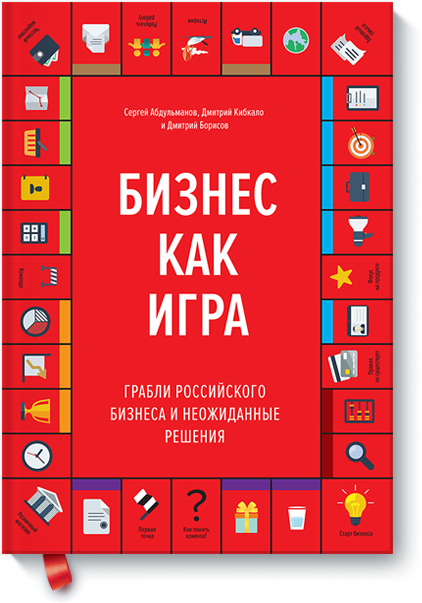
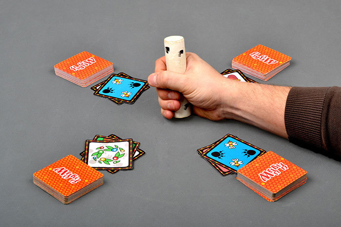
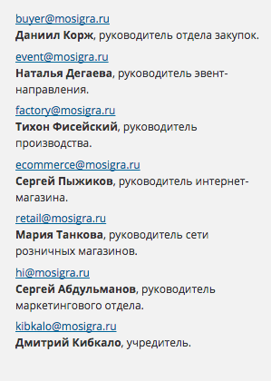

+++
date = 2016-06-14T09:54:23Z
description = "100 эвристик «хорошо-плохо» по управлению, продажам, работе с магазинами и маркетингу. От создателей «Мосигры» Сергея Абдульманова и Дмитрия Кибкало."
image = "/biznes-kak-igra/cover.jpg"
slug = "biznes-kak-igra"
tags = ["book"]
title = "Бизнес как игра"
+++

Руководители «Мосигры» — Сергей Абдульманов и Дмитрий Кибкало — написали книгу о своем опыте развития сети магазинов настольных игр. Мосигра славится человечным отношением к клиентом, а Абдульманов — легким слогом, так что книга получилась интересной.

    

Формат такой: 100 эвристик «хорошо-плохо» по управлению, продажам, работе с магазинами и маркетингу. С примерами. Примеров, впрочем, не хватает, из-за чего некоторые советы выглядят как «лучше быть здоровым и богатым, чем бедным и больным». В остальном книга хорошая. Читается вообще влет — вот бы все нон-фикшн авторы умели писать как Абдульманов.

Раздел об управлении показался мне очевидным. Про магазины полезно, но только если планируете их открывать. А вот последняя часть — о маркетинге — заинтересовала больше всего.

Выписал несколько заметок.

### Уберите возможность для ошибки и злоупотребления

Универсальное правило, одинаково подходит для интерфейсов, сотрудников и контрагентов:

- не кричать на пользователя ошибками после отправки заказа, а деактивировать кнопку «отправить», если что-то не так;
- уволился сотрудник — заблокировать учетные записи;
- заметили лазейку в договоре — исправить, а не надеяться, что партнер ей не воспользуется.

<h3>Цепляйтесь к локомотиву</h3>

Конкурентное преимущество для среднего бизнеса — люди-локомотивы в команде. Локомотив не ждет команды сверху, он сам толкает процессы в компании и создает правильную движуху.

  <figure>
    
    <figcaption>Cергей Абдульманов — локомотив «Мосигры»</figcaption>
  </figure>

### Считайте свою выгоду, а не чужую

Компания провела совместную рекламную компанию с партнером. Затраты пополам — по 500К, продажи компании — 1М, продажи партнера — 3М. Несправедливо!

К черту справедливость, её не существует. Компания заработала 100% от вложенного, вот это важно.

Та же ошибка встречается в быту: завидовать соседу проще и приятнее, чем оценивать собственные успехи.

### Удивляйте в мелочах

Базовый уровень — уважать покупателя и приносить пользу. Продвинутый — превзойти ожидания. Так люди становятся постоянными клиентами и адвокатами бренда.

> Ситуация: человек спрашивает игру, ее нет в магазине, но есть у конкурента. Продавец рассказал об этом и нарисовал, как пройти. Клиент запомнил такое обращение и в следующий раз за настольной игрой пришел в Мосигру.

Впечатление о компании у клиента складывается из мелочей. Когда нет явных «косяков» — это ОК, не более того. Когда вдобавок много приятных мелочей, рождается подсознательное ощущение, что все правильно и хорошо.

<figure>

<figcaption>Прежде чем выпускать игру в продажу, сотрудники сами играют в нее и пишут понятную инструкцию с фотографиями.</figcaption>
</figure>

Не жадничайте в мелочах. На конкурентом рынке преимущество складывается из «избыточных» частей, которые хочется снести ради оптимизации затрат. Не делайте этого.

> Мосигра тратит миллион рублей в год на бесплатные пакеты. Они большие, прочные, красивые и служат годами.

### Поставьте круглые цены и заметные скидки

Цены на «999» — неуважение к клиенту, и для многих показатель развода. 990 — лучше, а еще лучше — 950.

Точно так же раздражают «скидки» на 10-20 рублей. Поэтому Мосигра сделала робота, который зачеркивает старую цену и ставит новую, только если разница больше 50 рублей.

У скидки хорошо писать разницу между старой и новой ценой, чтобы человек не напрягал зря мозг:

> 950₽ было
> 870₽ стало
> экономия 80₽

### Признавайте ошибки

В бизнесе «лажают» все. А крупные компании постоянно находятся на грани публичного скандала: слишком много движущихся частей, много внимания в прессе и соцсетях. Разница в том, как компании реагируют на провалы.

Авторы советуют в кризис быть максимально открытыми. Расскажите первыми о проблеме и плане решения — тем самым погасите волну негатива на всходе.

Если вы что-то капитально сломали — напишите в твиттер (фейсбук, вконтакт — ваш основной канал). Пусть клиенты знают, что происходит и чего ожидать.

### Поговорите с клиентом после покупки

Иногда у человека наступает «постпродажный шок» — купил под влиянием порыва и теперь думает, зачем он это сделал. Лучший способ предотвратить — дать больше фактов до продажи: описание, фотографии, отзывы, гарантия возврата, «пощупать» перед покупкой.

А Мосигра еще иногда делает <em>постпродажный звонок</em>: сотрудник узнает, играл ли уже покупатель и понравилась ли игра. Если чувствует, что человек недоволен, рассказывает, где и как вернуть игру. Помогает разобраться в правилах, если что-то непонятно. И не пытается ничего продать! Это приятно удивляет клиентов, а компании дает обратную связь.

    <figure>
    
    <figcaption>На сайте «Мосигры» выложены емейлы всех топ-менеджеров. Сравните с другими магазинами, которые форму обратной связи за капчей прячут.</figcaption>
</figure>

### Цельтесь в потребность, а не демографию

Целевая аудитория продукта определяется не социально-демографическими показателям (мужчина 25–45 лет из Москвы), а потребностью (хочу, чтобы ребенок вырос инженером, как в игровой форме привить «технический» подход?).

Хорошее описание продукта показывает, как человек решит свою «боль» с помощью продукта.

⌘&nbsp;⌘&nbsp;⌘

Ссылки по теме:

- [Книга на сайте издательства](http://www.mann-ivanov-ferber.ru/books/biznes-kak-igra/)
- [Твиттер Сергея Абдульманова](https://twitter.com/milfgard)
- [Сайт «Мосигры»](http://www.mosigra.ru/)

