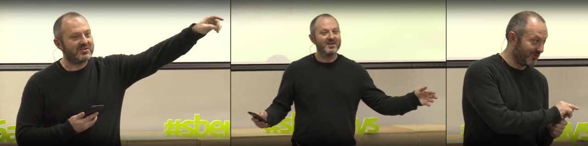
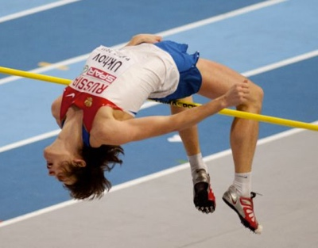

+++
date = 2016-12-27T13:28:57Z
description = "Конспект лекции Людвига Быстроновского об интересе и контринтуитивном решении задач."
featured = true
image = "/interest/cover.jpg"
slug = "interest"
tags = ["life"]
title = "Сделайте себе интересно"
+++

<em>Это конспект <a href="https://www.youtube.com/watch?v=CsFJzkNG5EY">лекции Людвига Быстроновского об интересе</a> и контринтуитивном решении задач. Людвиг рассказывает, когда возникает интерес, какие приемы помогают не потерять его, чем вреден «поток» и как разрыв шаблона приводит к успеху.</em>

## Не старайтесь и не ищите интерес на стороне

> Плохой тамада очень старается сделать интересно, но получается ровно наоборот: он только всех раздражает.

Не надо стараться «сделать себе интересно». Напряг в этом деле вызывает только скуку.

Не надо думать, что «интересно где-то там».

> Мозгу кажется, что интересно там, «где нас нет». Надоела работа? На другой наверняка будет лучше. Ведешь унылое существование? А вот когда был ребенком — как здорово было! (а дети, в свою очередь, считают, что самое интересное происходит во «взрослом» мире)

Это ошибка. Самое интересное — здесь, только надо его увидеть. Да и не всегда получится «сбежать», резко изменив жизнь — может держать ипотека, трое детей  <del>или подписанный кровью контракт</del>.

## Возьмите сложную задачу

Чтобы стало интересно, нужна сложная задача. Сложнее, чем вы привыкли решать.

Сравните две ситуации:

<ol>
<li>Вы отправляетесь в кругосветное путешествие на год, чтобы развлечься.</li>
<li>Вы, как в фильме «<a href="https://www.kinopoisk.ru/film/6034/">Невероятная жизнь Уолтера Митти</a>», ищете по всему миру уникальную фотографию, понятия не имея, как это сделать.</li>
</ol>

Какое приключение окажется интереснее?

<figure></figure>

Если вы понимаете, как решать задачу — становится неинтересно. Поэтому нужно что-то незнакомое:

> — Боже мой, как же я туда пойду? Я же ничего там не знаю!
> — Отлично! Значит, тебе туда и дорога!

## Оставляйте шансы на победу

При этом сложность не должна быть запредельной. Если вы понимаете, что шансов решить задачу нет, интерес пропадает. Если задача на грани возможного, но шансы есть — рождается кураж.

> Если 300 спартанцев должны остановить многотысячную армию персов в открытом поле — шансов ноль. Остается только уныло умереть.
> Но в узком ущелье у них появилась возможность. И хотя решить задачу почти нереально, на кураже им это удалось.

## Постоянно снижайте напряг

> Задача тяжелая и не «идет». Значит, что? Еще поднажать! Работать по десять часов. Нет, по двенадцать! Без выходных! Думать только о задаче. Всё равно не получается? Думать больше, интенсивнее, яростнее!

Так не работает. А работает ровно наоборот: решение сложной проблемы приходит, когда вы отдыхаете.

Снижайте напряг:

<ol>
<li>Не откладывайте задачу на последние дни перед дедлайном. Работайте над проблемой по 20 минут, но каждый день.</li>
<li>Сознательно закладывайте в план перерывы и нормальный сон.</li>
<li>Работайте с заказчиком без крупных сюрпризов. Вместо дедлайна на месяц или три — каждую неделю показывайте, что сделали.</li>
</ol>

<figure><figcaption>Самому Людвигу снижать напряг помогают <a href="https://www.headspace.com/">медитация</a>, спорт и путешествия.</figcaption></figure>

Еще помогает не наказывать за ошибки. Где наказание, там возникает страх, а страх убивает интерес. Если же вместо наказания из ошибок делают выводы (как не повторить ту же ошибку или улучшить процесс) — это снижает напряг.

## Будьте осторожны с «потоком»

В состоянии «потока» человек готов часами работать над задачей, не замечая ничего вокруг. Вроде бы это хорошо. Но если в вашу жизнь вместе с «потоком» приходит постоянный недосып, фаст-фуд и мегалитры кофе, то к черту такой поток.

Другая опасность «потока» в том, что он разделяет жизнь на «единственная офигенно интересная задача» и «остальной унылый шлак».

Лучше сознательно останавливайтесь и переключайте задачи. Так вас будет «переть» от всего, что вы делаете, а не только от чего-то одного.

## Работайте над несколькими задачами циклично

> Возьмем динамичный музыкальный клип. Он собран из четырех сцен: лес, ангар, бассейн, взлетное поле. Каждая сцена идет минуту. Если показывать их последовательно, зритель выключит клип через 30 секунд. Поэтому режиссер режет каждую сцену на кусочки по несколько секунд и перемешивает их: лес, ангар, бассейн, взлетное поле, лес, ангар... И зритель смотрит до конца.

Возьмите четыре разных задачи или проекта и делайте их циклично:

- кусочек первой задачи;
- кусочек второй;
- третьей;
- четвертой;
- первой;
- второй;
- ...

Так ни одна из задач не осточертеет, а вы получите равномерный прогресс.

<figure><figcaption>Выполняя рекомендацию Людвига, я сделал нарезку кадров из его выступления, чтобы вы не заскучали на длинной простыне текста.<figcaption></figure>

Не старайтесь сразу организовать жизнь по единому расписанию. Заполняйте его постепенно: начните регулярно делать одно дело в неделю, добавьте еще одно, затем еще, и так далее.

Старайтесь включать в расписание задачи с физической активностью: бассейн, спортзал, велосипед.

## Запланируйте неожиданность

Сюрприз приносит интерес и радость. Но не рассчитывайте, что он случится сам по себе.

> Человек — машина предсказаний. Если вам бросить мяч, вы поймаете его не там, где мяч находился в момент броска, а там, где ожидаете получить его через секунду.

Каждую секунду мозг пытается предугадать, что случится в следующую секунду. Неожиданные для него события и создают сюрприз. Поэтому, чтобы получить сюрприз, используйте *генератор неожиданности*.

- Кто-то путешествует во всякие странные места, никогда не зная заранее, что там встретит.
- Кто-то записывается в [спортивную секцию](http://sportsection.moscow/), где вид спорта становится для него сюрпризом (бац! тяжелоатлету достался балет).
- Сам Людвиг не планирует заранее тему выступления. Например, для этого рассказа он попросил организаторов придумать ему тему.

## Удивите себя

Все приемы, которые способны удивить, имеют в основе «а что, так можно было?». Это нечто странное, контринтуитивное.

> Вы привыкли на работе фигачить, пока фигачится. Вдруг прочитали о помидорном таймере: работать тайм-слотами по 20 минут, а между ними перерывы. Чудно, как это так — специально прерывать себя будильником? Попробовали, а и правда работает. Ух ты! А что, так можно было?

Чтобы устроить себе интересную жизнь, выбирайте дикий, нелогичный, непривычный способ решения задачи. А когда привыкнете его использовать — сразу откажитесь. И выберите другой, не менее странный. Рвите шаблон самому себе.

<blockquote class="big">Ключ к фонтану интереса — в контринтуитивности.</blockquote>

Осторожно: смена шаблона раздражает вас самих и окружающих. Если в ответ на предложение что-то сделать внутри поднимается волна гнева («да это дико! так нельзя!») — это она, смена шаблона.

<blockquote>
До 60-х годов 20 века спортсмены прыгали в высоту «перекидным» способом (оттолкнуться, перекинуть одну ногу, подтянуть вторую). А потом Дик Фосбери придумал прыгать спиной, последовательно перекидывая через перекладину голову, корпус, и наконец ноги.

Такой способ казался абсолютно диким («прыгать спиной вперед? чушь!»), но именно с ним Фосбери выиграл золотую медаль в 68 году и установил олимпийский рекорд. Теперь все спортсмены прыгают только способом фосбери-флоп.
</blockquote>

 <figure></a><figcaption>Идея прыгать спиной вперед в 60-х казалось абсурдом.</figcaption></figure>

Предложите решение задачи, которое вызовет оторопь. «Поймайте» свой привычный ход мыслей и разорвите шаблон.

> Известный повар пишет книгу о готовке. Не идёт. Тогда он меняет тему и издает «300 способов испортить еду». Дико? Да. Но о книге с удовольствием пишут журналисты, а покупатели расхватывают в магазинах. Потому что автор разорвал шаблон и вызвал интерес.

Неожиданный способ должен решать задачу. Если вы просто генерируете весёлый поток бреда, это не подойдет. Проверять работоспособность странной идеи хорошо на небольших прототипах, чтобы не потратить много времени и денег.

<a href="https://www.youtube.com/embed/CsFJzkNG5EY?start=5103&end=5392&autoplay=1">Самые ядерные 5 минут лекции, где Людвиг рассказывает о разрыве шаблона</a>

 

Не бойтесь предлагать людям странное. Да, убедить сложно. Но результат того стоит.

## Ω Смешайте приемы

Чтобы сделать себе интересно, перемешайте приемы:

- Возьмите несколько сложных задач.
- Работайте над ними кусочками, чередуйте.
- Снижайте напряг: контрольные точки, перерывы, сон, спорт, медитация.
- Используйте внешний генератор неожиданностей.
- Ловите себя на привычном ходе мыслей, ломайте шаблон и предлагайте дикие решения.

И наконец, не фокусируйтесь на интересе. Делайте всё перечисленное ради решения реальных задач, а не ради развлечения.

 

<em>И подписывайтеась на <i class="far fa-star color-sin"></i> «<a href="https://t.me/dangry">Интерфейсы без шелухи</a>»</em>

