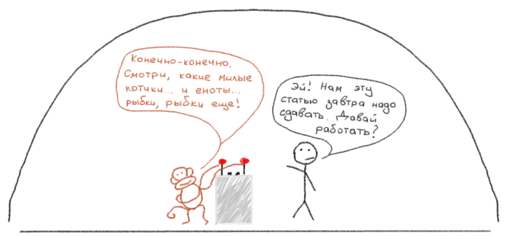
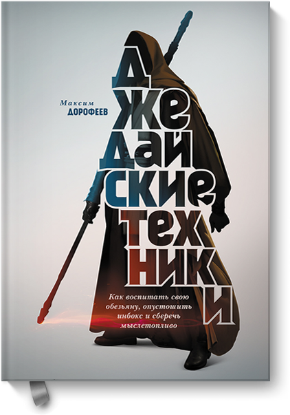

+++
date = 2016-04-26T08:30:16Z
description = "Люди действуют ради получения сиюминутного удовольствия. Ни черта не способны удержать в голове. Живут в постоянной неопределенности. И это нормально."
image = "/jedi/cover.png"
slug = "jedi"
tags = ["life"]
title = "Как привести дела в порядок без Дэвида Аллена и СМС"
+++

Я знаю три способа управления задачами:

1. По наитию. Иногда что-то куда записывать, эпизодически заносить дела в календарь, остальное запоминать (и забывать). Неплохо работает для фрилансеров — люди привыкли, что они факапят все на свете. Для остальных быстро превращает жизнь в боль.

2. По умной книжке. Прочитать что-нибудь о продуктивности от мэтров: Глеба Архангельского, Дэвида Аллена, Брайана Трейси — они учат *правильно жить*. Круто изменить жизнь, продержаться две недели, забросить и разочароваться.

3. Понять и простить. Понять, что *правильно жить* не получится — человек не робот. Простить собственные недостатки. Научиться их использовать, чтобы все-таки нормально управляться с делами.

Работает только третий способ. Учит ему Максим Дорофеев, он называет такой путь «джедайской техникой». Джедайская техника признает, что:

- люди большую часть времени действуют ради получения сиюминутного удовольствия;
- ни черта не способны удержать в голове и вообще устают от мыслей;
- существуют в состоянии вечной неопределенности.

Это нормально и естественно. Больше того, эти «слабости» — основа для простой и надежной системы доведения дел до конца. Простой — потому что сложная тупо не работает. Надежной — потому что построена на примитивных правилах и инструментах.

Максим учит:

1. Разгружать память и минимизировать «повторные мысли».
2. Правильно формулировать задачи и планировать без зауми.
3. Уменьшать вредные переключения.
4. Держать под рукой полезную информацию.
5. Регулярно проводить «техобслуживание» системы. 

Чтобы освоить джедайскую технику, лучше всего прочитать книгу или посмотореть вебинар:

<ul>
  <li><a href="https://www.mann-ivanov-ferber.ru/books/dzhedajskie-texniki/">Книга «Джедайские техники»</a></li>
  <li><a href="https://www.youtube.com/watch?v=jt3_sq8LQYM">Вебинар</a></li>
  <li></li>
</ul>

 

<em>И подписывайтесь на <i class="far fa-star color-sin"></i> «<a href="https://t.me/dangry">Интерфейсы без шелухи</a>»</em>

