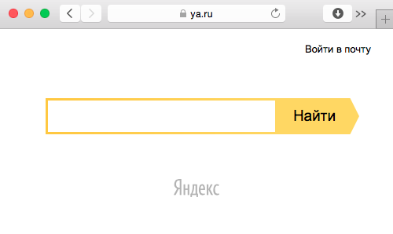
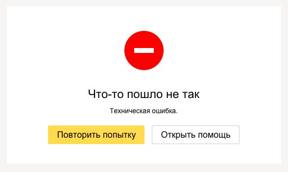
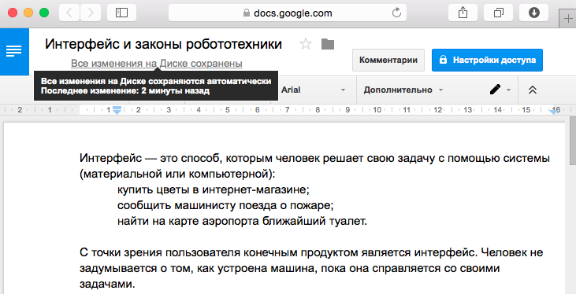
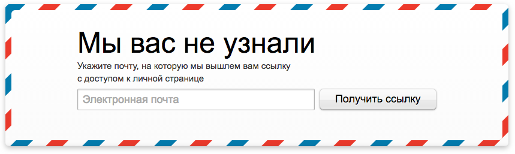
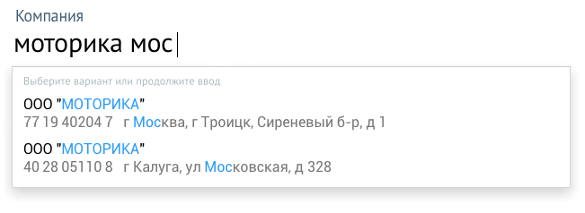

+++
date = 2016-04-12T11:15:02Z
description = "Хороший интерфейс, как робот из рассказов Азимова, подчиняется трем законам."
featured = true
image = "/laws/cover.png"
slug = "laws"
tags = ["interface"]
title = "Законы робототехники в интерфейсе"
+++

Интерфейс — это способ, которым человек решает свою задачу:

- войти в квартиру (интерфейс — дверь);
- сообщить машинисту поезда о пожаре (переговорная панель);
- найти на карте аэропорта ближайший туалет (информационный киоск).
- купить цветы в интернет-магазине (форма заказа).

Для человека интерфейс — это внешность и наблюдаемое поведение, а не внутреннее устройство. Пользователь не задумывается о том, как работает механизм или программа изнутри, пока она справляется со своими задачами.

    <figure class="image">
        
        <figcaption>Поиск Яндекса — это сложнейшая программа, которая работает на тысячах серверов. Но кого это волнует, когда все знают, что Яндекс — это такая страничка, где быстро можно найти то, что нужно.</figcaption>
    </figure>

В проектировании интерфейсов вагон и маленькая тележка правил разной степени универсальности. В то же время, мне нравится выделять три базовых закона, о которых лучше всегда помнить. Из них выводятся все остальные.

Оригинальные законы робототехники придумал писатель-фантаст Айзек Азимов. В рассказах Азимова они защищали людей от произвола машин. А у нас помогут людям не страдать от кривых интерфейсов.

## № 1. Не навредить

Компьютер не может причинить данным человека вред или своим бездействием допустить, чтобы они пострадали.

### Не терять данные пользователя

♞ Человек пять минут вводил реквизиты в квитанцию на оплату, а потом нажал на «Отправить» и получил ошибку:

Человек нажимает на «повторить попытку», и…

    <em>Плохо</em> 
    Программа открывает пустую форму, пользователь вводит реквизиты заново.

    <em>Лучше</em> 
    Программа показывает форму с заполненными реквизитами, ровно как она была до отправки.

### Не перекладывать на человека заботу о сохранности данных

Ленивая программа заставляет человека указывать, когда и что сохранять. Забыл сохранить? Ну, твои проблемы.

♞ Человек дописал статью в текстовом редакторе и решил его закрыть. Реакция программы:

    <em>Плохо</em> 
    В документе «Мой документ 132» есть несохранённые изменения. Сохранить их? Да / нет / справка

    <em>Лучше</em> 
    (молча автоматически сохраняет после каждого изменения)

<figure class="image">
    
    <figcaption>Гуглодокументы моментально сохраняют любые изменения</figcaption>
</figure>

Ленивая программа не несёт ответственности за технические ошибки. Заботливая — страхует от них.

♞ В результате технического сбоя личный дневник в облачном хранилище затёрся версией пятилетней давности. Реакция сервиса:

    <em>Плохо</em> 
    Яндекс.Диск: «Извини, дружище. Надеюсь, у тебя есть бэкапы. Лично я прошлые версии не храню».

    <em>Лучше</em> 
    Дропбокс: «Хочешь восстановить дневник, как он был до этого досадного происшествия? Нет проблем».

### Помнить привычки человека

Равнодушная программа — как бестолковый сотрудник техподдержки: всегда начинает спрашивать «с чистого листа». Пользователь не барин, может и по второму разу то же самое сделать, и по третьему. Заботливая программа помнит предпочтения человека и старается их учитывать.

    <em>Плохо</em> 
    «Яндекс.Музыка» при старте всегда открывает раздел «подборки». Ей всё равно, что я никогда не слушал эти подборки и не собираюсь.

    <em>Лучше</em> 
    Открывать раздел, на котором пользователь остановился в прошлый раз. В моём случае это сохранённые треки. Ещё лучше — включать тот же трек, на котором я прервал прослушивание.

## № 2. Не выносить мозг

Компьютер должен решать задачу пользователя, а не выносить мозг по пустякам. Программа не должна впустую тратить время человека или заставлять его выполнять действия сверх необходимых.

### Не заставлять человека думать

Все, что может делать машина самостоятельно — она должна делать, не вмешивая человека. Помнить промежуточные результаты вычислений, пересчитывать американские размеры одежды в европейские, определять город и индекс, красиво форматировать номер банковской карты.

Для второстепенных задач хорошая программа делает выбор автоматически:

- Вместо того, чтобы заставлять человека придумывать «логин» — использует электронную почту. Даёт войти через соцсети, многим так удобнее.
- Вместо «введите номер телефона в формате 7xxxxxxxxxx» — разрешает свободный ввод и форматирует номер автоматически.
- Вместо того, чтобы с каждой покупкой запрашивать ФИО, адрес и телефон — подставляет их из предыдущего заказа.

<figure class="image">
    
    <figcaption>«<a href="http://www.mann-ivanov-ferber.ru/">Манн, Иванов и Фербер</a>» пускают в личный кабинет по эл. почте без логина и пароля</figcaption>
</figure>

### Решать конечную задачу, а не промежуточную

Хороший робот решает задачу человека, а не ту, что выдумал программист. Если в интернет-магазине покупатель видит «заказ отправлен», этого недостаточно — цель еще не достигнута.

Так лучше:

> Мы приняли заказ. Менеджер перезвонит через полчаса, чтобы согласовать доставку.

Так тоже хорошо:

<blockquote>
    
Мы приняли заказ. Сегодня воскресенье, поэтому менеджер перезвонит насчёт доставки завтра с 10 до 11.

    
Для тех, кто любит покупать в выходные и праздники, у нас бывают скидки. Подпишитесь <u>на рассылку</u>, чтобы их не пропустить.

</blockquote>

### Не заставлять человека ждать

Компьютер не должен заставлять человека ждать. Ритм взаимодействия устанавливает пользователь.

> Если интернет-магазин десять секунд грузит десяток скриптов веб-аналитики, чата, обратного звонка, виджетов с акциями и черта лысого в сухарях, а я в это время сижу перед экраном и жду, когда увижу карточку товара — то мне такой магазин не нужен.

Программа не имеет права оставить человека в неизвестности:

> Отправил заказ, а она крутит индикатором ожидания, типа «не видишь что ли — работаю». А сама тихо и навсегда сломалась.

Если приказ человека не выполнен, робот обязан немедленно сказать об этом:

> Нет интернета. Мы не успели передать заказ в магазин, но сохранили его на этой странице. Так что когда интернет появится, вы сможете отправить заказ одной кнопкой — заново вводить ничего не придётся.

## № 3. Общаться по-человечески

Плохой интерфейс говорит языком программиста: с удовольствием делится подробностями, как у него всё внутри устроено и что сломалось. Решений он не предлагает — человек умный, сам разберётся. Хороший интерфейс, напротив *по-человечески говорит в чём дело* и помогает справиться с проблемой:

♞ Человек пытается войти в интернет-банк и видит сообщение:

    <em>Плохо</em> 
    В целях безопасности подтверждение операции невозможно. Обратитесь в Телефонный центр.

    <em>Лучше</em> 
    Кажется, вы сменили SIM-карту. Ответьте на пару вопросов, чтобы получить доступ к интернет-банку: позвоните +7 495 223-23-23 или напишите <u>в чат</u>.

Плохой интерфейс требует, и тем самым бесит человека. Хороший — *объясняет пользу*, и тем самым убеждает:

♞ На форме заказа цветов в интернет-магазине пользователь дошёл до поля «Телефон». Под полем надпись:

    <em>Плохо</em> 
    Телефон — обязательное поле

    <em>Лучше</em> 
    Курьер позвонит за час до приезда

Плохой интерфейс многословно и путано объясняет. Хороший — *наглядно показывает*.

♞ В CRM-системе появилась новая возможность. Пора рассказать о ней пользователю:

    <em>Плохо</em> 
    Система ускоряет заполнение сведений о компании с помощью функций подсказок для реквизитов юридических лиц. Продвинутые возможности полнотекстового поиска делают возможным указание всех сведений за считанные секунды.

    <em>Лучше</em> 
    

Плохой интерфейс учит человека, как правильно жить. Хороший — *молча делает, но предупреждает* о неприятных последствиях:

    <em>Плохо</em> 
    Вы задали элемент запрета разрешений. Элементы запрета имеют более высокий приоритет, чем элементы разрешения. Это означает, что пользователь, являющийся членом двух групп, одна из которых имеет разрешение, а другой это разрешение запрещено, не будет иметь это разрешения. Продолжить выполнение операции? Да / нет

    <em>Лучше</em> 
    Вы добавили Виктора Васильева в группу «Читатели», и поэтому он не сможет редактировать статьи. Если это не то, чего вы хотели — <u>уберите его из группы</u>.

А ещё хороший интерфейс называет вещи своими именами и не коверкает язык:

- Программа для книжного магазина работает с книгами и открытками, а не «объектами учета».
- В туду-листе осталось «23 задачи», а не «задач: 23»

⌘&nbsp;⌘&nbsp;⌘

## Запомнить

Если вы никогда ничего больше не прочитаете о проектировании интерфейсов, но примете и начнёте применять три закона робототехники в своих программах — пользователи будут слать вам лучи благодарности вместо проклятий.

Эти «законы» — просто здравый смысл. То же самое, что вы ожидаете от смышлёного коллеги:

- Не подставлять и не пакостить.
- Работать на совесть и решать проблемы самостоятельно.
- Внятно доносить свою мысль и адекватно общаться.

Следующая статья цикла:

<a href="/simple-ui">Что делает интерфейс простым</a>

 

<em>И подписывайтесь на <i class="far fa-star color-sin"></i> «<a href="tg://resolve?domain=dangry">Интерфейсы без шелухи</a>»</em>

