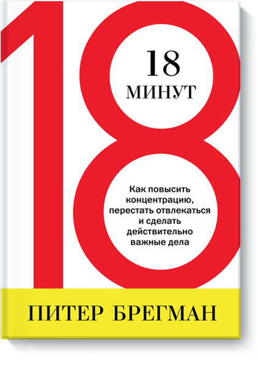

+++
date = 2016-03-15T08:14:00Z
description = "Осмотритесь. Войдите в одну реку дважды. Подавите первую реакцию. Кушайте кашу по утрам."
image = "/look-around/cover.jpg"
slug = "look-around"
tags = ["life"]
title = "Оглянуться вокруг, чтобы не налажать"
+++

Я почти не читаю книги про личную продуктивность-эффективность, но пару недель назад попалась на глаза одна. Питер Брегман, «[18 минут](http://www.mann-ivanov-ferber.ru/books/paperbook/18-minutes)».

272 страницы в печатной версии. <em>Восемнадцать</em> минут. <em>Двести семьдесят две</em> страницы. Отличная иллюстрация современной душеспасительной бизнес-литературы.

На удивление, первая глава в книге оказалась толковая, если отжать воду. Брегман пишет о том, как за рутиной и опытом не потерять адекватную картину мира.

### 1. Осмотритесь

> Kodak так хорошо продавала пленку 100 лет, что в ее картину мира просто не укладывалась цифровая фотография. В результате компания обанкротилась.

Замедлитесь и посмотрите вокруг: как изменилась ситуация? Не ищите подтверждения тому, в чем уверены; изучите контраргументы и новую информацию. В споре услышьте оппонента вместо того, чтобы доказывать его неправоту.

### 2. Войдите в одну реку дважды

> У вас есть склочный сотрудник, который отравляет весь коллектив. Выгнать жаль: компания прилично вложилась в его обучение. Спросите себя: приняли бы вы его на работу, зная, насколько он «токсичен»? Если нет, расстаньтесь с ним немедленно.

Мысленно начните с начала: вы бы начали делать то, что *делаете сейчас*, зная то, что *знаете сейчас*? Если нет — прекратите это делать.

### 3. Подавите первую реакцию

> Звонит разъяренный клиент и с ходу начинает орать в трубку. Спонтанная реакция — «наехать» на него в ответ. Но какой вам нужен результат? Если потерять клиента — смело орите. Но если решить проблему и нормализовать отношения — проявите эмпатию и спокойно узнайте причину раздражения.

Сделайте паузу перед тем, как отреагировать на событие, которое подключает ваши эмоции. Достаточно 5 секунд. Какой результат хотите получить? Действуйте, исходя из него.

Я заметил, что сам постоянно наступаю на эти «грабли», и вижу то же у других: ехать по колее легко и приятно. Теперь стараюсь отлавливать привычные паттерны поведения и «пробую их на зуб»:

- не изменилась ли ситуация?
- действительно ли хочу продолжать делать то, что привык?
- реагирую на автомате или действую на результат?

Попробуйте. Это необычно, но забавно.

*Есть что добавить? Пишите в [твитер](https://twitter.com/nalgeon)*

