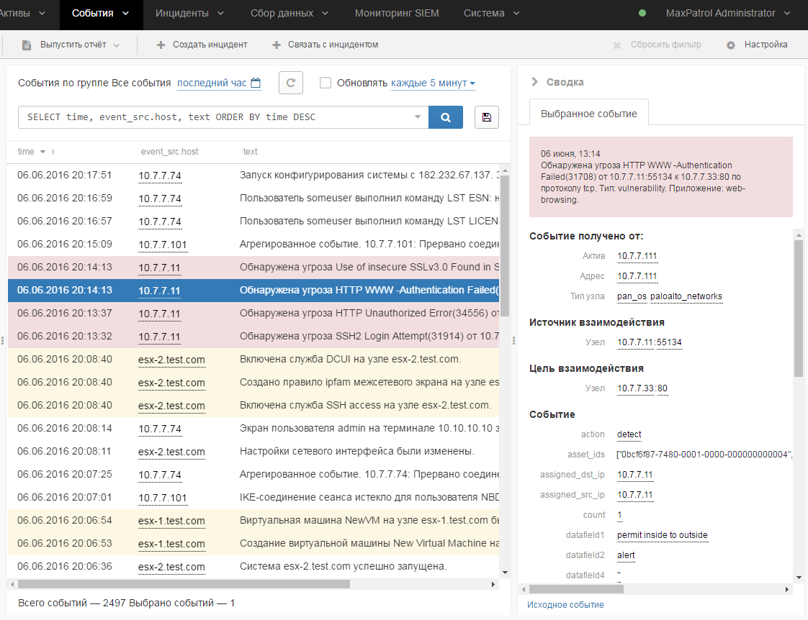
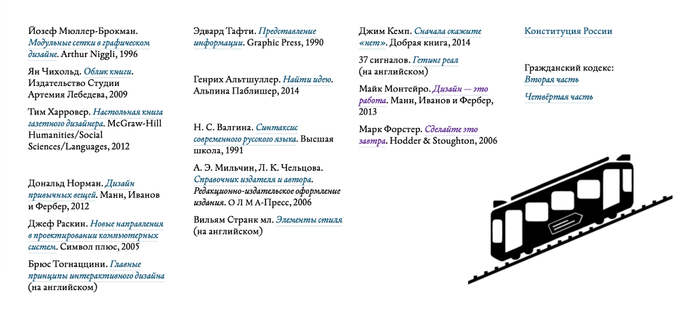

+++
date = 2016-09-01T06:56:41Z
description = "Интервью с Михаилом Озорниным — дизайнером интерфейсов для мрачных мужчин в костюмах."
image = "/mike-ozornin/cover.jpg"
slug = "mike-ozornin"
tags = ["talk", "interface"]
title = "Интерфейсы в энтерпрайзе и прокачка дизайнера"
+++

<em>Я решил запустить серию интервью с дизайнерами интерфейсов. Не супер-звездами, а обычными ребятами, которые работают над коммерческими и массовыми продуктами и сервисами. Сегодня пилотный выпуск с Михаилом Озорниным.</em>

### Расскажи о себе вкратце: чем занимаешься, где и над чем работаешь, чем увлекаешься помимо работы?

Я был разработчиком, системным аналитиком, менеджером проектов, а потом пришел в проектирование и дизайн. Сейчас — дизайнер интерфейсов в <a href="https://www.ptsecurity.ru">Positive Technologies</a>. Спорим, вы о ней не слышали? Обычно её не знает никто за пределами рынка информационной безопасности, а ИБ-специалисты знают все поголовно.

<figure><figcaption><a href="http://mikeozornin.ru">Михаил Озорнин</a></figcaption></figure>

Делаю интерфейсы для этих самых ИБ-специалистов. Это те люди, которые вынуждают вас придумывать сложные пароли, а потом еще и менять их каждые 43 дня. Они обычно не могут выбирать программы, которыми пользуются на работе (корпоративное ПО же), но тоже хотят удобных и понятных интерфейсов. Я проектирую разные сканеры, системы анализа поведения, сбора и анализа событий.

Вырос в Екатеринбурге, переехал в Москву.

Люблю велосипеды (в городах) и путешествия, предпочту Амстердам или Питер вместо Пхукета или Бали.

### Что в дизайне для тебя самое интересное? За что любишь эту профессию?

Мне нравится мысль, что я хотя бы немного делаю мир более упорядоченным, проще и эстетичней. Этакая борьба со вторым началом термодинамики. Радуюсь, когда я приношу решение и реакция «оу, а так можно было?». Такое, правда, бывает очень и очень нечасто.

### Ты пишешь на сайте, что занимаешься дизайном интерфейсов для сложных продуктов. Расскажи о самом крутом проекте.

С этим сложно. Рынок корпоративных программных продуктов часто далек от хорошего дизайна. (Вот Артём Локи немного [пишет про это](http://www.lowkee.com/all/sever/)). Соберусь и напишу пост для тех, кто не знаком, что такое корпоративное ПО (апдейт: <a href="http://mikeozornin.ru/blog/all/why-enterprise-software-so-bad-design/">написал</a>).

Приходится заниматься не только дизайном, но и воспитывать своих коллег, чтобы они переходили от задач «вставь чекбокс» к «придумай решение вот такой задачи». Небыстро, но получается. У дизайнеров уже есть авторитет в командах, их слушают, на них не забивают.

<figure>
    
    <figcaption>MaxPatrol — один из продуктов Positive Technologies, где работает Михаил</figcaption>
</figure>

Вот что приходится применять:

- продавать идею менеджеру продукта,
- продавать заказчику, чтобы он заказал фичу у менеджера,
- договориться с тестировщиками, чтобы завели баг, часто их баги рассматривают лучше, чем просто пожелания,
- договориться с менеджером последить за разработкой, чтобы разгрузить его, некоторые соглашаются,
- иногда договариваться в обход всех прямо с разработчиками. Когда уже сделано, все сразу понимают, что так и надо было.

Многие компании не показывают скриншоты продуктов, наша, как правило, тоже. Публично моих продуктов вроде не было. Но поверьте, там мало чего интересного.

### Что посоветуешь начинающим дизайнерам, как лучше всего прокачаться в профессии?

1. Пройти школу [бюро Горбунова](http://artgorbunov.ru/school/), см. следующий вопрос.
2. Поработать с хорошим арт-директором или ведущим дизайнером. У меня этого способа в жизни не было, но учеба показала, что он очень круто помогает.
3. Очень помогает устраивать себе марафоны. Делать каждый день какую-то штуку: за неделю нарисовать 300 иконок, сверстать 100 ценников или придумывать и рисовать по мобильному приложению в день. Есть даже такой марафон [Daily UI](http://www.dailyui.co), я подписался, но сразу бросил — понял, что не смогу держать темп.
4. Перестать читать статьи «23 правила построения сайтов» и прочитать оригиналы в книгах.
5. Учить английский, почти все хорошее публикуется или только на английском, или сначала на английском. На русском или не переводят, или переводят плохо.
6. Научиться немного верстать и программировать: так будет проще найти общий язык с разработчиками, да и просто в жизни поможет не делать вручную всякую рутину.

### Ты закончил школу бюро Горбунова. Что скажешь о ней?

Через месяц после окончания я написал пост «[9 месяцев в Школе стажёров Бюро](http://mikeozornin.ru/blog/all/9-mesyacev-v-shkole-stazhyorov-byuro/)», в котором описал результаты и мнение. Я перечитал его сейчас и в общей оценке до сих пор согласен. Единственное, что для «продуктового дизайнера» там маловато про продукт: исследования, гипотезы, прототипы, ЭмВиПи. Я немного зря тогда употребил этот термин. Не хватало типографики не на макроуровне, а на уровне шрифтов.

В общем, это были самые полезные 9 месяцев для меня как дизайнера. Не жалею, и если бы вернулся в то время, пошел бы снова и на этот раз постарался получить от школы больше.

### Какие инструменты используешь в работе? Какие из них считаешь безупречными?

У меня всё как и у всех: скетч, бумажный блокнот, [атом](https://atom.io), альфред, мейл.апп, скриншотилка и скайп. Безупречных среди них нет.

Скетч: не потому, что Фотошоп — плохой, я просто не умею им пользоваться. Я долго пользовался файрворксом, но потом стало ясно что в нем нет будущего. Скетч — это нормально сделанный файрворкс.  
Не представляю себе скетч без <a href="https://evilmartians.com/chronicles/compo-sketch">Компо</a>, <a href="https://www.invisionapp.com/craft">Крафта</a> и ещё пары плагинов.

<a href="https://www.alfredapp.com">Альфред</a> распробовал только месяца полтора назад (до этого не пошел), сейчас без него неудобно. Число моих сниппетов и воркфлоу медленно растёт.

Последние несколько месяцев вынужденно не пользуюсь Мейл.аппом, он перестал нормально работать с Эксченджем. Жду релиза Сиерры — в ней починили обратно.

### Какие книги больше всего рекомендуешь коллегам?

Я согласен со входным списком [Школы дизайнеров](http://artgorbunov.ru/school/):  

<figure>
    
    <figcaption>Список литературы школы Горбунова</figcaption>
</figure>

Еще раз посмотрел свои оценки на Лайвлибе, всё так. Все эти книги стоит прочитать. Некоторые лучше, некоторые хуже, но все нужны.
Начать с Нормана и Раскина (пропустить окончание про Кэнон Кэт), потом Тафти. По верстке: Мюллер-Брокманн больше академическая, для жизни полезней Харровер.

Что я бы добавил: 

- «[Основы стиля в типографике](http://store.artlebedev.ru/book/typography/osnovy-stilya-v-tipografike/)» Брингхёрста,
- «[Образцы шрифтов](http://store.artlebedev.ru/books/calligraphy/obraztsy-shriftov/)» Чихольда,
- «[Ремоут](http://www.mann-ivanov-ferber.ru/books/paperbook/remote-office-not-required/)» от 37 Signals,
- «[Об интерфейсе](http://www.piter.com/collection/all/product/interfeys-osnovy-proektirovaniya-vzaimodeystviya-4-e-izd-2)» Купера,
- «[100 фактов](https://bookmate.com/books/wl7IfIqp), которые нужно знать о людях» Сьюзан Вайншенк (перевод названия на русский — катастрофа).

### В каких профессиональных сообществах состоишь? Какие посещаешь конференции?

Так вышло, что в сообществах ни в каких не состою: подписан на [UX Russia](https://www.facebook.com/uxrussia/), но там давно нет жизни, числюсь в «[Полезном клубе](http://usefulclub.ru)», но там тоже мало что происходит.

Из конференций иногда хожу на [WUD](http://wud.ru) или [Dribble Meetup](http://dribbblemeetup.ru), когда оказываюсь в городе. К UX Russia отношусь скептически: последние две, на которых был, были очень откровенно плохие.

Ценю, когда конференции выкладывают видео, смотрю доклады на удвоенной скорости.

### Что тебя больше всего огорчает в отрасли и в коллегах?

Мне тяжело работать с людьми, у которых сильно [отличаются принципы](http://mikeozornin.ru/blog/all/principy-2/). Отсутствие 1–2 из принципов усложняет совместную работу, отсутствие нескольких делает совместную работу маловероятной.

Огорчают постоянные статьи «10 лучших способов сделать хороший дизайн». Ещё больше удручает, если это плохой перевод английских статей. Я не верю, что без английского языка сейчас можно как-то существовать в мире.

### Хочешь что-нибудь сказать коллегам-дизайнерам? Совет или напутствие?

Делайте хорошо и не делайте плохо :–)

### Где на тебя подписаться?

Я недавно переехал на новый блог, читать можно там: [mikeozornin.ru/blog](http://mikeozornin.ru/blog/)

<h3>Как подписаться на блог Михаила</h3>

<ol>
<li>Заходить и проверять новые посты. Способ для гиперответственных, я так не умею.</li>
<li>Через РСС (самый <a href="http://ilyabirman.ru/meanwhile/all/rss-subscription/">правильный способ</a>). Добавьте адрес <code>http://mikeozornin.ru/blog/</code> в свою РСС-читалку (например, Фидли или Риидер) и все будет ОК.</li>
<li>По почте. Вставьте <code>http://mikeozornin.ru/blog/</code> в <a href="https://blogtrottr.com/">blogtrottr.com</a>, сервис будет присылать посты на почту.</li>
<li><a href="http://facebook.com/mike.ozornin">В фейсбуке</a>. Посты там все, но иногда там пишу что-то другое.</li>
<li><a href="http://twitter.com/mikeozornin">В твиттере</a>. Кроме постов там будет много всякого, в том числе не самого интересного.</li>
</ol>

<em>Специально для подписчиков канала <i class="far fa-star color-sin"></i> «<a href="https://t.me/dangry">Интерфейсы без шелухи</a>»</em>

