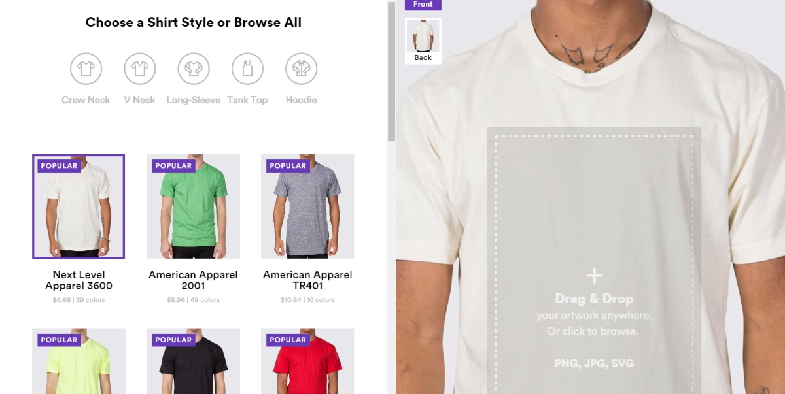
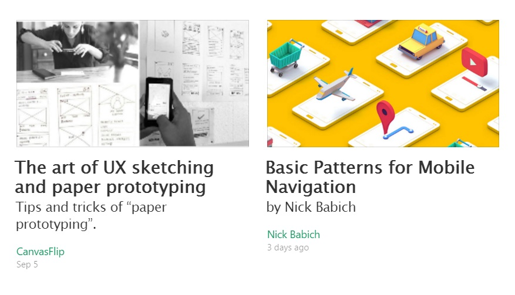
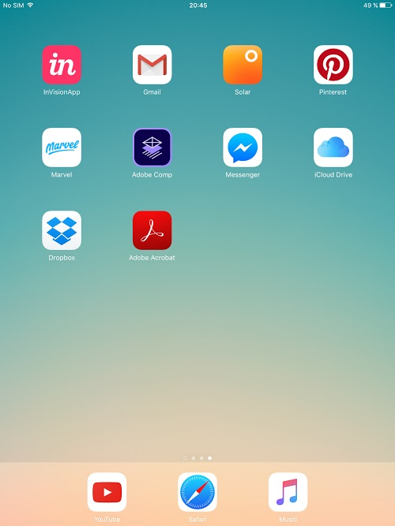
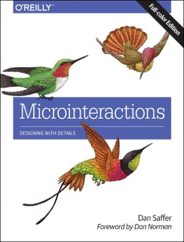
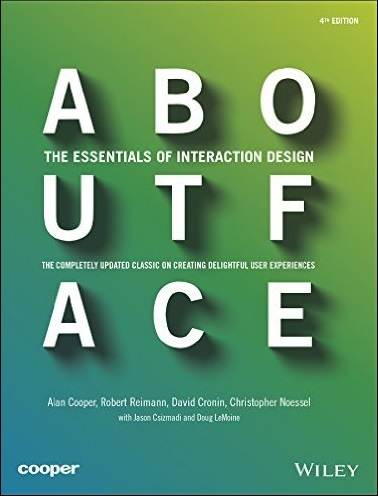
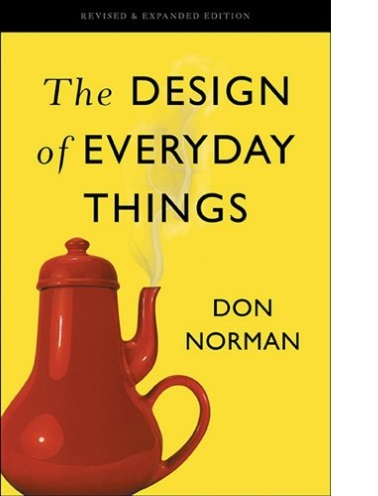

+++
date = 2016-09-14T11:23:30Z
description = "Николай Бабич о разработке, гайдлайнах и UX Planet"
image = "/nick-babich/cover.jpg"
slug = "nick-babich"
tags = ["interface", "talk"]
title = "Как совмещать дизайн и разработку"
+++

<em>Сегодняшнее интервью — с Николаем Бабичем, известным дизайнером и автором статей, который оказался не совсем дизайнером ツ</em>

### Расскажи о себе вкратце: чем занимаешься, где и над чем работаешь, чем увлекаешься помимо работы?

Ты не поверишь, но я программист :–) Причем достаточно далеко нахожусь от фронтенда и проектирования UI, занимаюсь приложением для бекенда. В работе, как и в жизни, люблю чередовать вещи. Заниматься постоянно бекендом тяжко, и в качестве разнообразия у меня wireframing и прототипирование (как веб, так и мобильные приложения).

<figure><figcaption><a href="http://babich.biz">Николай Бабич</a></figcaption></figure>

Работаю в компании RingCentral (занимаемся телефонией), больше всего работаю с людьми. Я тренер для молодых кадров, воспитываю и взращиваю новые таланты. Образую команды, которые дальше идут по департаментам, поэтому общения много. Работа занимает значительную часть времени, но забавно, что работой я её не воспринимаю — это как часть жизни, которая вдохновляет.

Живу в Санкт-Петербурге.

### Что в дизайне для тебя самое интересное? За что любишь эту профессию?

Для меня дизайн в целом это все. В буквальном смысле. Я большой фанат архитектуры, автомобильного дизайна и одежды. С детства любой предмет оцениваю с точки зрения эстетики. Для меня важно, чтобы не было лишних деталей и все было хорошо подобрано.

Саму профессию люблю за многогранность: в другой профессии невозможно проявить себя так, как в дизайне. Вижу твое удивление и предвкушаю вопрос «но ты же разработчик». Отвечу так: разработка кода и прототипирование тоже дизайн. Так что в разработке я тоже в своей тарелке :–)

### [На сайте](http://babich.biz) ты публикуешь статьи о проектировании интерфейсов для веба и мобильных устройств. Чем все-таки ты сейчас занимаешься?

Занимаюсь и вебом, и мобильными, причем по всему миру. Вот некоторые проекты, в которых я помогал:

- приложение [для родителей и нянь](https://itunes.apple.com/fr/app/baby-sittor/id1015021247?l=en&mt=8);
- сайт [развлекательной платформы](https://pycker.com/);
- сервис [рубашек на заказ](https://www.realthread.com/) — сейчас работаем над новой версией.

<figure>
    
    <figcaption>Real Thread — «рубашка на заказ» во Флориде</figcaption>
</figure>

### Я так понял, это фриланс. Как находишь заказчиков?

Чаще находят меня они, а не я их :–) Если проект интересный, я однозначно пытаюсь помочь, и поработать вместе над улучшением продукта. Чаще это изучение user flow и консультации (как сделать удобный UI), но и прототипирование тоже в долгий ящик не откладываю. Редко делаю разработку для сайд-проектов, потому что она требует большего фокуса, на это не хватает времени.

### Ты пишешь только на английском. Почему?

Для меня это возможность практиковать навыки письменного языка. До блога практика была в основном разговорной, так что переход на написание статей позволил структурировать мысли и навыки письма. Когда пишешь на другом языке, вынужден продумывать одну и ту же мысль дважды — первый раз на русском, второй — уже на английском, это помогает четче излагать.

Можно сказать, что написание статьи на английском для меня как урок языка. Еще плюс английского: публика более требовательная (на английском гораздо больше статей, читателям есть из чего выбирать), поэтому сам себя подстегиваешь писать что-то интересное.

### Расскажи о своем проекте [UX Planet](https://uxplanet.org)

Честно сказать — в начале я ничего не планировал. Просто хотел создать небольшой блог для дизайнеров и инженеров, которые стремятся делать продукты лучше. Когда начал публиковать первые статьи, был немного обескуражен — количество прочтений постоянно росло.

«Небольшой блог» превратился в проект с 400 тысяч посещений в месяц

Сейчас в блоге 20 тысяч читателей, и для меня это показатель того, что люди очень заинтересованы в теме UX. Это вдохновляет! Отдельное спасибо всем, кто помогает делать UX Planet лучше — авторам публикаций и комментариев (в особенности друзьям из студий [Tubik](http://tubikstudio.com/blog/) и [icons8](https://icons8.com/blog/) — Марина и Саша — вы крутые!)

### Откуда ты берешь материалы для статей?

Гайдлайны большой тройки (Эпл, Гугл и Майкрософт), срез других материалов по теме, и свои мысли. Все это слито в единое целое. Гайдлайны беру как основу. Они сильно заточены под платформу, а я стремлюсь писать про UX в целом — поэтому адаптирую для более широкой аудитории. Читаю UX-исследования (например, исследование [Стивена Хубера](http://4ourth.com), как люди взаимодействуют с тач-экранами). Общаюсь с авторами исследований, чтобы убедиться, что правильно понял их мысль.

### За счет чего растешь как дизайнер? Что посоветуешь коллегам?

Вдохновение. Наверное, это самый лучший совет. 

<blockquote class="big">Меня вдохновляют многие вещи, но больше вещей вдохновляют люди.</blockquote>

Поэтому, чтобы получить вдохновение — работаю с людьми, которые вдохновляют меня на что-то большее.

### Какие инструменты используешь в работе? Какие твои любимые?

Я ужасно консервативен в выборе инструментов, поэтому использую стандартный набор дизайнера от Adobe. Что касается любимых тулов: так как я постоянно вовлечен в разработку, очень понравились [Sympli](https://sympli.io) и [Zeplin](https://zeplin.io) (недавно делал по ним [обзор на Smashing Magazine](https://www.smashingmagazine.com/2016/08/pixel-perfect-specifications-without-the-headaches/)). Оба нацелены на трансляцию макета дизайна в код (по сути, интерактивная спецификация).

### Покажи скриншот экрана своего смартфона

Смартфон у меня только для звонков, а пользуюсь в основном планшетом. Постоянно пользуюсь Pinterest и Adobe Comp, чуть меньше InVisionApp и Marvel.

Solar стоит для вида и вдохновения (мне просто нравится созерцание оранжевой иконки <nobr>¯\_(ツ)_/¯</nobr>

### Ты прототипируешь прямо на планшете? Насколько это удобно?

Не сказал бы что прямо очень удобно, но терпимо. Если работаешь в дороге, проще сделать на планшете, а дома уже переносить на мак. Вообще, прототипировать начинаю на бумаге, потом уже переношу в Adobe Comp, XD, Photoshop.

### Какие книги рекомендуешь коллегам?

Три любимые: 

<a href="https://www.amazon.com/dp/B00FRSNHIW">Microinteractions</a>: Designing with Details, Ден Саффер

<a href="https://www.amazon.com/dp/B00MFPZ9UY">About Face</a>: The Essentials of Interaction Design, Алан Купер

<a href="https://www.amazon.com/dp/B00E257T6C">The Design of Everyday Things</a>, Дон Норман

### В каких профессиональных сообществах состоишь? Какие посещаешь конференции?

Ух, сложный вопрос. Наверно, правильным ответом будет — ни в каких. Дело в том, что я могу причислять себя к активным участникам сообщества, если веду там работу, а просто состоять в сообществе для меня мало :–) Конференции в основном «про UX», в октябре буду выступать на [Push Conference](http://push-conference.com/2016/) в Мюнхене.

### Что тебя больше всего огорчает в отрасли и в коллегах?

Нежелание учитывать чужой опыт — когда видишь, что одни и те же ошибки повторяются из раза в раз.

Люди игнорируют пользовательский опыт: создают продукт, только сами и могут пользоваться. Или нарушают паттерны проектирования так, что от это страдает продукт. Из последних примеров:

- «Гамбургерное» меню ради двух (!) пунктов внутри;
- отсутствие прогресс-индикатора для задачи, которая выполняется 3 минуты (пользователь волком воет и хочет айфон выкинуть за это время).

### Хочешь что-нибудь сказать коллегам-дизайнерам? Совет или напутствие?

То же самое, что говорю себе: занимайся тем, что нравится больше всего, и находи вдохновение в том, что делаешь.

### Где на тебя подписаться?

Мой твиттер <a href="https://twitter.com/101babich">@101babich</a>. Публикую ссылки на свои статьи и другие интересные ресурсы.

Если нужна помощь в проектировании интерфейса — пишите на <a href="mailto:nick@babich.biz">nick@babich.biz</a>

