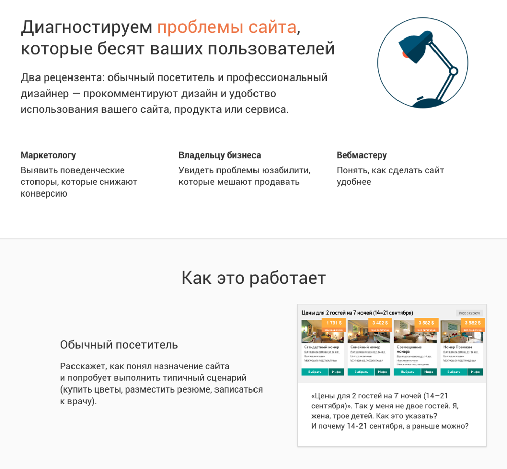
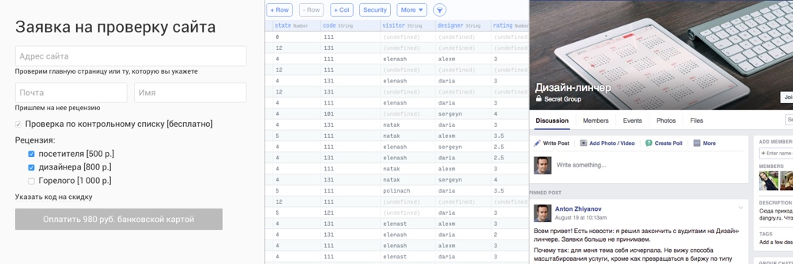
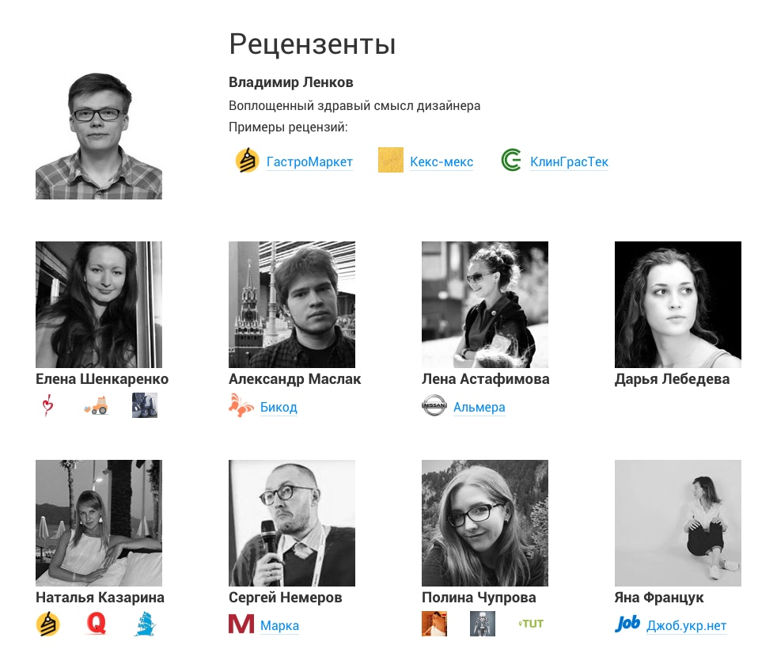

+++
date = 2016-08-24T09:27:59Z
description = "Смерть стартапа: как мы с Горелым линчевали интерфейсы и что из этого вышло"
image = "/o-tawa-toki/cover.jpg"
slug = "o-tawa-toki"
tags = ["interface", "project"]
title = "Горелый и его последний дизайн-линч"
+++

В апреле 2015 года я запустил [Дизайн-линчер](http://dangry.ru) — аудит юзабилити сайта от обычного посетителя и профессионального дизайнера. Сегодня закрываю услугу аудита и пишу об уроках, которые для себя вынес.

<figure class="image">
    
    <figcaption>— Один из лучших кейсов в маркетинге, что я видел <em>&nbsp;&nbsp;&nbsp;&nbsp;из отзыва заказчика</em></figcaption>
</figure>

## Урок первый: «минимальный прототип» работает

Сервис аудита состоял из трех частей:

- витрина: сайт и форма приема заявок;
- админка для управления заявками;
- мини-биржа для координации рецензентов.

Если реально все это разрабатывать — займет месяцы и стоить будет сотни тысяч рублей. Поэтому я сделал так:

1. Сверстал статичный сайт с формой заявки.
2. Приделал оплату через [Яндекс-деньги](https://money.yandex.ru/get/) в сто строчек на джаваскрипте.
3. Взял готовую бесплатную админку у [Парса](http://parse.com/).
4. Для взаимодействия с рецензентами завел секретную группу в Фейсбуке.

<figure class="image">
    
    <figcaption>Заявка + админка + рецензенты = сервис аудита</figcaption>
</figure>

Все. Система оказалась настолько удачной, что мне не пришлось менять ее до самого конца. А благодаря минимальным затратам на разработку сервис сразу вышел в плюс.

## Урок второй: никто не ценит бесплатный труд

Первые месяцы сервис был полностью бесплатным — я проверял, как работает идея. Рецензенты трудились на голом энтузиазме (святые люди!).

Типичный отзыв заказчика того периода:

<blockquote class="big">— Спасибо! Все понравилось) Успехов вам! <del>Счастья, здоровья, держитесь там</del>
</blockquote>

На первый взгляд, дело шло отлично — куча заявок и дым коромыслом. Но по отзывам клиентов я понял, что люди не ценят «бесплатные» результаты. Энтузиазм рецензентов тоже быстро затухал. Поэтому я перешел на платную модель, и все стало хорошо.

## Урок третий: правдоруб-матершинник решает

Сервисов UX-аудита много. Дизайн-линчер особенный: у него был Горелый. Это такой посетитель, который беспощаден к сайту и не стесняется в выражениях. Если честно, ради него я все и начинал (ノಠ益ಠ)ノ

<h3>Случайные цитаты из Горелого</h3>

«Компактный размер — гигантские возможности». Наверно, это сайт психологической помощи мужчинам с маленьким х♥ем. А нет. «IP-ТЕЛЕФОНИЯ ДЛЯ ВАШЕГО БИЗНЕСА ПОД КЛЮЧ ОТ 19 000 РУБ». Гигантские возможности понятно — можно ЗВОНИТЬ (вау). А у чего компактный размер?

«индивидуальность отождествляет качество». Эээ. И чо? Во-первых, ни·уя подобного: индивидуальность качество не отождествляет. Во-вторых, что мне с этим высказыванием делать? Распечатать и в рамку на стену повесить?

Ладно. Заполнил, нажал на «заказать». И знаете что? Кнопка пропала, бл·дь такая. Ну юмористы, сссука, такого еще не встречал ٩◔̯◔۶

Наберите воздуха побольше и длинно, разнообразно, с чувством выматеритесь. Сделали? Вот это и есть моя рецензия.

Так вот, Горелый стал неистово популярен: половина заказчиков выбирали его вместо обычного посетителя. Пришлось поднять цену втрое, а то бедняга не справлялся.

Горелый так пришелся всем по душе, что благодаря ему о Дизайн-линчере даже [в журнале](https://biz360.ru/materials/vypuskay-gorelogo-kak-protestirovat-svoy-sayt-na-vmenyaemost/) написали.

## Урок четвертый: без толковых рецензентов никуда

Сервис аудита сайтов хорош настолько, насколько хороши рецензенты, которые пишут отзывы. У Дизайн-линчера подобралась небольшая, но сильная команда:

— Рецензия отличная: согласны с 95% замечаний, а 80% мы в силу своей неопытности просто не видели. Сайт на комплексной поддержке — встречаемся с исполнителями и устраиваем разбор полетов. <em>из отзыва заказчика</em>

Ребята, спасибо вам огромное! Без вас бы ничего и не было. Я сам пару раз заказывал аудит: рецензии открывают глаза на серьезные проблемы, которые до этого не замечал.

Заказчики почти всегда оставались довольны: на 300 рецензий был один возврат денег. И люди присылали на удивление много отзывов.

## Почему я закрыл «Дизайн-линчера»

Логичное развитие для сервиса аудитов — больше рецензентов, больше заказов. Но я так и не смог на это пойти. Если даю клиенту рецензию, хочу лично отвечать за качество — значит, должен сам проверять каждый отзыв. Понятно, что так не масштабируешься.

Второй путь — сделать биржу с взаимным контролем рецензентов, автоматической проверкой рецензий по эвристическим признакам, рейтингами — можно много чего накрутить, чтобы держать нормальное качество. Но я понял, что биржу делать мне просто не интересно. Все-таки я гик, и хочу делать более технологические штуки.

Третий путь — остаться маленькими, но серьезно повысить ценник, до уровня полноценного UX-консалтинга. Но это противоречило моей исходной идее о доступном для всех UX-аудите.

В итоге, получился чемодан без ручки — нести неудобно, бросить жалко. Я все же решил бросить.

## Горелого нет, но тело его жует

Мы больше не рецензируем сайты. Но за полтора года «под зонтиком» сервиса вырос новый проект — [**Интерфейсы без шелухи**](https://t.me/dangry). Это заметки о продуктоводстве, здравом смысле и разработке софта. Без переводов, копипасты и унылых статей про «38 рекомендаций дизайнеру для создания потрясающего UX».

Что-то кончается, что-то начинается, как говорил пан Сапковский. И начинается самое интересное ツ

