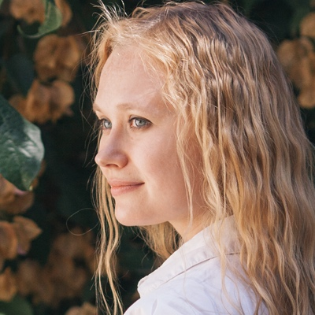
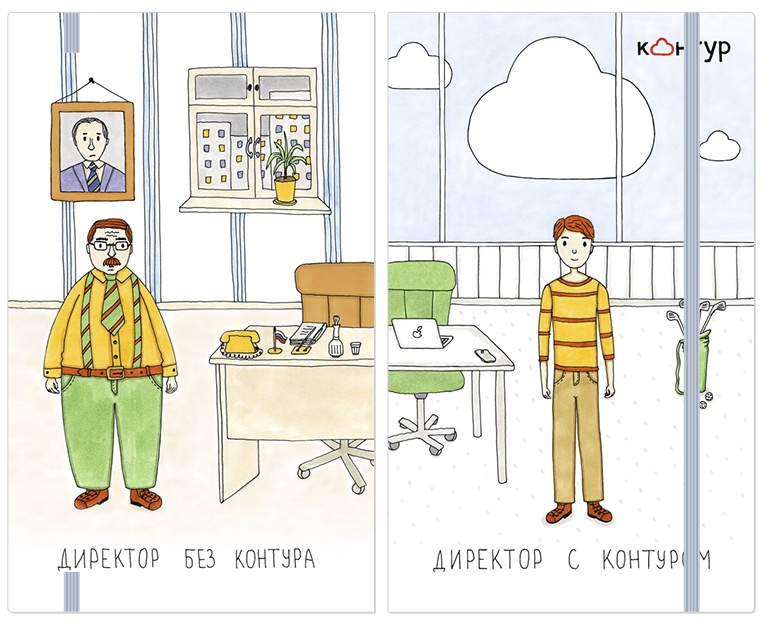
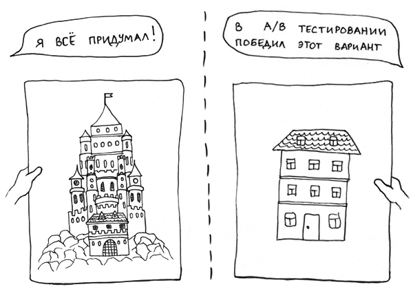
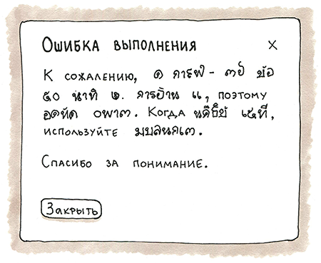
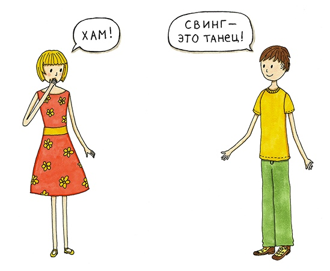
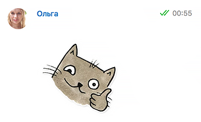
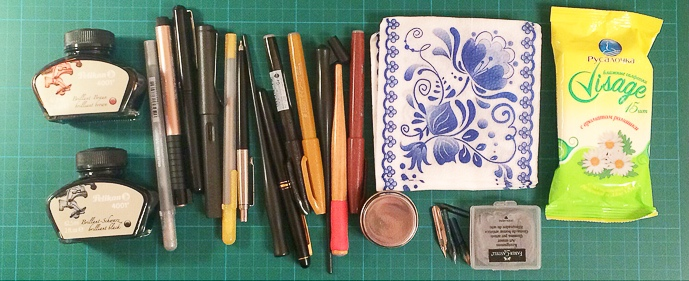
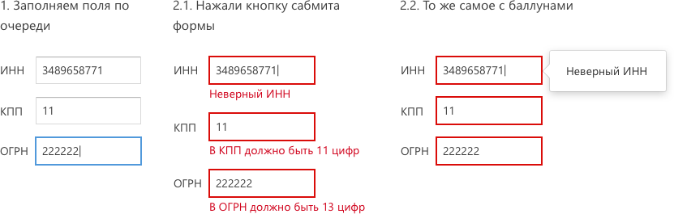
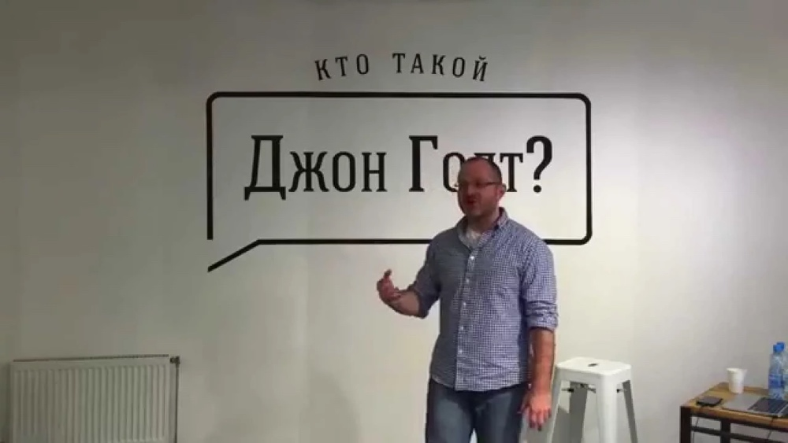

+++
date = 2016-12-01T08:11:04Z
description = "Ольга Романова из «Эльбы» — о сложных интерфейсах, иллюстрации и профессиональном росте."
image = "/olga-romanova/cover.jpg"
slug = "olga-romanova"
tags = ["talk", "interface"]
title = "Как спроектировать удобный интерфейс для сложной предметной области"
subscribe = "dangry"
+++

<em>Сегодняшнее интервью — с Ольгой Коноваловой из «Эльбы». Ольга рассказывает, как спроектировать сложный UI и научиться иллюстрации с нуля. А еще делится гайдлайнами дизайна интерфейсов и стикерами с котами для телеграма ツ</em>

## Расскажи о себе вкратце: чем занимаешься, где и над чем работаешь, чем увлекаешься помимо работы

Сейчас я проектирую интерфейсы в <a href="https://e-kontur.ru/">Эльбе</a>, это проект компании СКБ Контур. Компания крупная, в ней 4,5 тысячи человек, большая часть в Екатеринбурге. Эльба — небольшой проект, 25 человек.

Помимо работы увлекаюсь каллиграфией, леттерингом. Немного осваиваю иллюстрацию, какое-то время назад активно рисовала комиксы у себя в блоге, сейчас меньше, возможно, это временно и меня заново захватит :) Иногда пишу рецензии на книги.

<figure><figcaption><a href="http://cat-in-cap.ru/">Ольга Коновалова</a> Иллюстрации в статье нарисованы Ольгой</figcaption></figure>

## Ты проектируешь интерфейсы Эльбы в Контуре. Расскажи об этом проекте?

В Эльбе я полгода, а до этого 4,5 года проектировала Контур.Бухгалтерию. Сервис помогает предпринимателям и небольшим организациям вести свои дела и отчитываться перед государством. Это ведение бухгалтерии, понятное простым смертным. Не надо быть бухгалтером 80 уровня, чтобы разобраться.

<figure>
    
    <figcaption>Образ «директора без Контура» потряс бизнес-круги Екатеринбурга и чуть не привел к отставке главы региона (на самом деле нет).</figcaption>
</figure>

Для директора бухгалтерия — это целый новый мир. Мы стараемся упрощать, чтобы пользователи даже не задумывались, как что в бухгалтерии работает, не нагружаем сложными знаниями и предметкой. Владельцы бизнеса занятые ребята, зачем им это. Лучше обойти непонятное, сделать как можно проще. Тут нет задачи обучить бухгалтерии, задача — как можно меньше с ней знакомить. Где-то о чем-то можно умолчать. Главное, чтобы директор вовремя сдавал отчетность, и легко решал свои рабочие задачи самостоятельно.

## Эльба известна своим удобным и человечным интерфейсом. Как вам это удается?

Во-первых, мы достаточно хорошо знаем своего пользователя. В этом помогают юзабилити-тестирования, опросы, информация из техподдержки, аналитика и статистика.

На тестированиях показываем пользователю как кликабельные прототипы, так и работающий сервис. Иногда после тестирования концепция сильно меняется, прототип перерисовываем и заново тестим. Но чаще всего просто вносим правки, и макет идет в разработку.

<figure>
    
    <figcaption>Простые гипотезы Ольга проверяет «коридорным» тестированием, штуки посложней — на исследованиях пользователей.</figcaption>
</figure>

Техподдержка у Эльбы круглосуточная и качественно хорошая. Это тоже наше преимущество. Информация идет из звонков, с форм обратной связи, почты и с еще одного интересного инструмента — лайков. На каждой странице сервиса развешаны кнопочки: с пальцем вверх, пальцем вниз и конвертиком. Задумывалось это как быстрая обратная связь — нравится или нет. В жизни же пользователи пишут там любые свои вопросы, просьбы о помощи. То есть приходится активно мониторить и этот канал, а не просто изредка анализировать.

Второе, что помогает делать Эльбу удобной — это офигенная вовлеченность каждого члена команды во все, что происходит. Не только проектировщику и менеджеру есть дело до пользователя, каждый принимает активное участие в том, чтобы сделать Эльбу чуть лучше.

<blockquote class="big">Мы делаем сервис, которым сами бы захотели пользоваться.</blockquote>

Например, один тестировщик предложил запустить викторину с вопросами пользователям о нашем сервисе — чтобы понять, обо всей ли функциональности пользователи в курсе. Это важно, потому что можно делать кучу полезного, но если пользователи об этом плохо узнают, то грош цена нашим усилиям и всему сервису. В викторине были вопросы вроде «можно ли отправить счет на несколько почтовых адресов одновременно?». По итогам викторины пользователи получали подарок от Эльбы — бесплатное обслуживание на какой-то срок.

В-третьих, мы общаемся с пользователями довольно неформально, как общались бы в обычной жизни. От этого поддерживается ощущение дружелюбия, и что Эльба ближе к пользователю. Такими мы и хотим быть.

## Как ты проектируешь, какой у тебя процесс? Как проверяешь гипотезы?

Когда хорошее решение нельзя реализовать, то просто накидываешь варианты по типу мозгового штурма. Каракули на листочках вполне годятся. Иногда бывает полезно спросить второго проектировщика, так идей будет больше. Или другого человека из команды. Любые ответы могут натолкнуть на хорошую мысль. Это то, что касается несложных небольших вещей, когда надо просто больше вариантов.

Если задача посложней и надо придумать что-то концептуальное, продумать сценарий новой большой задачи, одной головы явно мало. Тогда беру второго проектировщика, и уходим куда-нибудь, чтобы не отвлекал никто. Каждый рисует по задаче свои варианты решений, любые мысли на тему. Большая детализация экранов не нужна, достаточно ухватить только концепцию. Если возникают какие-то интересные мысли по конкретным вещам, тоже фиксируем. Лучше зарисовать все, что в голову придет, потом может пригодится.

<figure><figcaption>Пользователю не важно, какие хитрые механизмы и алгоритмы спрятаны по ту сторону интерфейса. Важно, как ему в данный момент получить желаемое. Не грузите лишним.</figcaption></figure>

Через полчасика, когда каждый «уже все», показываем друг другу, находим интересные решения в набросках друг друга и скрещиваем. Таким способом рождается больше хороших идей, чем когда сразу садишься и вдвоем думаешь мысли вслух. Помогает не упустить важное, интересное, не повлиять на ход мыслей второго, чтобы у каждого был шанс что-то привнести.

## Ты рисуешь чудесные иллюстрации и активно применяешь их в жизни: в оформлении личного сайта, на банковских картах, ежедневниках, открытках для друзей и родственников. Кажется, иллюстрация очень много для тебя значит. Расскажи об этом увлечении?

Все началось с очень простых комиксов. Если у кого-то хватит терпения долистать мой блог до конца, то этот кто-то увидит там не очень симпатичные картинки. Дети в детском саду лучше рисуют, наверное :) Но это было забавно, мне было без разницы, как и кто это оценит. Я самовыражалась. Рисовала чуть ли не каждый день. А если что-то делать часто, это можно неплохо прокачать. Рука начинает линии ровней рисовать. Потом начинаешь интересоваться иллюстрациями других дизайнеров, пытаешься понять, на что стоит обращать внимание, что важно для персонажей. То есть все само. Интерес и любопытство движет всем.

<figure>
    
    <figcaption>В фирменном стиле Ольга оформила  главную страницу своего сайта, <a href="http://cat-in-cap.ru/">получилось симпатично</a></figcaption>
</figure>

Затем был двухдневный интенсив от [Стива Симпсона](http://stevesimpson.com/) в Екатеринбурге. Мы рисовали этикетку на бутылку вина ко Дню Святого Патрика. Мне было страшно. Потому что там были настоящие иллюстраторы, а я тут со своими комиксами домашними :) Но все прошло хорошо, очень понравилось. Дальше я совсем осмелела и поехала на офигенный недельный курс в Италии, его преподавали разные иллюстраторы. Жили в кампусе Везувианского института гуманитарных наук. Ходили по городам, делали зарисовки, были на раскопках, в Помпеях, забирались к кратеру Везувия. В итоге мы научились рисовать обложку книги. Для меня там было много новых полезных знаний. И впечатлений море.

Потом я совсем случайно попала на курс по каллиграфии для начинающих ко [Льву Либерману](https://vk.com/libermanschool_ekb). Это тоже затянуло. После короткого курса пошла к нему же на годичный курс. Он еще в процессе, прошел только первый блок — античность. Сейчас хожу на леттеринг у того же преподавателя. А вчера у меня начался курс по коммерческой иллюстрации в [школе Калачевой](https://kalachevaschool.ru/).

Часто у меня интерес к чему-то растет из интереса к инструментам — охота попробовать перо или хитрый маркер, как ведет себя, что им можно сделать. Или из интереса «как это делают?», как в акварели какие-то эффекты — хочу повторить и научиться.

Еще у меня случилась интересная история со <a href="http://cat-in-cap.ru/blog/all/stikery-telegram/">стикерами в Телеграме</a>. Нарисовала котов, выложила, а они как-то фантастически взлетели. Вообще не думала, что так будет. Сейчас они установлены у 18 тысяч человек. За все время люди отправили друг другу 135 тысяч стикеров. Второй пак с <a href="http://cat-in-cap.ru/blog/all/stikery-dlya-razrabotchikov/">котами для разработчиков</a> установлен у 16 тысяч человек.

Видно, что я много времени трачу на это все. Хотя цели продавать рукотворное у меня не было. Случается, что-то просят подписать, нарисовать. Те же [банковские карты](http://cat-in-cap.ru/blog/tags/karty/), открытки. Даже в Контуре иногда что-то случается порисовать. [Меловую доску](http://cat-in-cap.ru/blog/all/melovoy-letterring/) с меню для кафе, шкафчики с посудой и едой на кухнях нового офиса. Чаще всего я с радостью соглашаюсь :)

## Какие инструменты используешь в работе? Какие твои любимые?

Работа — это проектирование, и там прототипы в Sketch, ничего необычного. Общаемся с командой в Телеграме и устно. Бажики и мелкие задачки у нас в Ютреке. Трелло тоже иногда пригождается. Недавно увидели [notion.so](https://www.notion.so/), думаем, для чего может пригодится, понравился. А еще у Дропбокса сейчас что-то похожее появилось, Paper. В нем я писала ответы на вопросы этого интервью.

В каллиграфии мне полюбились брашпены, кистевая каллиграфия. Иллюстрации я рисовала маркерами, в основном Copic. Разных маркеров, кистей, перьев, чернил у меня много скопилось.

## Когда проектируешь, рисуешь в Скетче сразу готовый макет интерфейса со всеми стилями или мокапы? Если мокапы, как они превращаются в интерфейс?

Есть много рутинных задач, когда не надо что-то изобретать. Просто добавляется какая-то несложная вещь, и там без вариантов, как оно будет — и так все ясно. Тогда просто берешь старый прототип и добавляешь эту штуку на нужные экраны.

Если варианты есть и надо выбрать, то сначала бумага и карандаш. На бумаге хорошо думается, и это быстро. А потом уже Скетч. В Контуре есть библиотека контролов, в ней всякие кнопочки, поля со стилями.

<figure>
    
    <figcaption>Контур.Гайды — требования к поведению и дизайну элементов пользовательского интерфейса.</figcaption>
</figure>

Какое-то время назад в Контуре стало ясно, что негоже в каждом проекте делать все по-разному. Это продукты одной компании, должна быть узнаваемость, да и пользователь может купить несколько сервисов. Хорошо, когда одинаковые элементы выглядят похоже и находятся на привычных местах. А еще это экономия времени на разработку: каждый проект не изобретает велосипед, а берет контрол из особой библиотеки.

Поэтому стали стандартизировать разные контролы и даже поведение. Сделали [Контур.Гайды](https://guides.kontur.ru/): ключевые принципы проектирования, библиотеку контролов, иконки. Там же эталонная верстка контролов. Если кому-то наши стандарты пригодятся — мы только за. Знания надо шарить.

## Что помогает тебе профессионально расти как дизайнеру?

Постоянно смотреть по сторонам, замечать, что происходит. Замечать чужой опыт и формировать свой. Стараться мыслить нестандартно, выходить за рамки. Удивляться, испытывать интерес ко всему, задавать вопросы. Наслаждаться процессом, тем, что делаешь. Понимать, что ты на многое можешь влиять и от тебя многое может зависеть. Не оставаться в стороне, вмешиваться. Если что-то не получилось, пробовать снова и снова, не зацикливаться на неудачах. Пробовать другое или другими способами. Никогда не останавливаться. Движение — жизнь, не только в физическом плане, в развитии себя тоже.

## На кого из известных людей в отрасли ориентируешься?

Поглядываю за тем, что творится в Бюро Горбунова, в Студии Лебедева.

В Контуре мы все любим Максима Ильяхова. Он приезжал в Контур в 2013 году, провел трехдневный интенсив по инфостилю человек на 10. Я тоже была на этом курсе. Эффект потрясающий, сознание переворачивается. На прежние тексты смотреть не можешь, все косяки замечаешь и думаешь, как же я мог так писать. Интерфейсные тексты стали в разы лучше.

После этого курса знания о инфостиле передавались уже внутри Контура. У нас есть внутренняя соцсеть для сотрудников — Контур.Стафф, в ней есть интерфейс, где ребята пишут статьи. Так вот туда Игорь Луканин [прикрутил Главреда](https://medium.com/@igorlukanin/43d04ef9d). За пять месяцев средний балл статей вырос с 7,5 до 8. Мы воспылали радостью.

Еще недавно у нас был [Игорь Штанг](http://nobelfaik.livejournal.com/). Было очень интересно и полезно. [Людвиг](http://ludwigbistronovsky.ru/waves/) тоже крутой. В Контуре он не был, но был в Екатеринбурге. Мне не выдалось к нему попасть, но я бы хотела.

<figure>
    
    <figcaption>Людвиг Быстроновский читает лекции по всей стране, и каждую <a href="http://ludwigbistronovsky.ru/lectures/">записывает на видео</a>. Многим дизайнерам нравится.</figcaption>
</figure>

## Какая твоя «фишка» в проектировании интерфейсов — прием, лайфхак, секрет?

Не то, чтобы лайфхак, но есть одна полезность. Когда проектируешь, приходится очень много общаться. Иногда бывает общения больше, чем собственно рисования. Обсуждения задач, что и как сделать, в каком виде, в каком объеме, как что-то лучше починить, что оставить и не трогать, а что непременно надо поменять.

Договариваться приходится много, а люди бывают разные. Кто-то более эмоционален. Тогда бывает полезно не подключаться к этому и не отвечать в тон, а наоборот, как бы замедлить все. Брать паузы «на подумать», говорить спокойно и уверенно. Чем спокойней говоришь и чем больше рассудительности в ответах, тем быстрей собеседник начинает больше думать, а не эмоционировать. Обычно срабатывает.

Ну и еще важная вещь, надо понимать, почему собеседник на чем-то настаивает, надо влезать в его шкуру и пытаться это лечить. Вставать на его сторону и грести вместе.

## Хочешь дать совет или напутствие коллегам-дизайнерам?

Чтобы больше всего вокруг всерьез увлекало и было интересным. От этого получаешь много удовольствия. И качество от того, чем увлекаешься, выше. В итоге выходит, что польза не только тебе, а еще миру вокруг. Вообще, проактивная позиция это хорошо. Когда не проходишь мимо какой-то фигни, а видишь, что можешь улучшить ее, берешь и делаешь. Делать мир чуть лучше — это круто.

<h3>Где подписаться на Ольгу</h3>

<ol>
<li>В блоге <a href="http://cat-in-cap.ru/blog/">статьи об интерфейсах, иллюстрациях и жизни</a>.</li>
<li>В инстаграме бывает <a href="https://www.instagram.com/cat_in_trap/">каллиграфия</a> и редко иллюстрации, но есть много кошек, так что осторожно :)</li>
<li>В твитере <a href="https://twitter.com/cat_in_cap">анонсы из блога</a>.</li>
</ol>

