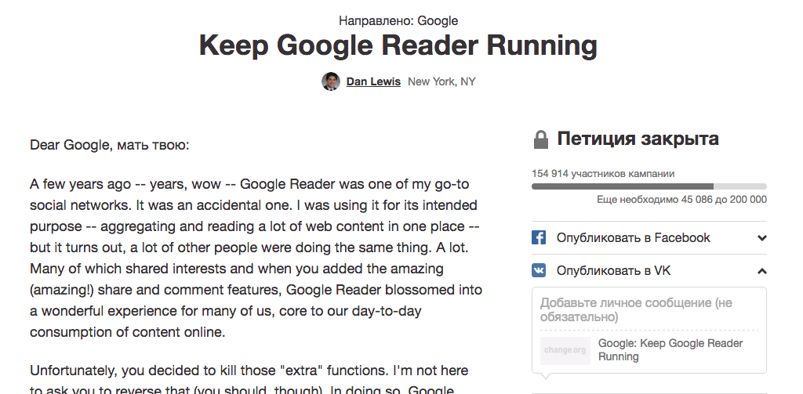

+++
date = 2016-03-22T08:08:20Z
description = "Пока не слишком поздно."
featured = true
image = "/shoot-the-feature/cover.png"
slug = "shoot-the-feature"
tags = ["productology"]
title = "Пристрелите фичу"
subscribe = "dangry"
+++

Фич всегда слишком много, а денег и времени — недостаточно. Вы и сами это знаете, если разрабатываете софт для реального мира, а не страны пресветлых эльфов. Трагическое несовершенство жирных фич и тощих сроков каждый разрешает для себя сам, но некоторые способы сильно лучше других.

Вот какие варианты усекновения фич мне встречались.

## Снять с забега

Капитанский совет: перед тем, как отдавать функцию в разработку, проверьте — может она вовсе не нужна? Ориентируйтесь на ценность для потребителя. Три простых правила:

- если фичу не просят каждый месяц, она не нужна;
- если фичу просят [не те, кто будет ей пользоваться](https://antonz.ru/users-not-backlog/) — она бесполезна;
- если даже по оптимистичным прогнозам вы заработаете на фиче меньше, чем потратите на разработку — выкиньте ее.

<figure>
  
  <figcaption>Наивные пользователи просят <a href="https://www.change.org/p/google-keep-google-reader-running">вернуть гугл-ридер</a></figcaption>
</figure>

## Поставить заглушку

Если снять фичу с забега не хватает духа, а вкладываться в реализацию страшно, поставьте заглушку.

> Статическая картинка — вместо сложной адаптивной верстки.

> Промо-страница с формой сбора электронной почты — вместо полноценного приложения.

> Кнопка «отменить подписку», которая открывает чат с техподдержкой — вместо автоматической отписки.

Соберите статистику использования и обратную связь — потом решите, что делать с фичей дальше.

## Упростить

Все любят усложнять: заказчики, аналитики, разработчики. Поэтому если у вас есть требования к системе, можете быть уверены — они переусложнены. Когда сроки кусают за попу, самое время радикально упрощать.

Вариант первый: решить задачу другим, более простым способом. Часто это замена большой и умной бизнес-логики на ручной труд оператора.

> Медицинская клиника: вместо интеллектуального алгоритма автоматического подбора врача по симптомам — кнопка «Заказать звонок». Сотрудник легко справится, причем лучше любого алгоритма.

<figure>
  
  <figcaption>Победитель среди форм записи на прием к врачу — <a href="http://artgorbunov.ru/bb/soviet/20140825/">чат с девушкой из регистратуры</a></figcaption>
</figure>

Вариант второй: предусмотреть только основной сценарий, удобный для большинства случаев. И не поддерживать более редкие альтернативы.

> CRM-система: сортировать заказы в списке по дате создания. Менять сортировку нельзя. 3% пользователей страдают, а остальным как-то пофиг.

## Изолировать изменения

Способ подходит, если вы делаете улучшенную версию старой унылой системы. Тогда, если не успеваете исправить все — измените один участок, не трогая смежные.

> Интернет-банк: причесать внешний вид личного кабинета, а функциональность не менять.

> Сайт компании: сделать новую главную страницу, остальные оставить как были.

> Интернет-магазин: починить ужасную форму заказа, не трогая карточку товара и регистрацию.

<figure>
  
  <figcaption>Система мониторинга серверов <a href="https://habrahabr.ru/company/zabbix/blog/277265/">Заббикс 3</a> стала визуально опрятнее, а функциональность не изменилась</figcaption>
</figure>

## Замести под ковер

У зрелой программы всегда есть участки, которыми нормальный человек без мата пользоваться не в состоянии (у сложных систем такие участки обычно составляют ≈90%, но это отдельный разговор).

Просветленные дизайнеры и аналитики про такие куски знают и мечтают их переделать. Если получается — хорошо. Но если не успеваете, попробуйте скрыть плохую часть, чтобы снизить ее отравляющее влияние на остальную систему.

> CRM-система: старый неудобный интерфейс работы с историей обращений клиента спрятан за кнопкой *История* на новой удобной карточке клиента.

## Отложить на потом

Вообще сейчас не делать, перенести на следующую итерацию. Слабый вариант: поскольку фичи нет вовсе, бизнес-задача не решена, и заказчик страдает.

Часто до отложенных фич дело не доходит никогда. Проверьте свой бэклог, если не верите.

## Впихнуть невпихуемое

Любимый способ криворукого управленца. Урезать тестирование, поработать 60 часов в неделю, срочно нанять еще пять разработчиков, молча продолбать сроки, выпустить неработающую функцию, а потом с каменным лицом допиливать — вариантов много. Не делайте так.

<figure>
  
  <figcaption>Помните: при попытке впихнуть невпихуемое выпихивается ранее впихнутое<figcaption>
</figure>

## Ω План действий

1. Начните с потребностей, которые закрывает фича. Если их нет, выкидывайте.
2. Упрощайте реализацию и изолируйте изменения. Старайтесь сохранить пользу для потребителя.
3. Если все равно не влезает — заметите под ковер.
4. Отложите, если не осталось других вариантов.
5. Никогда не впихивайте невпихуемое.
