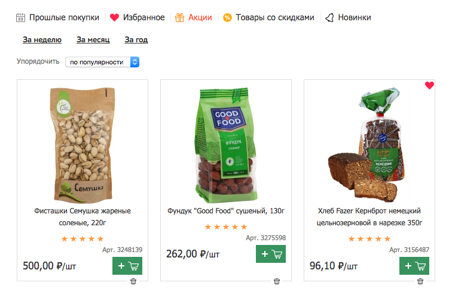
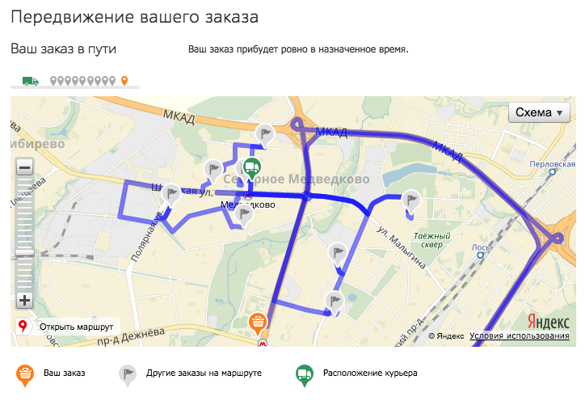
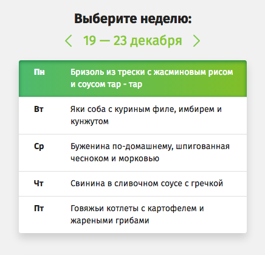

+++
date = 2016-12-15T09:25:00Z
description = "Хорошие продукты и интерфейсы упрощают жизнь. С этим обычно все согласны. Споры начинаются, когда придумывают, что и как упрощать."
featured = true
image = "/simplify-users-life/cover.jpg"
slug = "simplify-users-life"
tags = ["productology"]
title = "Как упростить пользователю жизнь"
+++

Хорошие продукты и интерфейсы упрощают жизнь. С этим обычно все согласны. Споры начинаются, когда придумывают, что и как упрощать.

Например: есть сеть супермаркетов с доставкой на дом. Интерфейс — интернет-витрина, через которую люди заказывают продукты. Очевидное уже упростили: идти в магазин не надо, натыкал мышкой, картой оплатил, назавтра получил. Что дальше?

Дональд Норман, автор книги «Дизайн привычных вещей», выделяет четыре способа упростить задачу. Примерим на наш супермаркет и его лояльных клиентов — Валеру и Настю:

## Снизить умственную нагрузку

<em>Было:</em>
Валера каждый раз, как в первый раз, набирает корзину с помощью фильтров по категориям и поиска.

<em>Стало:</em>
Магазин в первую очередь предлагает прошлые и «популярные» у Валеры товары. Если Валера каждый месяц заказывает бумажные полотенца, а тут вдруг забыл — напомнит. Предложит замену, если из ассортимента пропали любимые Валерины колбаски.

<figure><figcaption>«Прошлые покупки», избранное, акции, новинки — эти разделы помогают покупателю не напрягать особо мозг. Еще помогает кнопка «повторить предыдущий заказ».</figcaption></figure>

## Показать внутреннее состояние

У нашего супермаркета «окно» приезда курьера — два часа. Меньше ну никак не получается.

<em>Было:</em>
Насте приходится эти два часа сидеть дома, как приклеенной, и гадать, когда явится курьер.

<em>Стало:</em>
На сайте супермаркета Настя видит маршрут «своего» курьера на карте. Метки на маршруте — заказы и расположение курьера. По карте примерно понятно, когда курьер доберется до Насти, поэтому она спокойно планирует дела.

<figure><figcaption>«Утконос» пытается показать курьера на маршруте, но делает это так топорно, что помощи клиенту никакой.</figcaption></figure>

## Взять часть задачи на себя

<em>Было:</em>
Каждую пятницу Валера садится за компьютер, морщит мозг и заказывает продукты на неделю вперед. Ну, это в теории так. На практике Валера то вовсе забудет, то половину не закажет. Приходится потом бегать в магазин по соседству или баловать себя бутербродами с хлебом.

<em>Стало</em>:
Магазин сам регулярно формирует заказ, с учетом Валериных вкусов, бюджета и желания хоть чуть-чуть сбавить пузо к лету. В пятницу присылает Валере емейл, Валера подтверждает жмаком кнопки, в субботу получает заказ.

## Трансформировать суть задачи

Понятно, что покупка продуктов для Насти — не самоцель. Цель у нее другая: вкусно и разнообразно питаться без вреда для фигуры и цвета лица, и не посвящать жизнь готовке. Поэтому теперь Настя выбирает готовое меню на неделю и получает расфасованный по блюдам заказ. Каждого продукта ровно столько, сколько необходимо. Для завтрака, обеда и ужина прилагается рецепт на 20–30 минут готовки. Удобно!

<figure></figure>

По похожему принципу работают сервисы доставки еды на неделю — «Шефмаркет», «Партия еды» и другие.  
Но это только первый шаг, привязка к целям очень условная.

⌘&nbsp;⌘&nbsp;⌘

Первый шаг — снизить умственную нагрузку — так или иначе осиливают все проектировщики.

Вторым — показать внутреннее состояние — в основном злоупотребляют: показывают «внутреннюю кухню» там, где она клиенту вообще не интересна.

Третий шаг — взять часть задачи на себя — это то, в чем хороший продукт опережает конкурентов.

Ну, а кто делает четвертый шаг — трансформирует суть задачи — срывает банк.

 

<em>Заметка из телеграм-канала <i class="far fa-star color-sin"></i> «<a href="tg://resolve?domain=dangry">Интерфейсы без шелухи</a>»</em>

