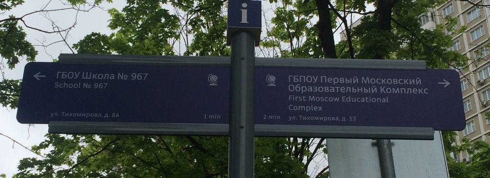
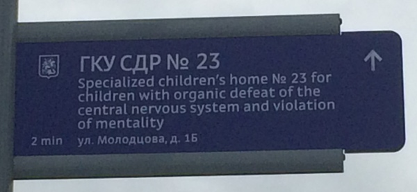
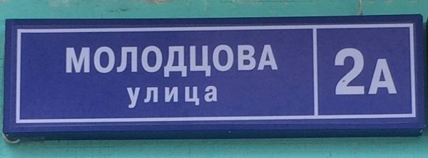

+++
date = 2016-05-18T10:39:00Z
description = "После победы над метро мозговой слизень перебрался в мэрию и расставил на улицах указатели. Вот что из этого вышло."
image = "/slug-navigation/cover.jpg"
slug = "slug-navigation"
tags = ["life"]
title = "Мозговой слизень атаковал городскую навигацию"
+++

После [победы над метро](/fixing-escalator-announcement/) мозговой слизень перебрался в мэрию. Теперь на перекрестках Москвы ставят вот такие указатели:

    

ГБОУ Школа № 967

ГКУ СДР № 23

МАУ ДО СОЦ КД «БЕРЕЗКА»

ЗБС УПРЛС № 111

Предположим, в спальных районах действительно нечего писать на указателях, кроме детских садов и школ (хм). Но *как* это написано.

Я сейчас буду предельно жесток. Большего идиотизма... погодите, пришел человек из мэрии... хм, что-то ползет по затылку... ой! Так вот, я говорю — молодцы в мэрии. Мне реально важно понимать, что там не дом ребенка, а государственное казенное учреждение. Не школа, а государственное бюджетное образовательное учреждение.

Но есть недоработка. Я заметил, что на домах таблички остались старые, неинформативные:

Просто «улица Молодцова, 2А» — это как вообще? Следует исправить:

- ОАТД ГМ улица Молодцова, КСТД № 2 ЛИТ А
- Объект административно-территориального деления города Москвы улица Молодцова, капитальное сооружение типа «дом» № 2 литер А

Надеюсь, что новые таблички просто не успели развесить, и скоро мы их увидим.

Еще по теме:

- Студия Лебедева [анонсирует указатели](http://www.artlebedev.ru/everything/moscow/street-signs/)
- Тема Лебедев пишет, [что из этого получилось](http://tema.livejournal.com/2149952.html)

<em>Слизни не пройдут: <i class="far fa-star color-sin"></i> «<a href="https://t.me/dangry">Интерфейсы без шелухи</a>»</em>

