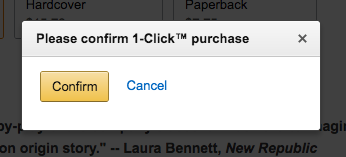

+++
date = 2017-03-23T15:20:00Z
description = "Покупку одной кнопкой, без оформления заказа, придумал лично Джеф Безос, основатель Амазона. Придумал, поставил задачу, сделали. Презентуют."
slug = "1-click"
tags = ["productology", "60-sec"]
title = "Купить в 1 клик"
subscribe = "dangry"
+++

Покупку одной кнопкой, без оформления заказа, придумал лично Джеф Безос, основатель Амазона. Придумал, поставил задачу команде, взяли в работу, сделали. Презентуют. Безос заходит на страницу книги, жмёт «купить в 1 клик» и… Получает окошко с подтверждением «Точно купить? Да / Нет».

Джеф сожрал продакт-менеджера, а разработчиков заставил окошко убрать. Так на Амазоне появилась покупка в 1 клик.

А кнопка «купить в 1 клик», которая торчит в каждом втором интернет-магазине, на самом деле означает «перезвоните мне». М-м-маркетологи, м-м-мать.
