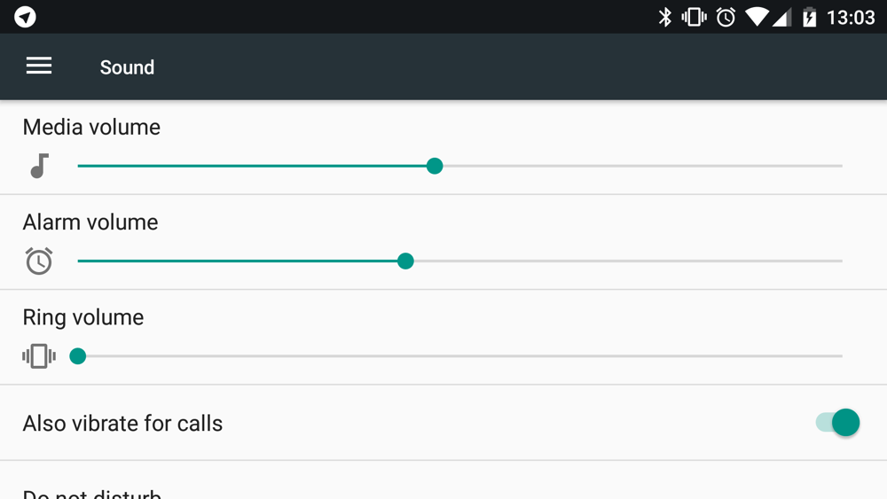

+++
date = 2017-11-29T10:22:37Z
description = "Если бы Гугл был рыцарем, то девизом следовало выбрать «пренебрежение к деталям»."
image = "/android-lego/cover.jpg"
slug = "android-lego"
tags = ["interface", "60-sec"]
title = "Андроид и китайское лего"
+++

Однажды мне достался китайский ноунейм-аналог лего. Издалека он выглядел в точности как настоящий, но вблизи иллюзия разрушилась: блёклые кирпичики из плохой пластмассы, уродливые люди с болтающимися руками, а кубики не держатся вместе. Наверно, китайцы сочли, что всё это мелочи.

Андроид, при всех своих достоинствах (их полно, без шуток) — китайское лего. Если бы Гугл был рыцарем, то девизом следовало выбрать «пренебрежение к деталям».

Вот несколько примеров для моих друзей, лишенных радости ежедневного взаимодействия с андроидом.

⌘&nbsp;⌘&nbsp;⌘

Иконка часов всегда показывает 11:10, а календарь — 31 число (в айоси они показывают текущее время и день, если что).

Слайдеры громкости (они раздельные для музыки и звонка) отградуированы по-разному. Соответственно, их невозможно поставить в одинаковое положение. Чей больной мозг вообще это придумал?

<figure>
  
  <figcaption>Кошмар перфекциониста — разные деления на слайдерах громкости</figcaption>
</figure>

В 7 андроиде одна и та же кнопка в панели быстрых настроек ведёт себя по-разному. Например, в одном случае отключает wifi, в другом — открывает настройки.

8 андроид жужжит и показывает оповещение каждый раз, когда пропадает сеть. Соответственно, в метро это гад жужжит постоянно. И нет, это не отключается.

8 андроид считает своим долгом сообщить, когда какая-то программа работает в фоне. Наверно, это станет новостью для дизайнеров Гугла, но программы *постоянно* работают в фоне. Угадайте, какое оповещение я теперь вижу чаще всего?

⌘&nbsp;⌘&nbsp;⌘

Я могу продолжать долго, но ограничусь последним штрихом, который отлично показывает внимание дизайнеров Гугла к деталям.

  

  
Приложение такси и приложение такси. Как бы назвать папку? Хммм. А! Unnamed Folder!

Если объединить несколько значков в папку, андроид назовёт её Unnamed. Ну правда, откуда ему знать, что там в папке? Конечно, человек скачал приложения из стора, где все они разбиты по категориям. Но теперь-то они не в сторе, а на рабочем столе, верно? Решительно невозможно придумать адекватное название для папки. Удивительно, что айось как-то с этим справляется.

<em>А хорошие интерфейсы — в телеграм-канале <i class="fa fa-star-o color-sin"></i> «<a href="https://t.me/dangry">Интерфейсы без шелухи</a>»</em>

