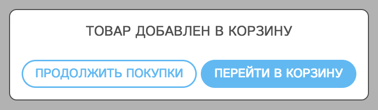

+++
date = 2017-11-14T08:58:30Z
description = "В России огромное количество плохих интернет-магазинов. И виноваты в этом разработчики."
image = "/bad-bad-shop/cover.jpg"
slug = "bad-bad-shop"
tags = ["interface", "life", "60-sec"]
title = "Плохой, плохой магазин"
+++

В России огромное количество плохих интернет-магазинов. В смысле, которыми неудобно пользоваться. И виноваты в этом не владельцы магазинов, которые не понимают в интерфейсах и не читают Baymard. Виноваты разработчики «коробок» и облачных платформ для магазинов, которые этого не делают.

Это они придумали спрашивать про «Ваш город — Самара. Мы угадали? Да / нет». Это они после складывания каждого товара в корзину показывают модальное окно «Продолжить покупки или перейти в корзину?». Это они начинают чекаут с требования зарегистрироваться.

Это они называют «заказом в один клик» функцию «перезвоните мне». Это они требуют ввести регион «город Москва» и город «город Москва». И обязательно индекс, а то как же без него доставку считать. И телефон в правильном формате, будьте добры. Докажите, что вы достойны покупать в нашем магазине, уважаемый.

Ах у вас блокировщик рекламы включён? Тогда точно недостойны, для вас кнопка «Оформить заказ» не работает (это прям мода такая пошла, привязывают кнопку к счётчику Метрики, нет счётчика — нет заказа).

Идея для стартапа: сервис, на котором проще сделать хороший магазин, чем то что сейчас делают.

