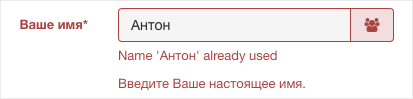

+++
date = 2017-01-16T09:46:33Z
description = "Абсурдное поведение системы часто имеет логичное объяснение со стороны разработчиков. Но такая «логичность» — иллюзия."
image = "/bug-not-feature/cover.jpg"
slug = "bug-not-feature"
tags = ["productology"]
title = "Баг, не фича"
subscribe = "dangry"
+++

Абсурдное поведение системы часто имеет логичное объяснение со стороны разработчиков. Под разработчиком имею в виду любого, кто смотрит «изнутри» — это может быть менеджер, дизайнер или тестировщик. Но такая «логичность» — иллюзия.

Захотел я в одном сервисе изменить имя в профиле. Было «Антон Жиянов», а я решил поставить просто «Антон», чтобы не так официально. Зашел, изменил, сохранил, получил ошибку:

«Имя „Антон“ уже используется». Очевидный баг, верно? Ан нет.

Я написал разработчикам, и получил ответ основателя сервиса: это фича. Оказывается, некоторые злодеи-пользователи ставили себе имя «Администратор» и обманом входили в доверие более наивных пользователей. Мощное обоснование, а?

Со стороны понятно, что проблема «пользователи выдают себя за администраторов» не решается через «запретим людям иметь одинаковые имена». Но разработчику «изнутри» кажется, что всё логично.

К чему я это. Если вы только пришли в проект, самое время вскрывать нелепые «багофичи», пока у вас свежий взгляд. Выписывайте всё, что кажется странным. Расспрашивайте коллег о причинах. Думайте, как достичь цели по-человечески, без костылей.

А если вы на проекте давно, то не отметайте с ходу «глупые» вопросы новичков. Лучше задумайтесь — вдруг люди «снаружи» считают вашу фичу глупым багом?
