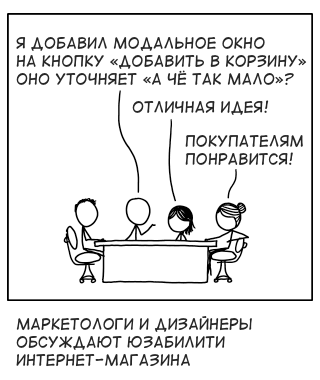
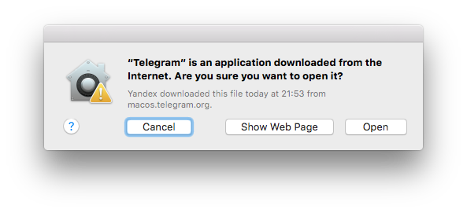
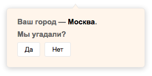
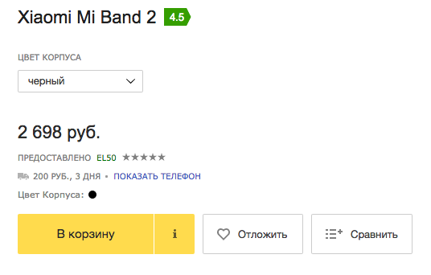
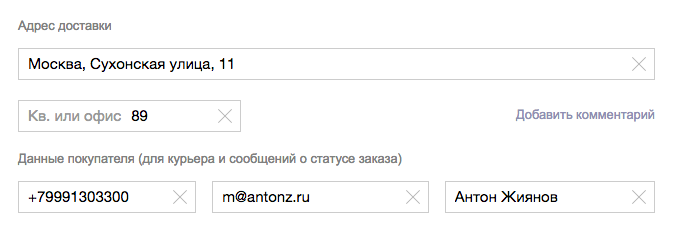
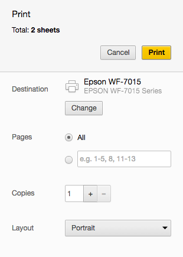
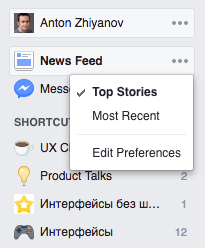

+++
date = 2017-03-09T07:54:20Z
description = "Каждый раз, когда вы просите пользователя сделать выбор — заставляете принимать решение. Это не всегда плохо."
featured = true
image = "/choice/cover.jpg"
slug = "choice"
tags = ["interface"]
title = "Главное правило выбора в интерфейсе"
subscribe = "dangry"
+++

<figure>
    
    <figcaption>
    <em>Обложка — <a href="https://xkcd.com/1804/">xkcd</a></em></figcaption>
</figure>

Главное правило выбора из нескольких вариантов в интерфейсе сформулировал Джоэл Спольски 16 лет назад:

> Каждый раз, когда вы просите пользователя сделать выбор — заставляете принимать решение. Это не всегда плохо. Но точно плохо, если выбор не относится к задаче, которую решает человек. Лучше сделать выбор за пользователя везде, кроме его основной задачи.

## Второстепенная задача → выбор делает программа

Делайте выбор за пользователя везде, где это не относится к его цели. Пример «как не надо»: когда в первый раз запускаешь приложение в макоси, она спрашивает:

<figure>
    
    <figcaption>Это приложение скачано из интернета. Точно запустить?</figcaption>
</figure>

Такой выбор НЕ относится к моей цели, поэтому делать его я не хочу, и этого дурацкого окна в природе существовать не должно. (Отдельно оцените гениальность формулировки: «скачано из интернета», ну надо же! Откуда оно ещё могло взяться, самозародиться в недрах операционной системы что ли?)

    <h3>Если от предыдущего абзаца в вас бурлит негодование</h3>
    
Конечно, я в курсе, что в данном случае Эпл имеет в виду «скачана не из апстора». Но это ровно ничего не меняет. Смотрите сами:

    <ul>
        <li>1. Апстор — это тоже интернет. Противопоставление между апстором и интернетом существует только в голове сотрудников Эпла.</li>
        <li>2. Противопоставление «апстор—интернет» можно было бы понять, если процессы установки приложения из апстора и вручную были полностью идентичны и отличались только последним шагом. Но они совершенно разные.</li>
        <li>3. Я знаю, что приложение из интернета. Алё, я сам его оттуда скачал.</li>
        <li>4. Человек в здравом уме и твердой памяти, который только что сознательно запустил приложение, не передумает и не нажмёт на «ой, не надо».</li>
        <li>5. Приложение «из интернета» не менее безопасно, чем приложение из апстора. Если бы оно было от неидентифицированного разработчика, макось вообще не дала бы его запустить (отдельная тема для разговора).</li>
    </ul>
    
Следовательно, для пользователя Эпловое предупреждение не имеет смысла.

Ещё пример «как не надо». Большинство магазинов умеют автоматически определять город посетителя по айпи-адресу. Но некоторые делают это так:

    

        <figure>
            
            <figcaption>Не думаю, что задача сыграть в «угадайку» — основная для покупателя магазина</figcaption>
        </figure>
    

Хороший магазин определяет город *молча*. Логичный вопрос: что делать, если машина ошиблась и сделала неправильный выбор? Что, если город неправильный? Ну, тогда человек просто сам укажет правильный вариант, когда это потребуется — когда дело дойдёт до покупки. Ничего страшного.

Лучше угадать в 80% случаев и ошибиться в 20% (и дать возможность человеку исправить ошибку), чем в 100% случаев бесить людей неинтересным им выбором.

## Основная задача → выбор делает человек

Если выбор напрямую относится к задаче пользователя — он полезен. Но всё равно хорошо выделить *основной* (по мнению программы) вариант. Например, Мейлчимп перед отправкой писем подсвечивает кнопку «Отправить», но рядом показывает серенькую «Запланировать» — на случай, если человек не хочет отправлять прямо сейчас.

Основной вариант — это либо *самый популярный*, либо *прошлый выбор*.

### Самый популярный вариант

По статистике использования или данным пользовательского тестирования. На карточке товара основное действие — добавить в корзину:

    

        <figure>
            
            <figcaption>Основной вариант очевиден, но если человеку нужно отложить товар или добавить к сравнению — он догадается, как это сделать.</figcaption>
        </figure>
    

### Прошлый выбор

Выбор, который человек сделал раньше в аналогичной ситуации. Пользователь указал адрес при первом заказе — магазин использует его при следующих покупках:

    

        <figure>
            
            <figcaption>Программа оставляет возможность изменить выбор — с прошлого раза обстоятельства могли измениться.</figcaption>
        </figure>
    

Пример на сочетание популярного варианта и прошлого выбора. Диалоговое окно печати:

    

        <figure>
            
        </figure>
    

    

        
Принтер от прошлой печати. Страницы, количество копий и ориентация листа — умолчательные, наиболее типичные значения.

         
        
Возможно, программа не угадала с выбором, и пользователь хочет напечатать в ПДФ с альбомной ориентацией. Стоит ради этого блокировать кнопку «печатать», пока человек не указал принтер и остальные параметры? Нет, конечно. Если железяка ошиблась, человек исправит. Ничего страшного.

    

## Слишком много вариантов → выбор делает программа

Иногда вариантов в основной задаче пользователя слишком много, поэтому выбор всё-таки приходится делать программе. Это характерно для медиа (новости, соцсети) и магазинов. 

Обычно показывают «рекомендуемые» варианты на основе прошлых предпочтений пользователи (какие посты он лайкал или товары покупал). А поскольку люди не любят, когда им всё навязывают, программа оставляет иллюзию контроля (скрыть не понравившийся пост в Фейсбуке).

    

        <figure>
            
        </figure>
    

    

        
Иллюзия контроля над лентой фейсбука. Если выбрать вариант «Most Recent», фейсбук выключит «алгоритмическую» ленту и будет показывать все посты. Но недолго. Вскоре он молча вернёт настройку «Top Stories» и вас не спросит.

    

⌘ ⌘ ⌘

Если вы проектируете обычные приложения, придерживайтесь правила Спольски:

1. Делайте выбор за человека во второстепенных задачах.
2. Оставляйте ему выбор в основных задачах. Но подсвечивайте предпочтительный вариант.
3. В любой непонятной ситуации ориентируйтесь на прошлый выбор пользователя.
