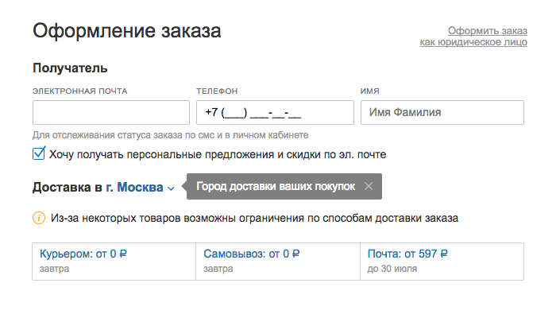

+++
date = 2017-07-27T08:47:46Z
description = "Как магазину избавиться от назойливого попапа выбора города, если цены и доставка отличаются в разных городах."
image = "/delivery-city-puzzle/cover.jpg"
slug = "delivery-city-puzzle"
tags = ["interface", "puzzle"]
title = "Задачка: город в интернет-магазине"
+++

Два дня назад я предложил читателям телеграм-канала «<a href="https://t.me/dangry" class="nowrap">интерфейсов без шелухи</a>» такую задачку:

<h3>Город в интернет-магазине</h3>

Есть интернет-магазин, работает по всей стране. От города к городу отличаются доступные способы и стоимость доставки. Цены на 95% товаров одинаковые для всех городов, но для 5% отличаются.

Раньше магазин показывал каждому посетителю при входе такой попап:

<blockquote>
Ваш город — «Санкт-Петербург». Мы угадали? 
ДА / НЕТ

</blockquote>

Но пришёл новый директор по маркетингу и категорически требует попап убрать — он, мол, бесит покупателей. Что делать, чтобы и маркетолога удовлетворить, и покупателям по ценам и доставке не наврать?

Теперь время разобрать решение. Неожиданно для меня откликнулось аж 80 человек. Ребята, спасибо вам большое! Простите, что не перечисляю всех в заметке — очень много отличных ответов ¯\\\_(ツ)\_/¯

Попробую собрать их вместе. Поехали.

### Сначала обоснуй

Некоторые предложили с ходу отправить маркетолога куда подальше — иди мол, докажи с данными в руках, что попап реально мешает.

Я согласен, что в неочевидных ситуациях надо опираться на данные. Но не уверен, что заслоняющий главную страницу попап требует дополнительных исследований ツ

## Выбор города без насилия над личностью

Магазин уже автоматически определяет город — значит, осталась только вместо попапа молча вывести его в шапке:

По тыку на название город можно поменять.

Некоторые предложили добавить в шапку призыв проверить правильность геолокации:

Тоже вариант, если место позволяет. Но не подходит для мобильных.

@KarelWintersky резонно заметил, что иногда геолокация покажет страну, в которой магазин вовсе не работает (например, продаёт по России, а человек по айпи в Казахстане). И предложил для таких случаев показывать попап. Я бы всё же попап не показывал, а выбрал город по умолчанию (самый популярный для магазина).

И отличное дополнение от [Александра Попова](https://www.facebook.com/grepto):

> Если определился город, с которым магазин не работает — ставим ближайший к нему.

Насчёт геолокации. Она бывает двух видов: по айпи-адресу и по геокоординатам от браузера. По айпи менее точно, но работает прозрачно для пользователя. По координатам более точно, но браузер спрашивает разрешение (особенно бесит оно на мобильных, потому что выглядит как попап). Лично я за определение по айпи только потому, что оно не теребит пользователя.

## Город и стоимость доставки

Стоимость и время доставки волнуют человека, только когда он определился с товаром. Поэтому город при входе на сайт можно не спрашивать. Вместо этого на карточке товара пишем:

> Доставим в <u>Санкт-Петербург</u> послезавтра, от 300 ₽

Если человек видит, что магазин не угадал с городом, тыкает на «Санкт-Петербург» и выбирает свой вариант.

Ещё рабочее решение: не показывать стоимость доставки вовсе, пока человек не начнёт оформлять заказ и не укажет там адрес. Есть адрес — всё понятно с доставкой.

Со способами доставки — аналогично.

## Город и стоимость товаров

Тут интереснее. Едкое замечание прислал [Эван Коненко](https://www.facebook.com/evan.konenko):

> Директору по маркетингу стоит намекнуть, что разные цены на товары в зависимости от региона раздражают гораздо сильнее несчастного попапа. Разнобой в ценах — типичная недоработка маркетологов и продактов.

Действительно, может оказаться, что проще и правильнее выровнять все цены, чем решать это в интерфейсе.

Но предположим, что цены никак не поменять. Стоит ли тыкать в человека выбором города ради 5% товаров? Большинство считает, что нет — и я с этим согласен.

Вот рабочие варианты, что делать для 5% товаров, по которым цены отличаются:

1. Показывать наибольшую цену, а при изменении города уменьшать её и радовать человека «скидкой». Сработает, если разброс цен по городам небольшой.
2. Явно писать рядом с ценой, для какого она города («5250 ₽  в <u>Санкт-Петербурге</u>»). При смене города пересчитывать стоимость корзины и уведомлять покупателя.

Остроумное решение предложил Игорь @vespexx: показывать минимальную цену, а дельту при необходимости добавлять в стоимость доставки. Стоимость доставки при этом определять на этапе оформления заказа, когда город уже точно известен.

### Подвох с геолокацией и городом доставки

Эван Коненко указал на подвох в условиях задачи:

> Проблему с различными ценами на товары в зависимости от региона не решает ни существующий попап, ни автоматическое определение локации, ни пальцы пользователя в дверях, потому что определяющим цену является *адрес доставки*, а не нынешнее месторасположение покупателя. Таким образом, мы работаем с переменной, значение которой узнаем где-то в середине пользовательского заказа.

Действительно, человек может быть в Питере, а заказывать для Омска. Но я не думаю, что это большая проблема — такой покупатель точно обратит внимание на город, и сам выберет Омск.

## Что не сработает

Несколько решений, которые я бы в свой магазин не поставил:

<em>Дорогой попап</em>
Оставить попап, но добавить ему ценности (засунуть туда спецпредложение).

<em>Цену не скажу</em>
Не показывать цену товара, пока пользователь явно не выберет город. Сюда же — не показывать такие товары вовсе.

<em>Сам разбирайся</em>
Показывать вилку цен со сноской и пояснением. Сюда же — показывать наименьшую цену и ссылку «посмотреть цены по всем городам».

<em>Гражданин, ваши документы</em>
Сделать отдельную стартовую страницу, на которой будет *только* выбор города. Не выбрал — на сайт не пускать!

⌘&nbsp;⌘&nbsp;⌘

Ещё раз спасибо всем участникам! Любые вопросы и замечания пишите в личку — [@nalgeon](https://t.me/nalgeon). Продолжим через недельку ツ

<em>Решайте задачки на канале <i class="fa fa-star-o color-sin"></i> «<a href="https://t.me/dangry">Интерфейсы без шелухи</a>»</em>

