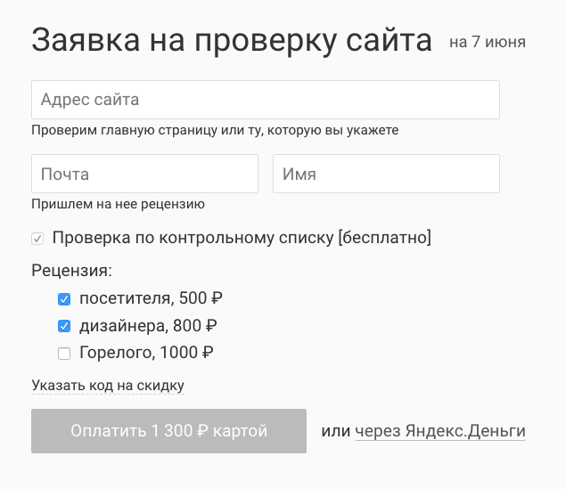

+++
date = 2017-08-14T06:43:58Z
description = "Суперсила хорошего дизайнера — находить простые решения. Особенно это полезно в стартапах."
image = "/design-superpower/cover.png"
slug = "design-superpower"
tags = ["interface"]
title = "Суперсила дизайнера"
+++

Суперсила хорошего дизайнера — находить простые решения. Особенно это полезно в стартапах и, напротив, в сложных продуктах с большой историей:

- В стартапах важно двигаться как можно быстрее, а простые решения экономят время.
- В продуктах с историей интерфейс наслаивался годами, часто без оглядки на внутреннюю логику и удобство использования, и в результате так и просит упрощения.

Сегодня о первой ситуации — стартапах.

Возьмем сервис юзабилити-аудита, который показывает проблемы в UX сайта глазами обычного посетителя и дизайнера:

1. Клиент оставляет заявку.
2. Она распределяется между рецензентами.
3. Те пишут отзывы.
4. Результат отправляется клиенту.

<figure>

<figcaption>У каждой заявки до трёх рецензентов, которых надо как-то координировать</figcaption>
</figure>

Классический подход к конструированию таких программ: делаем фронтенд с формой заявки и админку с бизнес-процессом. В админке регистрируются рецензенты, у каждого дашборд, где видны новые заявки. Рецензенты откликаются на заявки, бизнес-логика следит, чтобы два человека не взяли одну и ту же заявку и чтобы один рецензент не забрал себе слишком много заявок.

Неплохо добавить ещё оповещение по почте, чтобы рецензенты оперативно узнавали о заявках. А может лучше слать пуш-уведомления на смартфон? Да, и обязательно нужен отдельный интерфейс модератора, где он проверит заявку и вернёт рецензенту, если тот фигню написал.

Ох, а ещё надо отзывы рецензентов скомпоновать в красивый отчёт. И хорошо бы добавить поддержку визуальных комментариев, форматирования и картинок в отзывах.

Чувствуете миллион рублей и полгода работы, которые придется потратить на разработку сервиса?

Теперь к чёрту классический подход и включаем суперсилу. Пристальный взгляд на рецензентов показывает, что они — активные пользователи фейсбука. Создаем секретную группу, приглашаем в неё рецензентов, администратор группы — модератор.

Делаем фронтенд с заявкой, каждая заявка — пост в группе. Чтобы забрать заявку, рецензент оставляет комментарий. Там же модератор пишет замечания, если есть.

Всё. Админка не нужна, сервер с базой не нужен, уведомления работают из коробки. Сама рецензия — гуглодокумент: в нём и совместная работа, и форматирование, и комментарии. Сервис делается с нуля за два дня без программирования.

Простые решения срезают углы и игнорируют нюансы. Но в стартапе это даже хорошо: никто не знает, куда в итоге вывезет продукт, а простые решения переделывать легче, чем сложные.

<em>Заметка из рассылки <i class="fa fa-star-o color-sin"></i> «<a href="https://dangry.ru/sin/">Интерфейсы без шелухи</a>»</em>

<em>Обложка — <a href="https://thenounproject.com/term/charging-superpower/882197/">Gan Khoon Lay</a></em>

