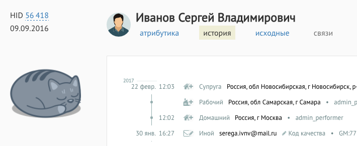

+++
date = 2017-02-28T08:11:56Z
description = "Почему стоит закладывать «пасхальное яйцо» в каждый проект или даже отдельную задачу."
image = "/easter-egg/cover.png"
slug = "easter-egg"
tags = ["productology", "life"]
title = "Делайте пасхалки"
subscribe = "dangry"
+++

«Пасхальное яйцо» в программе — это такая неочевидная для других деталь, которая приятно греет вам сердце. Если потребитель заметит пасхалку — порадуется, а если нет — ничего страшного. Главное, вы знаете, что она есть.

Мне нравится закладывать пасхалки в каждый проект или даже отдельную задачу. Это не требует много времени, а результату придает какую-то особую душевность.

Пример: в ХФЛабс мы разрабатываем суровый корпоративный продукт для банков и страховых компаний. Я обычно пишу для него заметки к релизу. И в одном из релизов добавили новый тип документа, удостоверяющего личность: свидетельство о предоставлении временного убежища. Ну, я решил приложить картинку для наглядности:

<figure>
  
  <figcaption>Бедняга наконец-то получил документы.</figcaption>
</figure>

Если читатель не заметит пасхалку, ничего — иллюстрация всё равно выполняет свою функцию. Но мне радостно знать, что она здесь ツ

Или ещё: в том же самом корпоративном продукте живёт котик. Это не слишком типично для энтерпрайзного софта, и если пользователи его находят — приятно удивляются.

<figure>
  
  <figcaption>Прикорнул <a href="http://hflabs.ru/products-services/common-client/functions/">на карточке клиента</a>.</figcaption>
</figure>

Пасхалки можно встраивать в интерфейс, текст, изображения. Да даже в сугубо технические штуки. Например, на сайте «интерфейсов без шелухи» адреса страниц имеют особый смысл, заметит который один человек на миллион. А в глубине многомегабайтных исходников, в функции сборки программы, я как-то наткнулся на комментарий «make love, not WAR» (шутка будет понятна только джавистам).

По моей экспертной оценке, использование пасхалок повышает продолжительность жизни на 4,2%. Делайте пасхалки!
