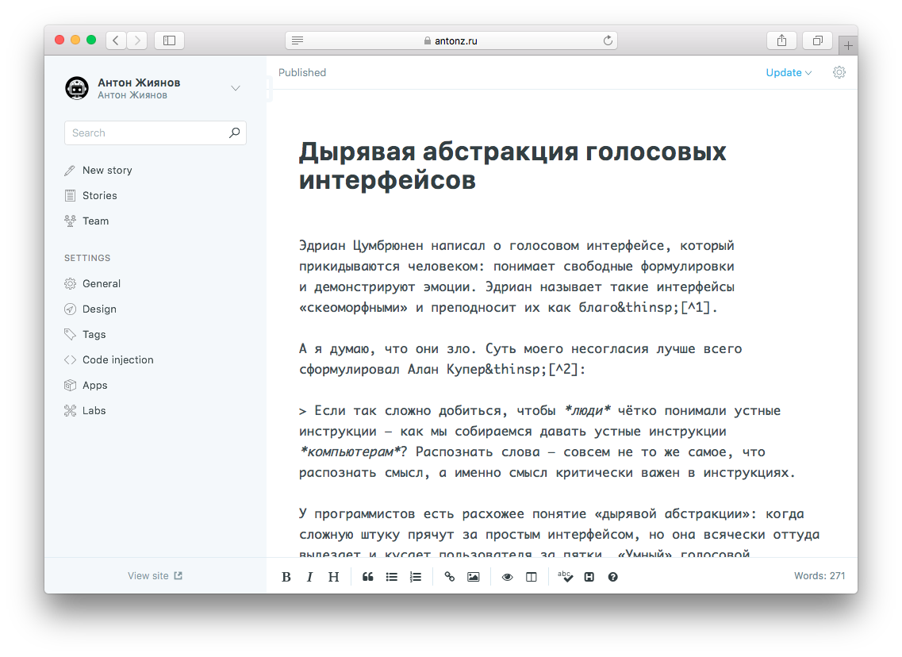
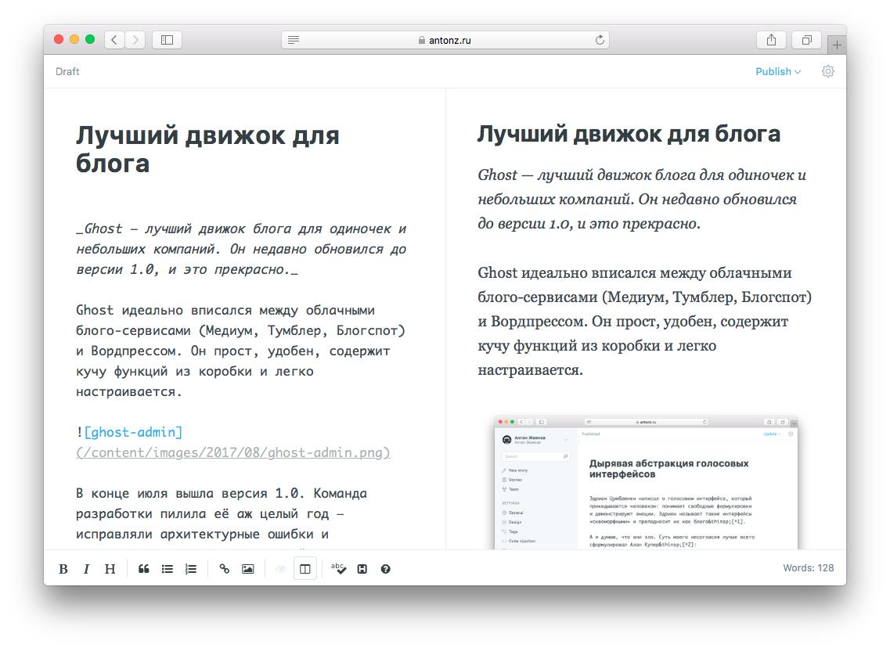
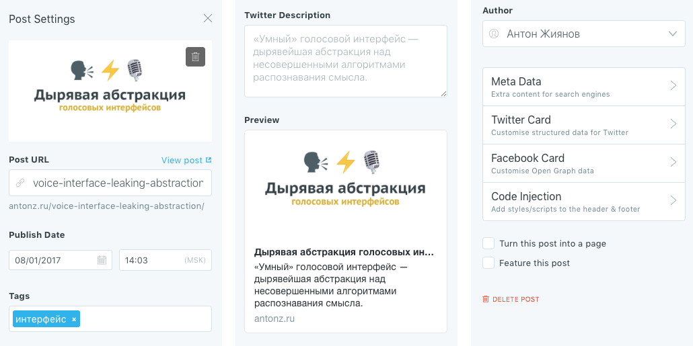
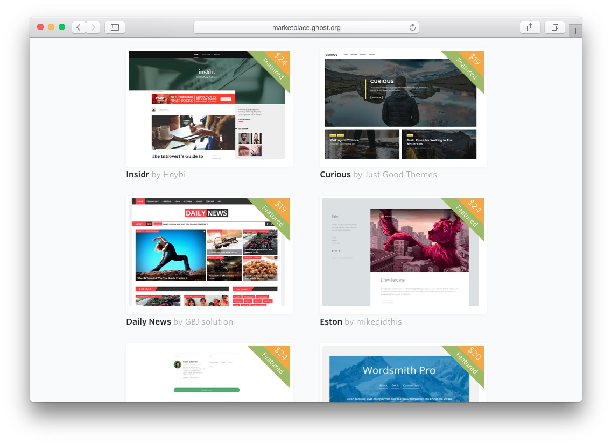
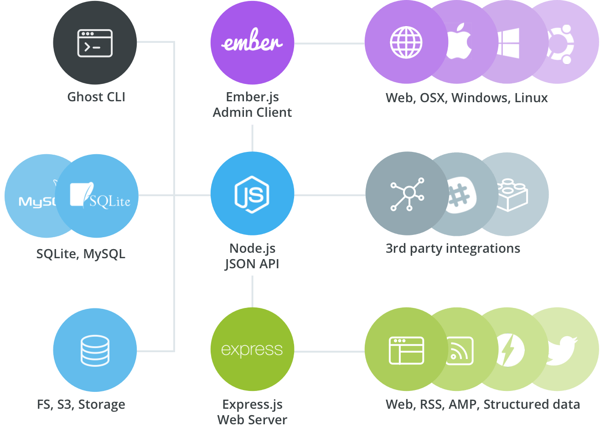

+++
date = 2017-08-28T07:17:05Z
description = "Ghost — лучший блоговый движок для одиночек и небольших компаний. Он недавно обновился до версии 1.0, и это прекрасно."
featured = false
image = "/ghost-one/cover.png"
slug = "ghost-one"
tags = ["life"]
title = "Лучший движок для блога"
+++

_Ghost — лучший блоговый движок для одиночек и небольших компаний. Он недавно обновился до версии 1.0, и это прекрасно._

Ghost идеально вписался между облачными платформами (Медиум, Тильда, Блогспот) и Вордпрессом. Он прост, удобен, содержит кучу функций из коробки и легко настраивается.

В конце июля вышла версия 1.0. Команда разработки пилила её весь год — исправляли конструктивные огрехи и закладывали основу для дальнейшего развития. В новой версии переработали редактор (хотя он и так был неплох), добавили пачку мелких фич, но основные изменения под капотом. Авторы говорят, что благодаря им Гост будет развиваться быстрее. Посмотрим ツ

Расскажу о некоторых возможностях Госта.

## Удобно писать и публиковать

Редактор поддерживает Маркдаун со всеми наворотами, вроде картинок, таблиц, ==подсветки== и исходных `кодов`. Пишешь и сразу видишь результат:

Есть черновики с секретными ссылками (чтобы показать рецензенту до публикации) и публикация по расписанию.

Полная настройка для соцсетей: обложка, заголовок, описание. Можно даже отдельно докрутить для фейсбука и твитера.

Всякие сеошные штуки включены из коробки: Google AMP, пермалинки, карта сайта. Вообще не приходится думать об этой фигне, она просто работает.

<figure>
  
  <figcaption>85% читателей приходят в блог из соцсетей, и Гост помогает настроить всё, чтобы их привлечь</figcaption>
</figure>

Работает подписка на обновления через RSS, емейл и Slack.

Если добавить статические страницы (например, главная, проекты и «о себе») — получится полноценный сайт, а не просто блог. Мой сайт сделан именно так.

## Удобно настраивать

Для Госта существуют сотни готовых тем — платных и бесплатных. Ещё лучше, что сделать свою тему проще простого — понятный синтаксис, плюс ребята сделали сайт с подробной документацией.

Настраивается всё, что душе угодно. Например, показывать заметки с фотографиями в виде мини-превьюшек, а статьи — аннотациями. Или сделать отдельную страницу о путешествиях. Или не показывать заметки, отмеченные секретным тегом. И это без копания в потрошках движка. Авторы отлично продумали и описали API, его хватает для любых фантазий.

## Удобно для бизнеса

У блога может быть сколько угодно авторов. Причём Гост поддерживает разделение прав на обычных авторов, редакторов и администраторов. Для небольшой (а может и для большой) компании этого более чем достаточно.

Гост полностью открыт под лицензией MIT. Это значит, что он бесплатен для коммерческого использования и разрешает любые модификации.

Гост не требователен к серверу: без проблем работает на SQLite и VPS за 150 рублей.

С версии 1.0 Гост наконец-то научился обновляться одной командой (`ghost update`), так что администратору не приходится напрягаться.

Если неохота хостить на своём сервере, есть облачная версия. Там прикрепляется свой домен, работают автоматические бэкапы и SSL, CDN из 100 точек по всему миру.

⌘ ⌘ ⌘

Как по мне, Гост — лучшее, что случилось с инструментами для блогеров за последние годы. Если решите попробовать, вот ссылки:

- [Описание и облачная версия](https://ghost.org/features/)
- [Коробочная версия](https://ghost.org/developers/)
- [Документация](https://docs.ghost.org/docs)
- [Темы](http://marketplace.ghost.org/)

<em>Если вы больше читатель, чем писатель, подписывайтесь на телеграм-канал <i class="fa fa-star-o color-sin"></i> «<a href="https://t.me/dangry">Интерфейсы без шелухи</a>»</em>

