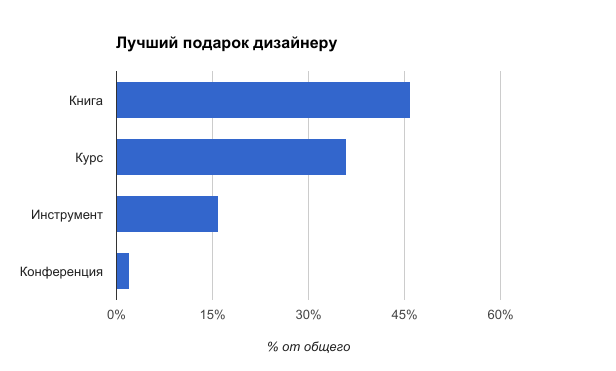
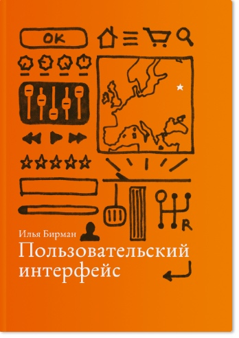
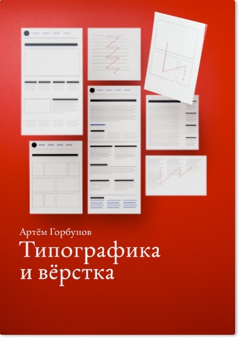
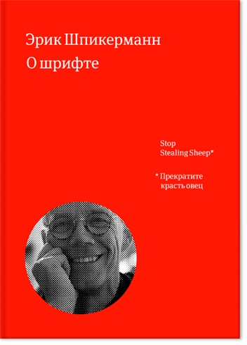
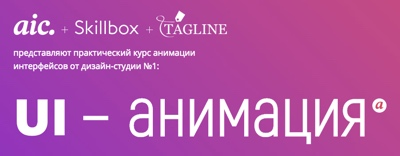
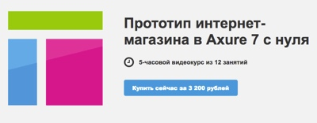

+++
date = 2017-02-21T08:42:44Z
description = "Я спросил 1300 дизайнеров о профессиональном подарке, который они больше всего хотят получить. И вот что они ответили."
featured = true
image = "/gift-for-designer/cover.png"
slug = "gift-for-designer"
tags = ["interface", "60-sec"]
title = "Что подарить дизайнеру интерфейсов"
+++

UPD: а вот [вариант 2019 года](https://vc.ru/flood/55198)

Я спросил 1300 дизайнеров о профессиональном подарке, который они больше всего хотят получить. И вот что они ответили.

<figure>
  
  <figcaption>Речь в опросе шла о подарках, которые существуют в электронном виде.</figcaption>
</figure>

Сильнее всего дизайнеры мечтают о хорошей книге, хотя с радостью примут в подарок и обучающий курс. Намного меньше людей хотят получить программу или подписку на сервис.

А вот топ-3 подарков в каждой категории.

## Книга

<figure>
  
  <figcaption><a href="http://artgorbunov.ru/projects/book-ui/">Пользовательский интерфейс</a> Бирмана</figcaption>
</figure>

<figure>
  
  <figcaption><a href="http://artgorbunov.ru/projects/book-typography/">Типографика и вёрстка</a> Горбунова</figcaption>
</figure>

<figure>
  
  <figcaption><a href="http://www.mann-ivanov-ferber.ru/books/o-shrifte/">О шрифте</a> Шпикерманна</figcaption>
</figure>

«[Пользовательский интерфейс](http://artgorbunov.ru/projects/book-ui/)» — электронный учебник для всех, кто причастен к созданию продуктов. В книге последовательно раскрываются ключевые принципы хорошего интерфейса. Они работали двадцать лет назад и будут работать через двадцать лет. Поэтому каждый показан и на исторических, и на современных примерах.

«[Типографика и вёрстка](http://artgorbunov.ru/projects/book-typography/)» — электронный учебник для дизайнеров, редакторов и разработчиков. Последовательно отвечает на вопрос *как*. Автор вводит принципы модульности и якорных объектов, правило внутреннего и внешнего. Затем шаг за шагом наглядно объясняет, как добиться аккуратной и плотной вёрстки сайтов, сервисов и СМИ.

«[О шрифте](http://www.mann-ivanov-ferber.ru/books/o-shrifte/)» — это введение в типографику на простых и привычных примерах. Автор рассказывает, откуда взялось множество разных гарнитур, когда и как их использовать.

## Курс

<figure>
  
</figure>

  

  <a href="http://netology.ru/programs/ui-ux">Проектирование интерфейсов</a> от Нетологии
  

  
Курс для начинающих, учит процессу проектирования от анализа требований до тестирования.
  

<figure>
  
</figure>

  

  <a href="https://skillbox.ru/motion/">UI-анимация</a> от AIC
  

  
Учит создавать анимацию в интерфейсах и презентовать клиентам. Используются инструменты After Effects, Principal, Atomic.io и Webflow.
  

<figure>
  
</figure>

  

  <a href="http://imaxure7.projectorat.ru">Прототип интернет-магазина в Axure</a> от Проектората
  

  
Учит основам работы с Axure на примере интернет-магазина. Автор с нуля создаёт прототип, попутно объясняя, как работают те или иные части Axure.
  

## Инструмент

<figure>
  
  <figcaption><a href="https://sketchapp.com">Sketch</a></figcaption>
</figure>

<figure>
  
  <figcaption><a href="http://principleformac.com">Principle</a></figcaption>
</figure>

<figure>
  
  <figcaption><a href="http://www.adobe.com/ru/creativecloud.html">Adobe Creative Cloud</a></figcaption>
</figure>

[Sketch](https://sketchapp.com) — векторный редактор, специально созданный для дизайнеров интерфейсов. Многие специалисты перешли на него и забыли продукцию Adobe как страшный сон.

[Principle](http://principleformac.com) — инструмент прототипирования интерфейсов с упором на анимацию. Умный микс между Sketch, Keynote, Flash и After Effects.

[Adobe Creative Cloud](http://www.adobe.com/ru/creativecloud.html) — подписка на линейку продуктов Adobe для дизайнеров и художников. Photoshop, Lightroom, Illustrator, Adobe Premiere Pro, InDesign, Experience Design.

⌘&nbsp;⌘&nbsp;⌘

Теперь вы знаете, что подарить коллеге-дизайнеру. Или чем себя любимого порадовать ツ

 

<em>Заметка из телеграм-канала <i class="far fa-star color-sin"></i> «<a href="https://t.me/dangry">Интерфейсы без шелухи</a>»</em>

