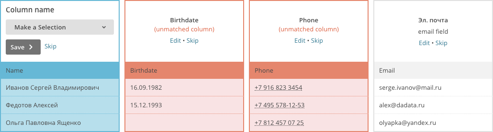
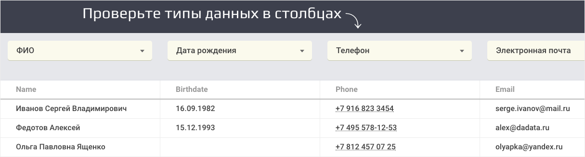

+++
date = 2017-11-28T16:03:48Z
description = "Лучше один раз напрячь программиста, чем тысячу раз приставать к пользователям."
featured = true
image = "/guess/cover.jpg"
slug = "guess"
tags = ["interface", "dadata"]
title = "Угадайка и неленивый интерфейс"
subscribe = "dangry"
+++

Ленивые интерфейсы любят выносить мозг. В любой ситуации, когда можно догадаться самостоятельно или спросить человека — ленивая программа предпочитает спросить. Давайте посмотрим, как этого избежать.

## Угадайка

Вот Мейлчимп требует, чтобы человек рассказал, где что лежит:

<figure>
  
  <figcaption>Ну невозможно же догадаться, где здесь имя, а где телефон, правда?</figcaption>
</figure>

Когда мы проектировали «[Дадату](https://dadata.ru/)», сразу хотели сделать нормально. В результате появилась угадайка типов:

<figure>
  
  <figcaption>Человек загружает файл, а Дадата сама расставляет типы на столбцах и просит проверить.</figcaption>
</figure>

Угадайку можно сделать довольно навороченной: приделать к ней нейросеть, обучать в реальном времени, учитывать индивидуальные особенности пользователя, и так далее.

Сильно проще — угадывать по эвристикам:

```
***@***.*** → это емейл
Начинается на 79xx или 89xx → телефон
Есть слово из топ-100 имён или фамилий → ФИО
Встречается «область», «город» или «улица» → почтовый адрес
```

Даже простой эвристический механизм работает много лучше, чем ничего. В 80% случаев человек пробежит глазами по заголовкам, убедится что всё хорошо, и запустит обработку. В оставшихся 20% беззлобно матернёт тупую железяку и исправит где надо.

А если взять историю взаимодействия с пользователями и проанализировать паттерны поведения, вообще можно делать чудеса.

## Эвристики

Я уважаю машинное обучение — оно помогает угадывать правильный вариант в сложных ситуациях. Но удивительно, как много можно сделать без него, с помощью простых эвристик. Например:

- В магазине автоматически выбирать домашний или рабочий адрес доставки в зависимости от дня недели и геопозиции.
- После регистрации, когда требуется подтвердить емейл, показать ссылку «перейти в почту», которая отправит человека в почту Яндекса, Мейла или Гугла — в зависимости от почтового домена.
- Предложить сохранить фильтр в CRM, если пользователь вручную настраивает его уже в третий раз.
- Автоматически выбрать предпочтительную папку для письма из тематической рассылки, ориентируясь на предыдущие письма.

Другую информацию легко получить из сторонних API (Дадата, Яндекс, Гугл, ...):

- Пол по ФИО.
- Индекс, район города, ближайшее метро и почтовое отделение по адресу.
- Реквизиты компании по названию или ИНН.
- Страну, оператора связи и часовой пояс по телефону.
- Банк по номеру карты.
- Аватарку по емейлу.

Такие мелочи производят приятное впечатление на человека, а в реализации обходятся недорого.

## Итого

Лучше один раз напрячь программиста, чем тысячу раз приставать к пользователям:

1. Программа нормально угадывает и не теребит человека по мелочам.
2. Для этого не нужен отдел машинлёнинга и бюджет в миллион рублей. Достаточно выделить день на анализ эвристик и несколько дней на реализацию.
3. Попробуйте сами ツ
