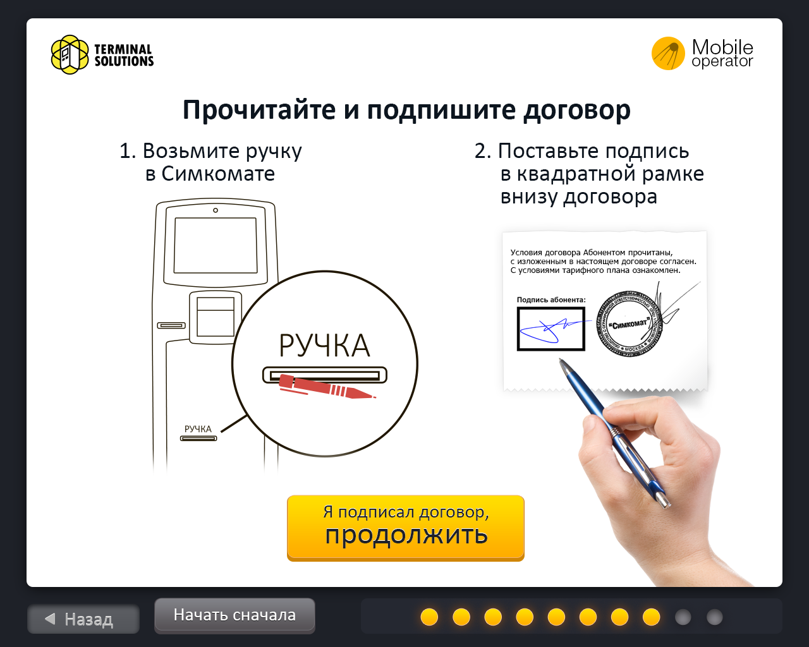
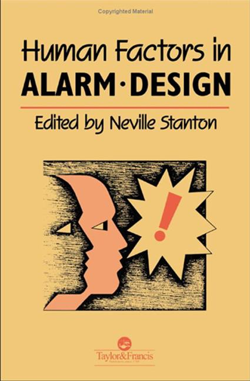
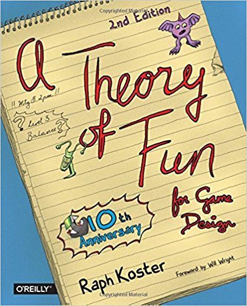
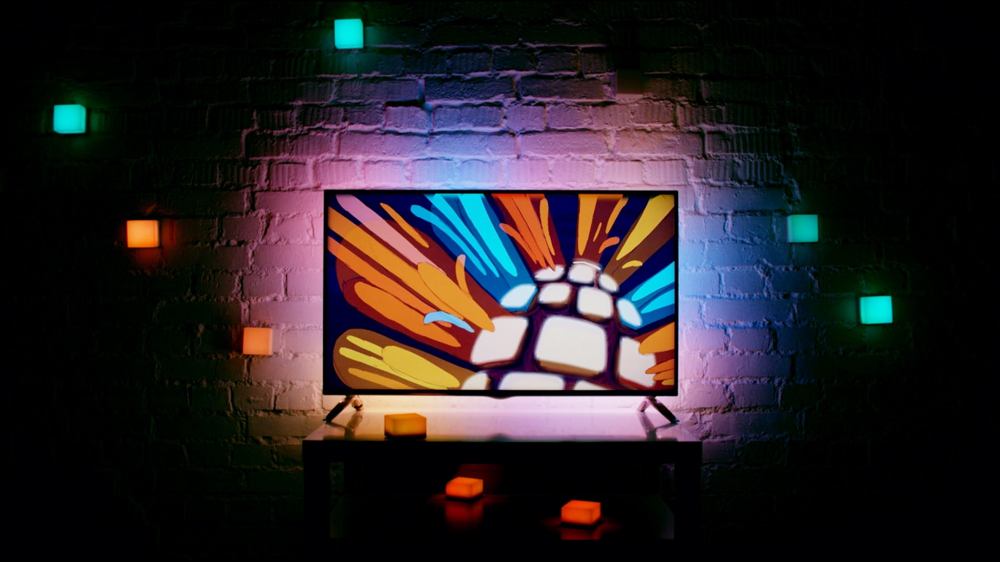

+++
date = 2017-06-21T07:56:53Z
description = "Илья Александров о дизайне интерфейсов для «железных» продуктов — носимых устройств, автомобилей и киосков самообслуживания."
image = "/ilya-aleksandrov/cover.jpg"
slug = "ilya-aleksandrov"
tags = ["talk", "interface"]
title = "Как веб-дизайнеру проектировать хардварные интерфейсы"
+++

<em>Сегодняшнее интервью — с Ильёй Александровым. Он рассказывает о специфике проектирования интерфейсов для «железных» продуктов — носимых устройств, автомобилей и киосков самообслуживания. И советует, как обычному дизайнеру попасть в hardware.
 </em>

### Расскажи о себе вкратце: чем занимаешься, где работаешь, чем увлекаешься

Я проектирую продукты и интерфейсы. Люблю разнообразие. Начинал с веб-сайтов и презентаций, немного мобильных приложений. Затем игровые интерфейсы в World of Tanks, позже киоск самообслуживания, электрический грузовик, рельсовый электровелосипед. Сейчас работаю над несколькими носимыми устройствами и <a href="http://www.lightpack.tv/">Лайтпаком</a> — «световым оркестром» для комнаты.

Чаще всего работаю на старте проекта, либо когда продукт требует глобальных изменений. Мой основной интерес — прийти туда, где ничего не понятно, и придать продукту ясные очертания и вектор развития.

<figure><figcaption><a href="https://www.facebook.com/yakostro">Илья Александров</a> Человек-стартер: делает из идей понятные продукты.</figcaption></figure>

Кроме работы хожу в бассейн, катаюсь на роликах и велосипеде. Изучаю разные уголки Питера (живу тут уже два года). Играю на гитаре и флейте. Недавно начал программировать свою мини-игру. Ну и конечно, новое увлекательное занятие — воспитание дочери.

### Ты пишешь <a href="https://medium.com/@yakostro">в блоге</a>, что занимаешься интерфейсами для сложных систем. Расскажи о каком-нибудь крутом проекте.

Почти все проекты, с которыми я имею дело, можно назвать сложными. В них много сущностей и взаимосвязей. Много возможных вариантов использования, и не всегда понятно как и что делать.

Например, для «[Симкомата](https://medium.com/@yakostro/ae8a3b12a3b7)» (киоск по автоматизированной продаже симкарт) проектировал сразу четыре ветки UX-сценариев:

1. Для самих пользователей — людей, которые покупают сим-карту. На этом главный фокус.
2. Для обслуживающего персонала — людей, которые заполняют киоск симками, забирают деньги, вставляют чековую ленту.
3. Для администраторов от бизнеса.
4. Для технарей, которые настраивают киоск.

<figure>
  
  <figcaption>Один из уроков проекта: простые нарисованные схемы работают лучше, чем видео с инструкцией</figcaption>
</figure>

Требования по первым двум пунктам пересекаются. Поэтому, чтобы спроектировать расположение элементов и устройств внутри симкомата, приходится учитывать сценарии обеих групп.

Или <a href="https://charge.auto/">Charge</a>. В этом проекте я проектировал пользовательский опыт водителей грузовиков. Задачей было переосмыслить стандартные подходы. Поэтому я занимался не одним интерфейсом, а целой экосистемой:

- интерфейсами кабины грузовика (приборная панель, физические контролы, инфотейнмент-система);
- интерфейсами, с которыми водитель будет работать вне кабины (на базе мобильных устройств);
- логистической системой в вебе для связи с водителями и клиентами.

За полтора года удалось спроектировать верхний уровень всей экосистемы и разработать базовые версии ключевых интерфейсов.

### Я знаю, что тебе доводилось проектировать звуковые интерфейсы. Расскажи, какие есть правила в работе со звуком?

Да, сейчас как раз делаю носимое устройство — «паническую кнопку» для путешественников-экстремалов. У него звуковой фидбек и световые индикаторы — эти два вида нотификации дублируют и дополняют друг друга.

Из того, что нашёл по правилам и стандартам, самое краткое и по делу — <a href="http://www.cs.au.dk/~dsound/DigitalAudio.dir/Papers/Earcons_and_Icons.pdf">Earcons and Icons: Their Structure and Common Design Principles</a>.

Впервые узнал оттуда понятие «earcon» — иконка для уха. Очень концептуально, по-моему ツ В брошюре описано, как они должны «выглядеть», как их объединять в группы и создавать систему из понятных звуковых фраз.

Ещё интересная книга по теме — <a href="https://www.crcpress.com/Human-Factors-in-Alarm-Design/Stanton/p/book/9780748401093">Human Factors in Alarm Design</a>.

  

### Расскажи о специфике дизайна для игровых проектов на основе своего опыта работы для World of Tanks?

О специфике мы с Лёшей Копыловым [рассказывали](http://2013.profsoux.ru/papers/38/). Я не буду повторяться, потому что получится очень длинно.

В играх встречаются разные по типу интерфейсы. В «танках», например, есть боевой интерфейс, а есть сервисные: меню игры, «магазин», «инвентарь», игровой чат.

Сервисные интерфейсы — не геймплейные, а скорее обслуживающие. Их проектирование бывает похоже на проектирование сайта или мобильного приложения. Но если прийти с опытом чисто «вебовским», то будет очень сложно перестраиваться. Мы даже в какой-то момент старались искать людей без опыта сайтоделания.

Боевой интерфейс — совсем иная история. Нужно работать, например, над поведением камеры. Это уже выход из плоскости. Как камера интерпретирует прокрутку или перемещение мышки? Как на неё влияет скорость движения танка?

От этого сильно зависит, как чувствует себя игрок, комфортно ли ему, вовлечён ли он в процесс. Неправильно настроенная камера может даже способствовать «выдёргиванию» человека из процесса. Чтобы лучше понять, о чём я говорю, посмотрите выступление <a href="https://www.youtube.com/watch?v=doVivf-Nvuo">Creating an Emotionally Engaging Camera for Tomb Raider</a>.

Самое важное в играх — фан, на эту тему читайте книгу <a href="https://www.amazon.com/Theory-Game-Design-Raph-Koster/dp/1449363210">Theory of Fun</a>. Интерфейс должен помогать переживать этот фан, способствовать вовлечению, получению эмоций — помимо более утилитарных функций.

### Кто обычно есть в твоей команде? Как распределяете обязанности?

Поначалу делаю большую часть работы сам. Потом подтягиваю дизайнеров, когда понятен фронт работ.

В «Варгейминге» сначала нас было двое проектировщиков в отделе UX, а графические дизайнеры — отдельно. Потом объединились, набрали людей, и я стал отвечать за будущее интерфейса и за систему. Параллельно пропускал через себя все фичи, которые делали остальные дизайнеры.

В «Симкомате» начинал тоже сам, затем наняли дизайнера. Я обучал его UX-аналитике, учил проводить пользовательское тестирование. Программисты были на аутсорсе, и я параллельно с проектированием руководил софтовой разработкой.

В «Чардже» (электрический грузовик) я сначала был один. Делал всё, включая аналитику, UX-исследования, планирование, управление софтовой разработкой и поиском железных поставщиков. Затем взяли дизайнера, программиста и специалиста по железу.

Сейчас в «[Вуденшарке](http://www.woodenshark.com)» занимаюсь всем спектром UX-работ. Исследования, системная аналитика, создание всех артефактов, помощь в создании прототипов, тестирование. Только не рисую сам.

### Как ты находишь такие крутые проекты? Большинству дизайнеров за всю жизнь не придётся поработать с электрическим грузовиком, носимыми устройствами или лайтпаком. А у тебя прямо цепочка достижений — от одной крутой штуки к другой. Как тебе это удаётся?

Это череда неслучайных случайностей. В «танки» я попал, потому что пошел работать в [UIDG](http://www.uidg.ru). К ним тогда пришли заказчики и говорят: «Надо аналитику». А я нашим в компании сказал: «Я люблю игры и всегда хотел ими заниматься, дайте мне этот заказ». Мне дали. Я сделал аналитику, потом нам заказали проектирование пары больших фич. «Танкам» всё понравилось и они схантили меня ツ

Когда уходил из «Варгейминга», хотел делать что-то более реальное, физическое. Вернулся на родину, в Ижевск. Там мой друг Артём Субботин, основатель Симкомата, попросил немного помочь советом. А потом говорит — пошли работать.

После «Симкомата» начал искать работу, и мне написали ребята из Charge. Сказали, что нашли меня через выступление на [ПрофсоUX](http://2013.profsoux.ru/papers/38/). Оттуда вышли на линкедин-профиль, а был описан релевантный опыт «симкомата».

Когда ушел из Charge, спустя пять месяцев расстройства и размышлений написал в Фейсбуке, что ищу работу. Не ждал, что вообще будет что-то с железками в Питере. Был уже почти готов работать над какой-нибудь CRM-кой. Тут мне написал Митя Гориловский и пригласил работать над «Лайтпаком» и другими интересными проектами в компании [Woodenshark](http://www.woodenshark.com). Я про такую даже и не знал.

<figure>
  
  <figcaption>Илья с командой сделали из концептуальной идеи «Лайтпака» цельный продукт.</figcaption>
</figure>

То есть оно как-то само друг за друга цепляется. Главное след за собой оставлять: рассказывать о своем опыте. Статьи и выступления хорошо работают. Например, по статье об [автомобильных интерфейсах](https://medium.com/@yakostro/7e4180b6ef8d) на меня вышли ещё одни ребята с транспортом.

### Допустим, есть дизайнер, который пресытился работой с веб-интерфейсами. Хочет поработать в «железных» проектах — делать интерфейсы для голосовых помощников, роботов или автопилотов. Что ему посоветуешь, с чего начать?

Искать такие проекты, пытаться к ним устроиться. Проектировщиков прямо по «железным» интерфейсам почти нет. Поэтому компании с удовольствием берут людей с хорошей базой знаний, методологий и опытом. Нужно хотя бы немного зацепиться за тему, а дальше само пойдет. Главное — копошиться, расставлять «капканчики»: писать статьи, выступать, рассказывать всем о своем опыте, не стесняться.

Или другой вариант: взять интересную тему и сделать проект — хотя бы просто концепт. Классно оформить и выложить. Говорят, это работает, хотя мне удалось работать сразу с живыми проектами.

Смотреть по сторонам в компании, где работаешь. Везде «совать свой нос» и вовремя заметить возможность (как было у меня с «танками» — проект ведь могли просто отдать другому дизайнеру).

### Какие инструменты используешь в работе? Какие твои любимые?

Любимые — бумага и гелевая ручка [PaperMate](https://www.komus.ru/katalog/pismennye-prinadlezhnosti/ruchki-gelevye/ruchki-gelevye-neavtomaticheskie/c/6271/?pageSize=30&sort=relevance&q=&q.Trademark.6.2=Paper+Mate). Затем доска. Потом всё остальное. Смотря что делаю:

- [Гуглдокс](https://www.google.com/intl/ru/docs/about/) и [MindManager](https://www.mindjet.com/mindmanager/) на старте проекта.
- [Draw.io](https://www.draw.io) или [Visio](https://products.office.com/visio/flowchart-software) чтобы описать состояния, переходы и сущности.
- [Illustrator](http://www.adobe.com/ru/products/illustrator.html) или [Figma](https://www.figma.com) для графических интерфейсов, схем навигации по продукту и детального проектирования. Финальный дизайн я обычно отдаю кому-то, чтобы не тратить время на пиксели.
- [Invision](https://www.invisionapp.com), если надо быстро запрототипировать.
- Среда программирования, если надо кодить для прототипа.

<h3>Где подписаться на Илью</h3>

В блоге <a href="https://medium.com/@yakostro">статьи на профессиональные темы</a>

В фейсбуке <a href="http://facebook.com/yakostro">всё остальное</a>

<em>Заметка из телеграм-канала <i class="far fa-star color-sin"></i> «<a href="https://t.me/dangry">Интерфейсы без шелухи</a>»</em>

