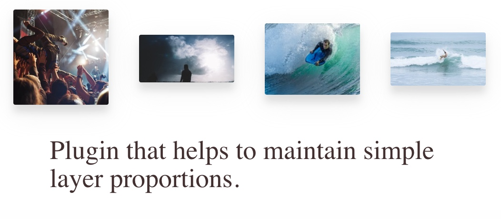

+++
date = 2017-02-14T12:06:00Z
description = "Как рассказать о проекте в интернете, чтобы вас услышали."
image = "/louder/cover.jpg"
slug = "louder"
tags = ["life", "60-sec"]
title = "Говорите громче!"
subscribe = "dangry"
+++

Есть одна проблема у людей, которые делают сайд-проекты: забывают рассказать о сделанном. Особенно выражена у программистов, но у дизайнеров тоже встречается.

Сделал человек годную штуку, молодец. Теперь надо бы помочь миру узнать о ней. Наш герой пишет в любимую соцсеть «я сделялъ», получает десять лайков от друзей и один комментарий. Всё.

Так бывает чаще всего. Но сегодня мне повезло наткнуться на контрпример: отличное и содержание, и подача работы.

<h3>Рассказ о проекте здорового человека</h3>

<a href="http://alexanderkatin.ru/">Александр Катин</a> разработал плагин для скетча, который задаёт простые пропорции для слоёв (1:1, 2:1, 4:3, 16:9).

Смотрите, что он сделал дальше:

<ol>
  <li>Оформил <a href="https://github.com/lessthanzero/Formr">проект на гитхабе</a>.</li>
  <li>Сверстал <a href="https://readymag.com/sashakatin/527315/">промо-страницу</a>.</li>
  <li>Рассказал о проекте <a href="https://medium.com/sketch-app-sources/2fadac52c38a">в блоге</a>.</li>
</ol>

Благодаря этому «еще один плагин» превратился в стоящую штуку, о которой хочется рассказывать.

Эти три пункта — гигиенический минимум «пиара» собственной работы. А вот что еще можно сделать:

- Написать анонсы в профильные группы в соцсетях.
- Написать ведущим профильных [рассылок](http://демиш.рф/mailbase.html) и [телеграм-каналов](http://telegra.ph/Telegram-kanaly-pro-dizajn-produkty-i-strategiyu-07-18).
- Написать редакторам сайтов, которые публикуют материалы по вашей теме (в случае с плагином для скетча — условный sketchapp.me).
- Написать заметным в отрасли людям, которым сделанная штука может быть интересна.
- Написать статью о проблеме, которую решает проект. Опубликовать на условном vc.ru.

И да, на это уйдет куча времени. Больше, чем вы потратили на разработку проекта. И это не самая интересная работа для «творца». Но без этого ваша работа мало кому интересна.

Говорите громче!
