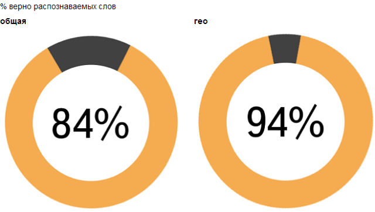
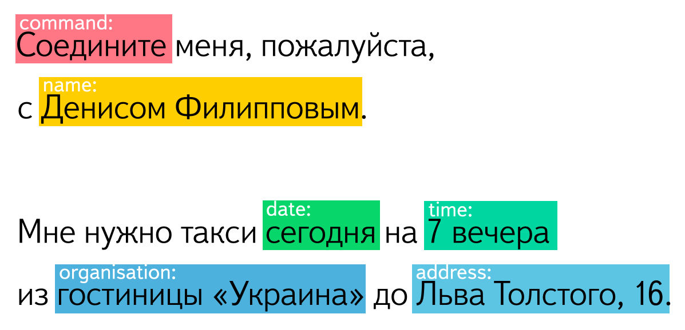
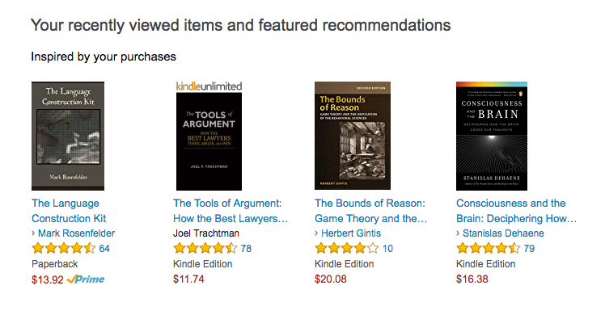

+++
date = 2017-05-03T07:37:06Z
description = "Рассказываю для не-специалистов, какие инструменты машинного обучения можно применять здесь и сейчас."
featured = true
image = "/machine-learning/cover.png"
slug = "machine-learning"
tags = ["interface"]
title = "Машинное обучение для нормальных людей"
+++

Прочитал на днях статью «Применение машинного обучения для дизайнеров» и книгу «Машинное обучение для дизайнеров». Разочарован: не понимаю, для кого это всё пишут. Куча размахиваний руками в воздухе и псевдо-сложных рассуждений. Ноль практического применения.

Но я задумался — а где *реально* обычный дизайнер интерфейсов (или любой не-специалист в computer science) может столкнуться с машинным обучением в повседневных проектах, да ещё с русскоязычными данными. Я попробовал собрать несколько примеров вместе с инструментами.

Поехали!

## Распознавание речи

*Что это*. Программа слушает запись голоса и преобразует её в текст.

*Инструменты*. Распознавать речь умеют все крупные вендоры: Гугл, Амазон, Микрософт. Они сделали удобные облачные сервисы и библиотеки, только с русским всё печально. Поэтому для русской речи я использовал [SpeechKit](https://tech.yandex.ru/speechkit/) от Яндекса.

<figure>
  
  <figcaption>Яндекс обещает 84% точность распознавания. Ну, если только в мечтах маркетологов ツ</figcaption>
</figure>

Речь распознавать он более-менее умеет, но качество очень так себе. По моему опыту, короткие бытовые фразы распознаются на 70%, а если говорит ребёнок или у человека плохая дикция — 50%. То есть это далеко не продакшен-качество, использовать голос как единственный способ ввода нельзя.

Есть одно исключение: адреса. Их Яндекс распознаёт очень хорошо (возможно, вы замечали это по яндекс-навигатору). Лучше человека. Так что для ввода адресов SpeechKit реально можно использовать.

## Понимание смысла сказанного

*Что это*. Программа анализирует текст и пытается понять, что имел в виду человек. По такому принципу работают голосовые помощники вроде Siri и «умные» чат-боты (тупые же ориентируются по ключевым словам, без всякого машинного обучения).

<figure>
  
  <figcaption>Красиво, да? Это иллюстрация из SpeechKit от Яндекса. Жаль, что на самом деле он так не умеет ツ</figcaption>
</figure>

*Инструменты*. Всё ещё хуже, чем с распознаванием речи. Тот же SpeechKit умеет проводить морфологический анализ предложения (части речи, лица, падежи). Плюс-минус умеет вычленять даты, адреса и ФИО. Но не умеет главного — понимать смысл: выделять действия, объекты, характеристики и обстоятельства.

## Распознавание текста

*Что это*. Программа распознаёт печатный и рукописный текст на сканах и из видео, извлекает текст из фотографий документов и банковских карт, считывает штрихкоды.

*Инструменты*. На этой поляне давно и прочно играет ABBYY с их [FineReader Engine](https://www.abbyy.com/ru-ru/ocr-sdk/), а ещё есть [Smart Engines](http://smartengines.ru/).

Smart Engines распознаёт паспорт, СНИЛС или водительское удостоверение за секунду и предупреждает, если не уверен в распознавании.

## Компьютерное зрение и классификация изображений

*Что это*. Программа анализирует изображение и относит его к одной из категорий (спортивная машина, ребёнок, цветок и т. п.) Отсеивает «взрослые» фото, считывает текст и логотип с фотографии. Находит лица, определяет количество людей и их пол. Выделяет основные цвета.

*Инструменты*. Тут работают [Cloud Vision](https://cloud.google.com/vision/) от Гугла и свеженький [Data Factory](https://imagemoderation.yandexdatafactory.com/) от Яндекса.

Про решение от Яндекса толком ничего не известно, а Гугл справляется хорошо. Вот Антон Мальцев на Хабре отлично [разобрал каждую возможность](https://habrahabr.ru/post/312714/) и сравнил с конкурентами.

## Рекомендации, прогнозы и анализ взаимосвязей

*Рекомендации* — это «классическое» машинное обучение, которое уже лет двадцать работает на том же Амазоне: проанализировать действия пользователя, понять его предпочтения, предложить что-то интересное. Аналогично Фейсбук формирует ленту, рекомендует друзей и группы — изучая предпочтения пользователя.

<figure>
  
  <figcaption>Рекомендации, прогнозы и анализ взаимосвязей — самые распространённые применения машинного обучения на сайтах и сервисах.</figcaption>
</figure>

*Прогнозы* — «обучить» программу на известной выборке данных, чтобы дальше она «предсказывала» результат по новым данным.

Например, банк скармливает программе базу людей, которые брали кредиты, и по каждому человеку указывает итог — вернул он долг или просрочил. Дальше программа сама выдаёт прогноз для новых заёмщиков — просрочит человек выплату или нет.

Еще пример: та же программа предсказывает, сколько конкретно денег можно ссудить человеку, чтобы он без проблем выплатил потом кредит.

*Анализ взаимосвязей* — программа смотрит на данные и замечает закономерности, которые человек не может увидеть самостоятельно. Например, тот же банк может получить ответ на вопрос «что общего у заёмщиков, которые просрочили выплату по кредиту?»

*Инструменты*. Тут много алгоритмов, я не буду вдаваться в подробности. Много готовых библиотек и сервисов, которые их реализуют. Вот [хороший обзор](https://jaxenter.com/machine-learning-frameworks-list-131500.html), а вот пример использования гуглового облака для [рекомендаций в интернет-магазине](https://habrahabr.ru/company/softline/blog/319704/), на русском.

## Творчество

*Что это*. Программа выступает «соавтором» дизайнера. Человек задаёт условия задачи, алгоритм анализирует варианты решения и предлагает оптимальный. Это направление ещё называют генеративным дизайном.

Генеративный дизайн используют в архитектуре, промышленности, медицине. Задача, которую решает программа — уменьшить вес и увеличить прочность конструкции (например, детали самолёта или протеза). Маловероятно, что вы столкнётесь с таким проектом, но мало ли ツ

*Инструменты*. Для генеративного дизайна используют [софт компании Autodesk](http://www.autodesk.com/solutions/generative-design).

⌘ ⌘ ⌘

Конечно, это очень поверхностный обзор. Если завзятый технарь каким-то чудом дочитает до этого места, он будет раскалён как чайник ツ С другой стороны, я надеюсь, что получилось понятное для не-специалистов введение в тему.

Описанные техники машинного обучения встречаются в повседневных проектах, поэтому хорошо понимать, про что они — даже если вы далеки от «компьютерных наук».

<em>Заметка из телеграм-канала <i class="far fa-star color-sin"></i> «<a href="https://t.me/dangry">Интерфейсы без шелухи</a>»</em>

