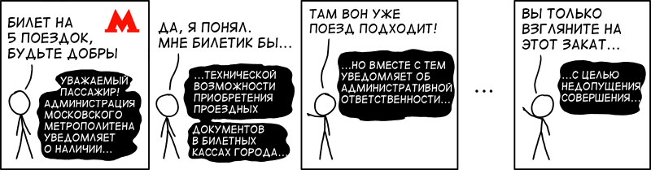

+++
date = 2017-03-14T07:11:00Z
description = "Большой кусок интерфейса метро — голосовые объявления. С ними есть две большие проблемы."
image = "/metro-voice-interface/cover.png"
slug = "metro-voice-interface"
tags = ["60-sec", "writing"]
title = "Редактура и голосовой интерфейс московского метро"
+++

<a href="https://xkcd.com/1684/">xkcd</a>

Большой кусок интерфейса метро — голосовые объявления. Они звучат в поездах и переходах, с их помощью метрополитен доносит до пассажиров всякие правильные мысли. С объявлениями есть две большие проблемы:

1. Реклама. Её просто не должно быть — никто не имеет права гадить мне в мозг без моего согласия.
2. Плохой текст. О нём и хочу поговорить.

Вы, может быть, слышали об инфостиле и проекте «пиши, сокращай» Максима Ильяхова. Там много пишут о вычистке текста от мусора. Так вот, объявления метрополитена состоят из мусора процентов на 90. Я езжу в метро каждый день и очень от этого страдаю.

Канцеляризмы и мусорные слова в тексте мешают, но при некотором навыке их легко отсеять при чтении. В голосовых объявлениях пропустить шлак невозможно, приходится каждый раз выслушивать такое:

> Уважаемые пассажиры, обращаем ваше внимание, что за нахождение в поезде, следующем в тупик, предусмотрена административная ответственность в соответствии с законодательством Российской Федерации.

А хочется вместо этого слышать:

> Пора выходить! Поезд едет в депо.

Вот моё правило для голосовых объявлений:

<blockquote class="big">Коротко и по делу</blockquote>

Написал серию статей, как применить правило в метро:

- [По техническим причинам](/metro-reason/)
- [Пурга о конечной станции](/terminal-station/)
- [Мозговые слизни на эскалаторе](/metro-brain-slug/)
