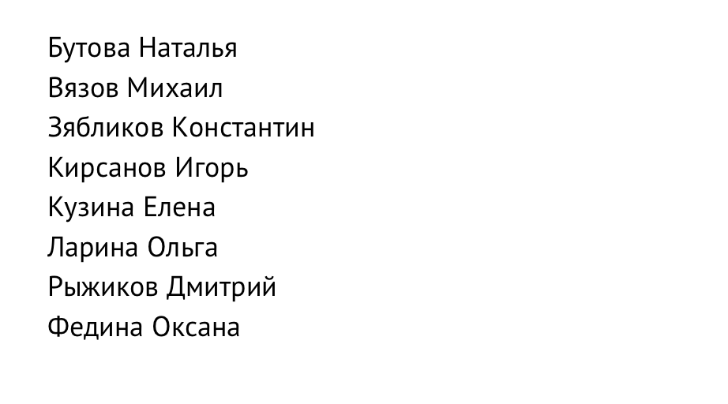
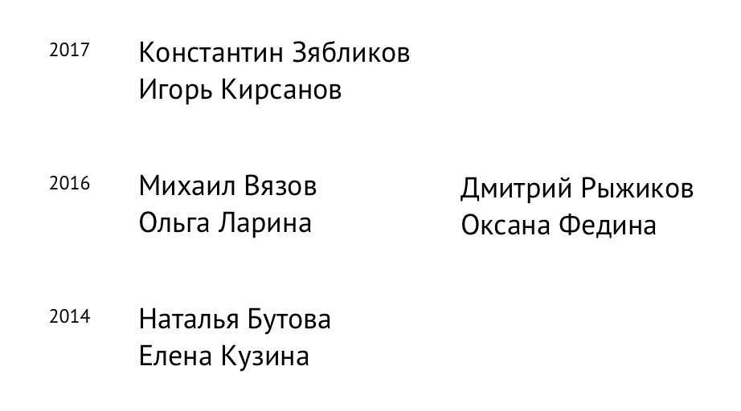
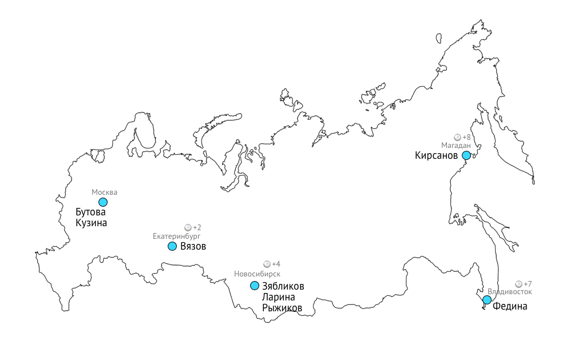
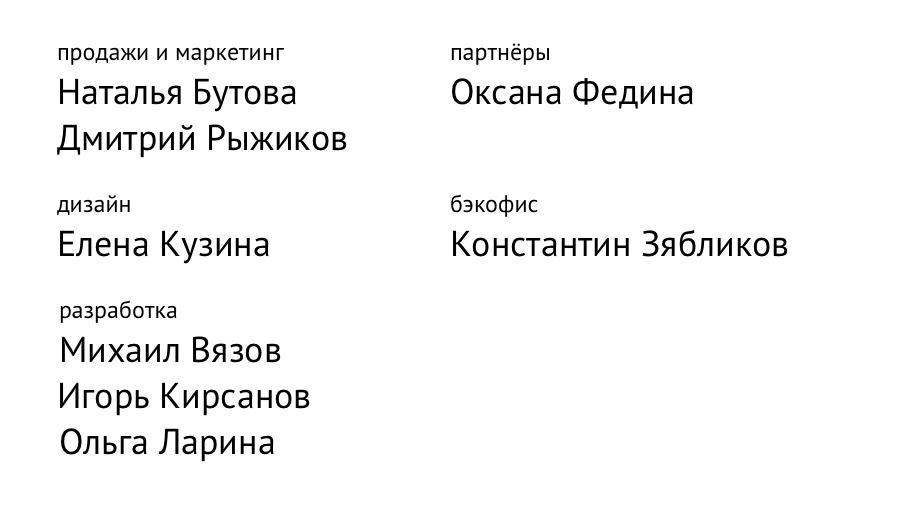
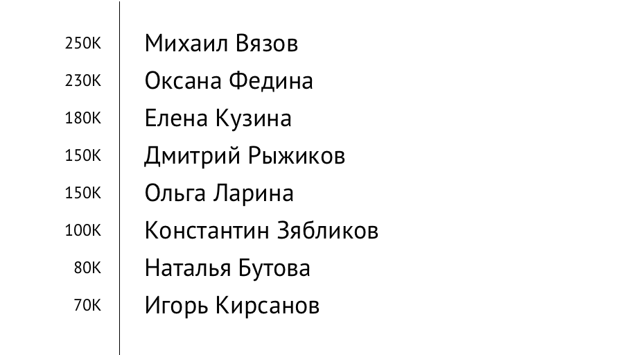
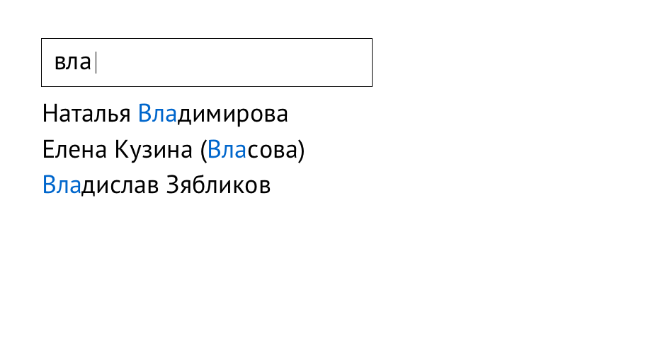
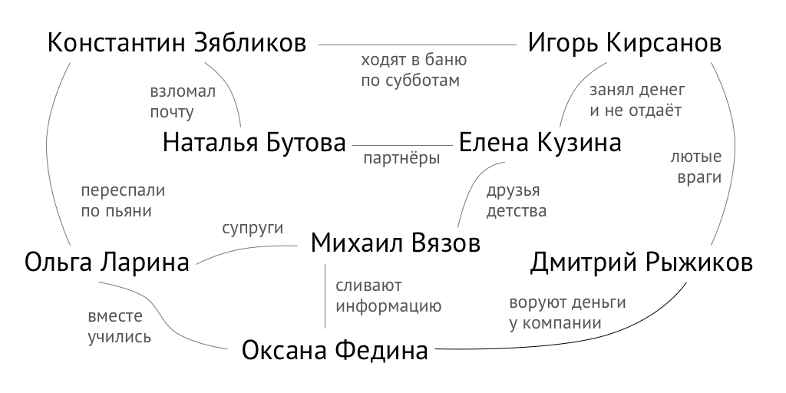

+++
date = 2017-07-18T08:52:05Z
description = "Как упорядочить объекты в интерфейсе, чтобы пользователю было удобно с ними работать."
image = "/no-more-latch/cover.png"
slug = "no-more-latch"
tags = ["interface"]
title = "Хватит сортировать по алфавиту"
+++

Часто при проектировании интерфейса нужно показать на экране список однотипных объектов: людей, товаров, статей. И возникает вопрос — как их организовать?
Классический ответ дал в 1989 году Ричард Вурман, автор термина «информационная архитектура». Он предложил [мнемонику LATCH](http://www.informit.com/articles/article.aspx?p=130881&seqNum=6): положение, алфавит, время, категория, иерархия.

Это неплохая модель, но есть что улучшить. Вот мой вариант — как организовать информацию в интерфейсе.

## По алфавиту

Составить список объектов и отсортировать по названию. Например, контакты в телефонной книге компании упорядочены по фамилиям:

Организацию по алфавиту используют, если пользователь будет искать нужный объект по первым буквам названия:

- глоссарий в книге,
- список учеников в классном журнале,
- код компании в биржевой сводке.

Часто алфавит используют «по умолчанию». Подход ленивого дизайнера: не знаешь, как упорядочить список — отсортируй по алфавиту ツ

## По времени

Показать объекты в хронологическом порядке — привязать к событиям во времени. Например, чтобы проиллюстрировать историю становления компании, написать, когда начал работать каждый сотрудник:

Организацию по времени используют, когда важно знать точный момент события:

- список встреч на день,
- расписание автобуса,
- история изменения карточки клиента в CRM.

Не всегда нужна привязка к моменту, иногда достаточно знать взаимный порядок событий (что произошло раньше, что позже):
- инструкция на случай пожара,
- последовательность шагов при регистрации на сайте,
- следующие номера на табло в электронной очереди.

## По положению

Привязать объекты к положению в пространстве. Например, если в компании сотрудники работают в разных городах, удобно показать их на карте:

Заодно понятно, какая у кого разница во времени.

Организацию по положению используют, когда важно, как расположены объекты относительно контейнера, друг друга или наблюдателя:

- станции метро на карте,
- туалеты на схеме терминала аэропорта,
- органы в теле человека.

Обычно объекты привязывают к точке в двух- или трёхмерном пространстве. Но иногда достаточно упорядочить объекты по взаимному расположению (первый, второй, третий). Так организован список сносок в конце книги или станции на конкретной ветке метро.

## По категориям

Разложить объекты по именованным кучкам — категориям. Например, распределить сотрудников по отделам:

Организацию по категориям используют, когда есть очевидный пользователю признак, по которому объекты похожи или отличаются:

- меню в ресторане (закуски, салаты, супы, основные блюда, десерт),
- формат листа в магазине канцтоваров (А1, А2, А3, А4),
- контакты на карточке клиента в CRM (адреса, телефоны, емейлы, аккаунты в соцсетях).

Для категории подходит любой качественный признак: цвет, форма, вкус, фактура. Если признак количественный (площадь, стоимость, вес) — попадаем в следующий раздел («по количеству»).

Иногда одновременно используют несколько наборов категорий. Основной набор показывают сразу. Например, для магазина ноутбуков это будут «бюджетные», «игровые» и «компактные» категории. Дополнительную классификацию прячут за фильтрами: бренды, диагональ экрана, объем диска, цвет.

## По количеству

Упорядочить объекты по значению количественного признака. Например, руководителю компании захотелось узнать, кто сколько получает:

Организацию по количеству используют, когда важно знать «у кого больше, у кого меньше» и «сколько конкретно»:

- фильмы по рейтингу IMDB,
- ноутбуки по цене,
- города по населению.

Если выделить диапазоны значений и придумать для них названия — получатся категории. Например, вместо точного количества товара на складе магазин может использовать категории «много», «несколько» и «остался последний».

<h3>Что не так с мнемоникой LATCH Ричарда Вурмана</h3>

Вурман напортачил с последним пунктом, иерархией (hierarchy). Он имел в виду «упорядочить по количеству»: расстоянию, стоимости, рейтингу. Но так бы не получилась мнемоника, поэтому он взял «иерархию» и всех запутал.

На самом деле иерархия возникает, когда дизайнер комбинирует несколько способов. Например, показать офисы компании на карте, а внутри офисов — сотрудников по алфавиту. Получилась иерархия.

Композиция конкретного способа с самим собой тоже создаёт иерархию. Особенно часто это встречается в категориях. Например, организовать сотрудников по отделам, отделы — по департаментам, департаменты — по бизнес-единицам. Тоже иерархия.

## По релевантности

Упорядочить объекты по полезности — по соответствию предпочтениям человека. Например, при поиске по списку контактов ранжировать результаты по соответствию запросу:

Организацию по релевантности используют, когда человек явно или неявно сообщил о своих предпочтениях:

- результаты поиска на сайте (явное предпочтение — поисковый запрос),
- выдача в социальной сети (неявное предпочтение — история лайков и просмотров пользователя),
- рекомендуемые товары (неявное предпочтение — поведение человека на сайте и история покупок).

Ещё порядок «по полезности» отлично подходит для коротких списков, элементы которых слабо связаны между собой:

- преимущества на сайте компании,
- характеристики на карточке товара в магазине,
- отзывы в портфолио консультанта.

## По связям с другими объектами

Организовать объекты в сеть и показать отношения между ними. Например, компания пригласила консультанта, чтобы проанализировал психологический климат в коллективе. Он нарисовал такую схему:

Организация по связям отличается от остальных методов: нет ни упорядоченности, ни явной принадлежности объекта к категории. Её используют, чтобы увидеть закономерности, пути и расстояния между объектами:

- социальный граф знакомств, чтобы «достучаться» до нужного человека,
- схема владения и аффилированности компаний, чтобы определить конечного бенефициара,
- схема дорог, чтобы найти кратчайший маршрут.

## Случайным образом

Показать список объектов «абы как», отобразить в случайном порядке. Если «по алфавиту» — умолчательный вариант ленивого дизайнера, то «случайным образом» — ленивого программиста.

Такой способ редко полезен. Но иногда случается: например, перемешать варианты ответов в тесте, чтобы сложнее было списать.

⌘&nbsp;⌘&nbsp;⌘

### Как это использовать

Когда в следующий раз будете проектировать экран с множеством однотипных объектов, не выбирайте вариант организации «по умолчанию» — абы как или по алфавиту.

Задайтесь вопросами:

- Как пользователь будет искать нужный объект?
- Важно ли знать взаимный порядок объектов?
- Привязаны ли объекты к моментам времени или точкам в пространстве?
- Чем объекты похожи и чем отличаются?
- Какие взаимосвязи есть между объектами?
- Что больше всего интересно человеку, каковы его намерения?

Ответив на вопросы, увидите, какой метод организации подходит лучше.

<em>И подписывайтесь на <i class="far fa-star color-sin"></i> «<a href="tg://resolve?domain=dangry">Интерфейсы без шелухи</a>»</em>

