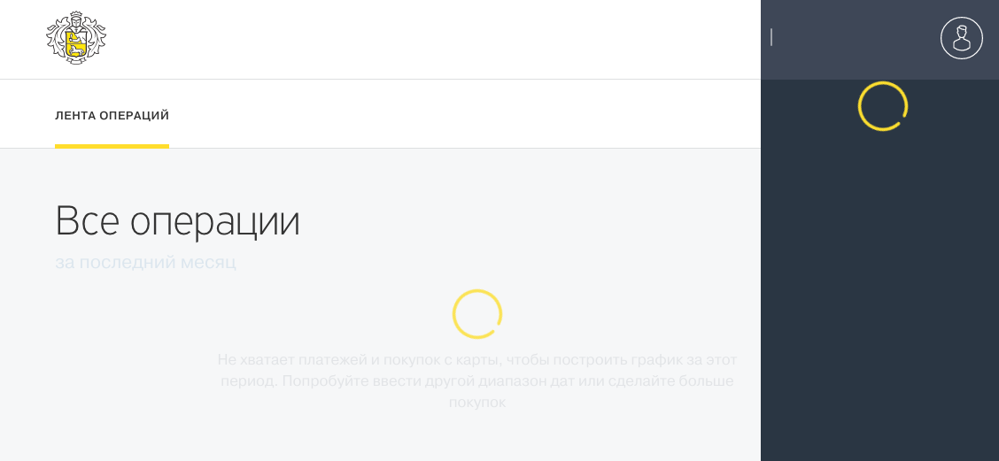
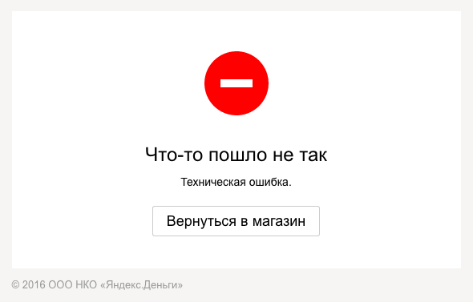

+++
date = 2017-04-04T12:42:27Z
description = "Такие, знаете, немодные и слегка неказистые, которых давно не касалась рука дизайнера и разработчика."
image = "/old-interface/cover.jpg"
slug = "old-interface"
tags = ["interface", "60-sec"]
title = "Люблю старые интерфейсы"
+++

Такие, знаете, немодные и слегка неказистые, которых давно не касалась рука дизайнера и разработчика.

К старому интерфейсу я привык. Пусть он не идеален, пусть заставляет выполнять лишние действия — зато я всё знаю, где и что лежит. Поэтому меня бесит Тинькофф: ребята как только закончат делать очередной интернет-банк, сразу начинают делать новый с нуля. Понимаю, lifetime learning и все дела, но я не готов каждый год осваивать ваш новый интерфейс.

<figure>
  
  <figcaption>Новый, глючный, тормозной интерфейс. Зато сделан на модном фронтенд-фреймворке.</figcaption>
</figure>

В старом интерфейсе проработаны сценарии использования. Пользователи достаточно капали на мозг дизайнеру, чтобы он протоптал в интерфейсе тропинки под их задачи. Пусть местами выглядит громоздко, зато могу добиться результата, не обращаясь в техподдержку. Хотите знать, что бывает с новыми модными интерфейсами, если они не поддерживают привычные сценарии — спросите у Яндекса с Кинопоиском.

В старом интерфейсе меньше багов. Большую часть давно починили, а новых не добавили, потому что дизайнер интерфейс не трогает. Да, мне может не хватать новых фич, но зато не придется через раз получать «что-то пошло не так». Слышите меня, Яндекс.Деньги?

<figure>
  
</figure>

    
Спасибо, очень помогли. 10% покупок вываливается в «техническую ошибку», зато выглядит стильненько.

Люблю старые интерфейсы.

<em>Заметка из телеграм-канала <i class="far fa-star color-sin"></i> «<a href="https://t.me/dangry">Интерфейсы без шелухи</a>»</em>

