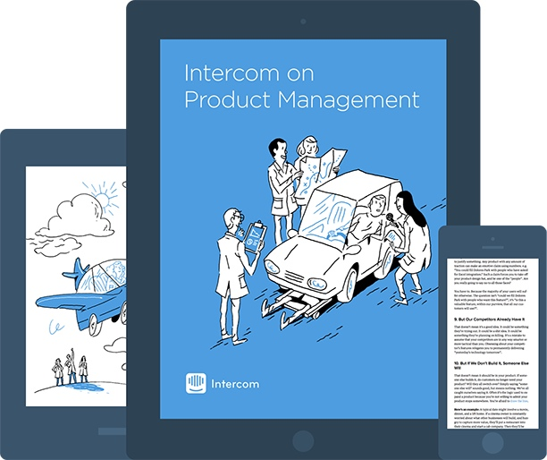

+++
date = 2017-01-18T10:20:00Z
description = "Если вы дизайнер, разработчик или тестировщик, рекомендую прочитать ровно одну книгу по продакт-менеджменту: Intercom on Product Management"
image = "/only-productology-book/cover.jpg"
slug = "only-productology-book"
tags = ["productology", "book", "60-sec"]
title = "Единственная книга о продакт-менеджменте"
subscribe = "dangry"
+++

Если вы дизайнер, разработчик или тестировщик, рекомендую прочитать ровно одну книгу по продакт-менеджменту. Она удивительно толковая, при этом небольшая и бесплатная: Intercom on Product Management.

Книга учит:

- как сказать новой фиче «нет» (самый важный навык для любого, кто разрабатывает софт),
- когда все-таки можно сказать ей «да»,
- как сделать так, чтобы фичей пользовались, а не сложили на полку,
- как улучшить существующие фичи,
- как составить роадмап.

Если вы начинающий продакт, тоже рекомендую.

Часто рекомендуют читать Inspired, Shipping Greatness или Hooked. Это всё хорошие книги для продактов. Но если хотите ровно одну книгу по продуктоводству — Intercom on Product Management.

ePub, Kindle, PDF. На английском. 65 страниц.

Раздают бесплатно, за емейл.

<a href="https://www.intercom.com/books/product-management">📖 Intercom on Product Management</a>

