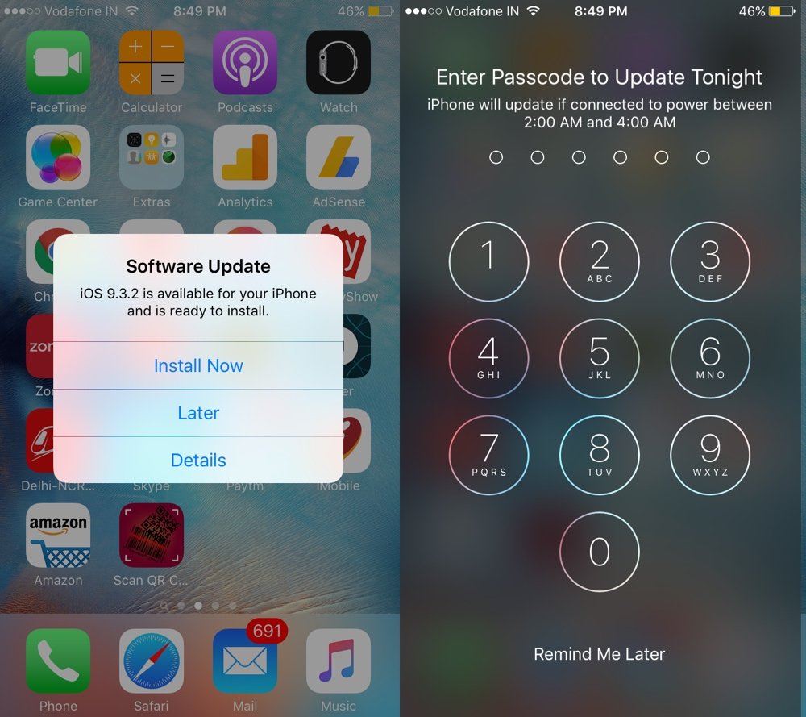
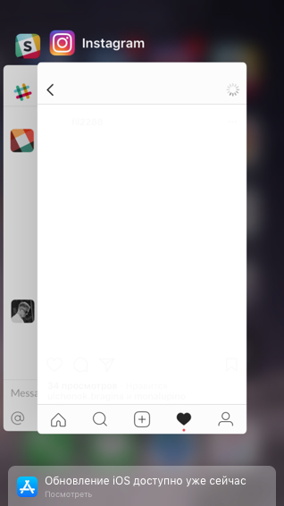
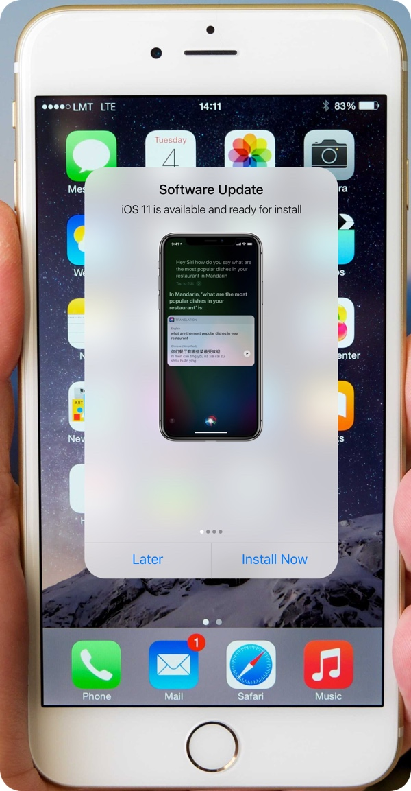

+++
date = 2017-10-19T07:05:03Z
description = "Как перевести пользователя на новую версию, не тыкая в лицо модальным окном."
image = "/os-update-puzzle/cover.jpg"
slug = "os-update-puzzle"
tags = ["puzzle", "interface"]
title = "Задачка: приглашение обновить ОС"
+++

Я предложил читателям телеграм-канала «<a href="https://t.me/dangry" class="nowrap">интерфейсов без шелухи</a>» такую задачку:

<h3>Приглашение обновить ОС</h3>

Сотрудники Apple любят хвастаться большим процентом пользователей, которые перешли на самую свежую версию ОС. Достигается этот большой процент модальным окном, которое выскакивает посреди экрана, блокируя работу с телефоном, и требует на выбор:

<ul>
  <li>Обнови меня немедленно.</li>
  <li>Обнови меня чуть позже.</li>
  <li>Насладись описанием новой версии.</li>
</ul>

<figure>
  
  <figcaption>Так выглядит приглашение обновить айось</figcaption>
</figure>

Как видите, варианта «пшла прочь» не предусмотрено. Если выбрать «позже», айось немедленно подсунет второе модальное окно (уже на весь экран), в котором потребует подтвердить твёрдое намерение обновиться ночью. Если и в этом окне выбрать неприметную надпись «напомнить позже», то айось вернётся на следующий день и начнёт всё с начала.

Поэтому выбор простой: или обновляйся, или получай каждый день по щщам модальным окном. Большинство выбирает обновление.

Предположим, вы занимаете высокий пост в Apple, и по странной случайности не хотите тыкать пользователю в лицо попапами в самой типа как удобной операционной системе на свете. Но при этом хотите сохранить высокие темпы перехода пользователей на новые версии.

Что делать?

### Не выносить человеку мозг

Большинство обновлений — минорные (версия 10.x.x). Особой пользы человеку они не добавляют. Следовательно, нет нужды тыкать модальными окошками. Новая версия ОС тихо скачивается в фоне, и автоматически планируется к обновлению следующей ночью.

Пользователю приходит пуш-уведомление:

> Сегодня ночью iOS обновится на версию 10.3.3. Новых фич нет, но исправили пачку ошибок.

По тыку на уведомление можно изменить расписание. Можно было бы и вариант «пропустить версию» добавить, но мы же в Apple работаем — понятно, что такой вариант не пройдёт ツ

Приятно, что этот вариант предложила треть ответивших.

### Выбрать подходящее время

Раз ось выбирает время обновления автоматически, есть риск, что она ошибётся. Что если человек по ночам тусит, а днём отсыпается и заряжает телефон?

Чтобы повысить вероятность угадать, не грех и пошпионить (айось всё равно это делает, кого мы обманываем). Пусть ОС собирает статистику по периодам «неактивности на подзарядке», и планирует обновление на соответствующий интервал.

Если ось не угадала — человек скорректирует время, не зря же ему уведомление приходит.

### Дать возможность откатиться

Если место позволяет, сделать резервную копию. На следующий день после обновления прислать радостное уведомление:

> iOS обновилась на версию 11. Если что-то не так, вернитесь на предыдущую версию до 22 октября.

Можно и по электронной почте инструкцию для экстренных ситуаций прислать, а то вдруг телефон после обновления неработоспособен.

Срок на откат — неделя, потом ось тихо удаляет бэкап.

### Чуть-чуть подтолкнуть

Если речь идёт о мажорной версии (10 → 11), или о серьёзной дыре в безопасности, хочется дополнительно простимулировать пользователя. Читатели прислали множество вариантов, как это сделать, не опускаясь до попапов:

<ul>
  <li>показывать в строке индикаторов иконку айоси;</li>
  <li>добавить новую заметную кнопку в центр управления;</li>
  <li>подсунуть баннер в список запущенных приложений;</li>
  <li>нудеть на экране блокировки;</li>
  <li>в особо любимых пользователем системных приложениях соблазнять классными фичами в новой версии ОС.</li>

</ul>

### Страна радужных пони: обновить незаметно

В идеальном мире всё было бы ещё проще. Ось бы обновлялась в фоне, не влияя на производительность телефона. Параллельно продолжала бы работать старая версия. В конце человек получил бы уведомление:

> Дружище, новая версия iOS готова к работе.

По тыку на уведомление через приятную глазу трёхсекундную анимацию старая версия морфировала бы в новую, и пользователь продолжал работать.

Увы, технически так не умеют.

### Плохая идея: улучшать попап

Вторая по популярности идея — оставить модальное окно, но добавить в него «пользы». Показывать там демо-ролики, или онбординговые картинки, или писать подробно о новых фичах.

Я думаю, это плохая идея. Главная проблема попапов — они прерывают нормальный процесс работы с устройством, вырывают из контекста и тем самым бесят. Путь «улучшения» модального окна тупиковый — злить человека оно не перестанет.

### Очень плохая идея: наказать за непослушание

Третья по популярности идея — наказать пользователя за то, что он не спешит обновиться:

- запретить обновлять приложения;
- запретить устанавливать новые приложения;
- заблокировать часть функций у уже установленных приложений;
- полностью заблокировать системные приложения.

Какое счастье, что эти люди не работают в команде Эпла. Хотя не исключаю, что к этому в итоге дело и придёт.

⌘ ⌘ ⌘

Спасибо всем участникам! Особенно хочу отметить [Матвея Правосудова](http://pravosudov.com/), Филиппа Ляха, Алексея Милеева и Мишу Березина.

Мы продолжим ツ

<em>Решайте задачки на канале <i class="fa fa-star-o color-sin"></i> «<a href="https://t.me/dangry">Интерфейсы без шелухи</a>»</em>

