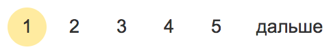
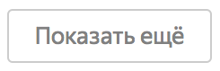

+++
date = 2017-09-27T14:48:37Z
description = "Три способа постраничной навигации по данным, и как их использовать."
featured = true
image = "/paging/cover.png"
slug = "paging"
tags = ["interface", "60-sec"]
title = "Пейджинг, ещёкалка и бесконечный скрол"
+++

_Три способа постраничной навигации по данным, и как их использовать._

Когда программа показывает пользователю много данных (товаров, клиентов, результатов поиска), загружать их все сразу бывает слишком накладно. Поэтому используют постраничную загрузку в одной из трёх разновидностей:

- _Пейджинг_. Разбить набор данных на страницы, присвоить каждой номер, показать номера пользователю. Пользователь может перейти к любой странице.

- _Ещёкалка_. Показывать следующую страницу по кнопке «загрузить ещё». Пользователь может перейти только к следующей странице; перейти к произвольной не получится.

- _Бесконечный скрол_. Автоматическая ещёкалка: следующая страница загружается не по кнопке, а по факту докручивания до конца предыдущей страницы.

«Контур.Гайды» отлично написали, как должен работать каждый вариант, чтобы человеку было удобно. Но остаётся вопрос — какой способ навигации выбрать. Мне нравится такое правило:

<blockquote class="big">
Всегда использовать бесконечный скрол, если умеешь его готовить.
</blockquote>

«Умеешь готовить» — значит:

- данные подгружаются быстро, человеку не придётся часто видеть индикатор загрузки;
- работает поиск (обязательно) и фильтрация (по вкусу);

И ещё:

- программа всегда грузит на одну страницу вперёд (некоторые люди наловчились очень быстро прокручивать вниз);
- программа запоминает текущую позицию списка;
- при возврате к списку на 100500 элементе программа не грузит всё с начала, а быстро загружает и показывает интервал (100500-N/2, 100500+N/2), где N — размер страницы.

В остальном «Контур.Гайды» всё сказали:

- [Пейджинг](https://guides.kontur.ru/components/paging/)
- [Ещёкалка](https://guides.kontur.ru/components/eschekalka/)
- [Бесконечный скрол](https://guides.kontur.ru/components/endlesscroll/)

<em>Заметка из телеграм-канала <i class="fa fa-star-o color-sin"></i> «<a href="https://t.me/dangry">Интерфейсы без шелухи</a>»</em>

