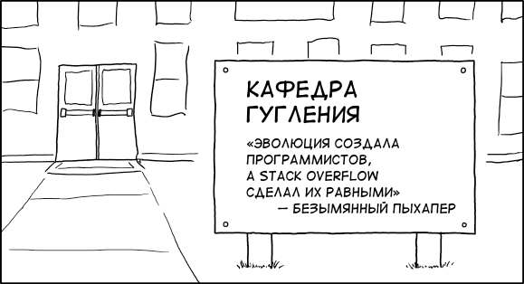

+++
date = 2017-02-10T15:47:40Z
description = "Использование Stack Overflow размягчает мозг. Чтобы привести его в форму, используйте правило 5 минут без интернета."
slug = "programming-without-internet"
tags = ["development"]
title = "Программирование без интернета"
+++

<figure>
  
  <figcaption><a href="https://xkcd.com/1758/">оригинал на xkcd</a></figcaption>
</figure>

Топ-3 повседневных вопросов программиста:

- как сделать Х,
- почему работает так, а не эдак,
- как назвать переменную.

С третьим вопросом всё понятно — он неразрешим в принципе. С первыми двумя интереснее.

Чтобы получить ответы, программисты девяностых читали исходники и руководства. Программисты двухтысячных начали активно гуглить. А затем в 2008 появился Stack Overflow, и стал «внешней памятью» для разработчиков. Теперь на 95% вопросов есть готовый ответ: первая ссылка из гугла на Стек.

## В чём проблема со Stack Overflow

Вроде бы это хорошо: не надо полдня разбираться в причинах. Скопировал решение, вставил, работаем дальше. Но плохо то, что внешние решения проходят мимо головы. Когда человек в следующий раз столкнется с той же проблемой, он снова полезет на Стек. И снова. И снова.

Чужое решение не запоминается. Нет стимула разбираться, как оно устроено. Нет чувства удовлетворения, когда «заработало!». Не образуются в мозгу новые нейронные связи. А без этого нет и запоминания.

Дальше хуже. Когда злоупотребляешь готовыми ответами, перестаешь воспринимать аналогии и косвенные решения. Ищешь, чтобы прямо один-в-один было то, что тебе нужно. В долгой перспективе это тупик.

Да и разработка с постоянной беготнёй из кода в гугл — это не программирование, а ерунда какая-то.

## Что с этим делать

Скачать документацию, чтобы была под рукой. Я рекомендую [devdocs.io](https://devdocs.io/) — на выбор 130 языков и фреймворков, бесплатно.

Скачать исходники бинарных библиотек, которые используются в проекте. Актуально для языков вроде Java и C#. Толковые IDE умеют делать это самостоятельно.

Использовать *правило пяти минут*. Столкнулся с проблемой — пять минут пытаешься решить её без интернета. Разрешается использовать исходники, документацию и собственный мозг.

Для одноразовых задач правило пяти минут не действует. Если вы веб-разработчик, и вдруг вынуждены разбираться с багой компиляции lxml на OracleLinux — не начинайте с 800-страничного руководства, просто загуглите текст ошибки.

Пять минут без интернета можно превратить в десять или пятнадцать. Григорий Бакунов из Яндекса вообще рекомендует блокировать доступ к Stack Overflow на 45 минут каждого часа. Как по мне, это уже перебор.

Ещё по теме:

- Лекция Григория Бакунова «[Можно ли программировать без интернета](https://www.youtube.com/embed/h10qZGq36DE?start=5&end=1228&autoplay=1)», 20 минут.
- Выпуск подкаста Developer Tea [Intentional Problem Solving](https://spec.fm/podcasts/developer-tea/15165), 15 минут.
