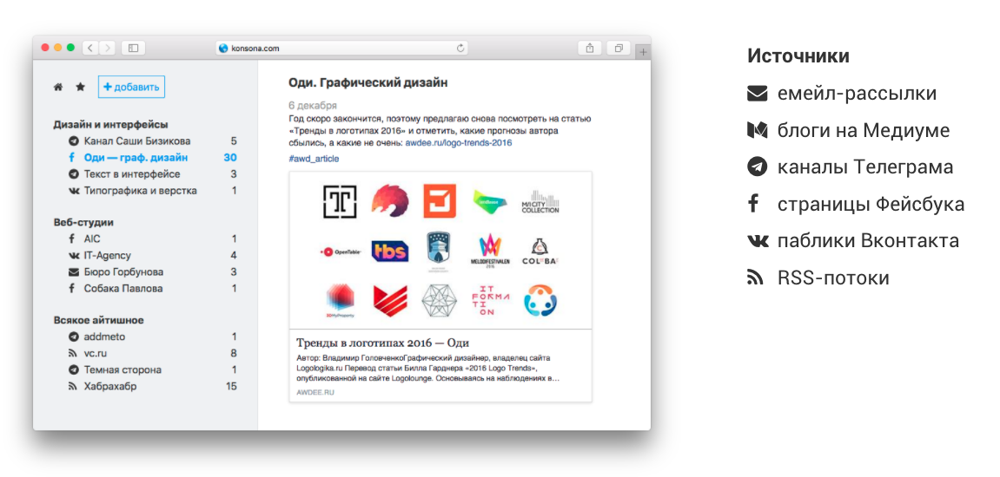

+++
date = 2017-11-08T06:44:27Z
description = "Как удобно читать блоги, рассылки, каналы в Телеграме, паблики в Фейсбуке и Вконтакте."
featured = true
image = "/rssify/cover.png"
slug = "rssify"
tags = ["life"]
title = "Жизнь через RSS"
+++

_Как удобно читать блоги, рассылки, каналы в Телеграме, паблики в Фейсбуке и Вконтакте._

Была у меня идея для стартапа на миллион: один инструмент для всех подписок. Я даже сделал промо-страницу для проверки спроса.

<figure>
  
  <figcaption>«Консона» берёт на себя все информационные подписки и показывает их в простом и удобном интерфейсе. Как RSS-ридер, только для любых источников.</figcaption>
</figure>

Спроса особого не обнаружилось, но лично для меня проблема актуальности не потеряла. И вот, наконец, удалось свести все информационные каналы в один. 

Делюсь рецептом, может и вам пригодится. Как читать всё что угодно через RSS:

- [Feedbin](https://feedbin.com/) для блогов. Или его бесплатный аналог — [Feedly](https://feedly.com/)
- Тот же Feedbin для [рассылок](https://feedbin.com/blog/2016/02/03/subscribe-to-email-newsletters-in-feedbin/)
- [Финт ушами](https://antonz.ru/medium-rss/) для Медиума.
- [Notifier](https://notifier.in/) Кирилла Мальцева для телеграм-каналов.

Не представляете, каким облегчением было отписаться от каналов в Телеграме и использовать его как мессенджер. Мечта ツ

