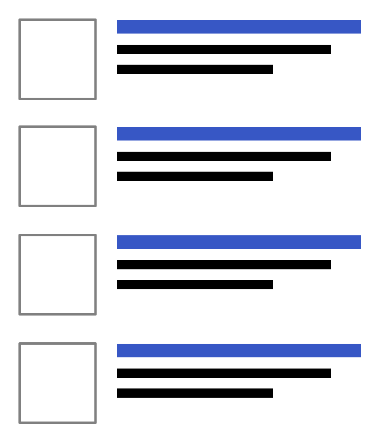
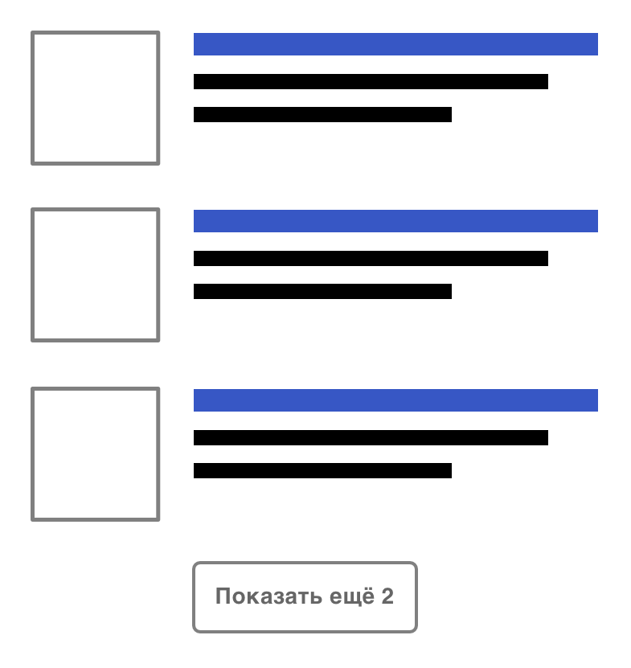

+++
date = 2017-10-24T09:04:47Z
description = "Подвох с решением «показать топ-N результатов» и кнопкой «показать все»."
featured = true
image = "/show-all/cover.png"
slug = "show-all"
tags = ["interface"]
title = "Приём «показать все»"
+++

Распространённый приём: когда есть неизвестное, но потенциально большое количество элементов (например, результатов поиска), показывать топ-N и кнопку «показать все».

  

Самый большой облом для пользователя: жмёшь на «показать все», и обнаруживаешь, что элементов всего и было N штук, то есть ничего нового ты не увидел.

Идеальный вариант — точно знать общее количество элементов, и сообщить пользователю. Но посчитать все элементы может быть вычислительно «дорого».

Есть алгоритм, который решает проблему. Я сначала покажу на примере, а потом напишу общее правило.

> Пусть есть виджет с результатами поиска, в котором показываем 3 наиболее релевантных результата и кнопку «показать все». При этом места на экране мало, в виджете можем уместить:
> - 3 результата + кнопку,
> - или 4 результата без кнопки.

Решение: вместо топ-3 попробуем запросить у сервера топ-6, и дальше:

1. Если нашлось 4 или меньше результатов, просто покажем их, без всяких кнопок:

  

2. Если нашлось 5 результатов, покажем топ-3 и кнопку с конкретным «остатком»:

  

3. Наконец, если нашлось 6 результатов (это значит, что их может быть и больше), покажем топ-3 и кнопку «показать все»:

  

⌘ ⌘ ⌘

Теперь общее правило:

1. Вместо `N` запрашивать `2N` элементов.
2. Если нашлось `X ≤ 1,5N` элементов — показать все без кнопки.
3. Если нашлось `1,5N < X < 2N` — показать `N` и кнопку с остатком.
4. Если нашлось ровно `2N` — показать `N` и кнопку «показать все».

P. S. Спасибо Саше Кириллову за замечания.

<em>Заметка из телеграм-канала <i class="fa fa-star-o color-sin"></i> «<a href="https://t.me/dangry">Интерфейсы без шелухи</a>»</em>

