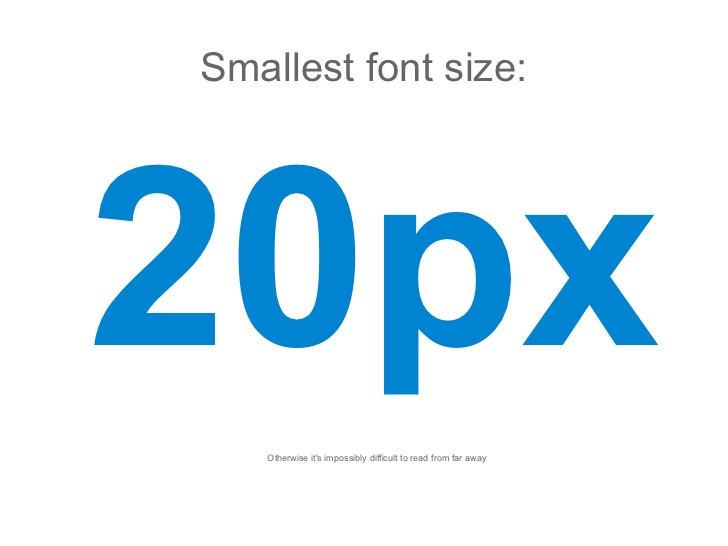

+++
date = 2017-02-02T16:04:00Z
description = "Люди любят делиться презентациями. А зря."
image = "/slides/cover.jpg"
slug = "slides"
tags = ["60-sec"]
title = "Тяжелая правда о презентациях"
subscribe = "dangry"
+++

Люди любят делиться презентациями. После каждой конференции организатор с трепетом выкладывает в соцсети пачку ПДФов, а люди не менее радостно репостят по всему фейсбуку и твитеру, и сохраняют в избранное. Я полагаю, что мотивация репостящего такая же, как с подборками «полезных ссылок» — человек думает, что презентация ему внезапно пригодится.

Тяжелая правда заключается в том, что презентация с конференции реально полезна только человеку, который слушал доклад. Потому что слайды дополняют выступление, сами по себе они — ничто. Поэтому мой вам совет:

1. Наплюйте на презентации.
2. Сходите на доклад вживую или посмотрите запись.
3. По результатам напишите конспект и поставьте задачи в туду-лист.
4. Если не попали на доклад, а записи нет — см. пункт 1.

Я знаю ровно одно исключение из правила: презентация «How to make Awesome Diagrams for your slides».

<figure>
  
  <figcaption>Один из советов — не мельчить</figcaption>
</figure>

Вот почему её стоит посмотреть:

1. Раскрывает тему, в которой «плавают» даже профессиональные дизайнеры — как рисовать схемы для презентаций. Люди постоянно забывают, что картинка проектора очень отличается от экранной. А тут все типичные ошибки разобраны и показано, как сделать хорошо.
2. Специально сделана не для выступления, а для чтения с экрана. Как статья, только с упором на визуальные образы.

О чём рассказывает автор:

- какие линии и стрелки использовать;
- как правильно показать иерархию и отношения между объектами;
- как показать вложенность на сложных схемах;
- сколько использовать цветов и каких;
- какой взять шрифт.

Автор сделал только одну ошибку — использовал SlideShare. Никогда его не берите, есть же прекрасный slides.com (к тому же, Росогород... ну вы в курсе).

<a href="http://www.slideshare.net/otikik/how-to-make-awesome-diagrams-for-your-slides">How to make Awesome Diagrams for your slides</a>

