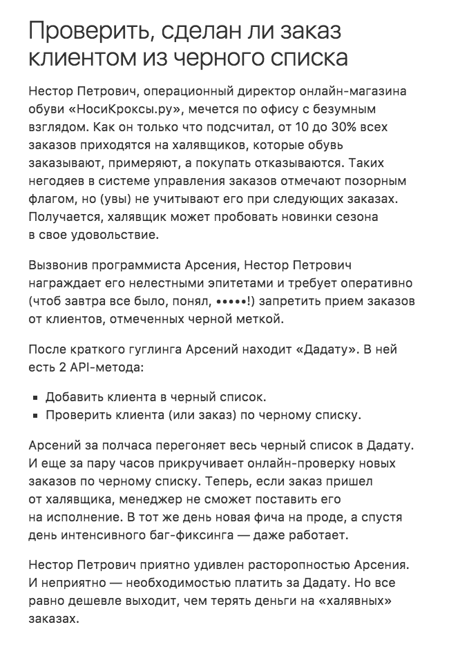

+++
date = 2017-11-23T11:33:28Z
description = "Люди не читают требования, хоть ты тресни. Единственный выход — писать их иначе."
image = "/specs/cover.jpg"
slug = "specs"
tags = ["productology", "dadata", "60-sec"]
title = "Никто не читает требования"
subscribe = "dangry"
+++

Раньше я писал требования по Коберну с Вигерсом. Действующие лица, основной сценарий, альтернативные, глоссарий, развесистая структура спецификации, вот это всё.

Отличные требования. Одна проблема с ними — никто не читает. Это странно, у нас же типа инженерная профессия, должны люди внимательно читать спецификации. Но вот не читают. Гады.

Потом мне как-то прислали такую же чужую спеку на ознакомление, я прочёл и понял, что не понял. И не хочу понимать (хотя пришлось себя заставить, да).

С тех пор стараюсь писать спецификации как статьи: с примерами из жизни, иллюстрациями, внутренней логикой повествования и кровавой развязкой (над последним ещё надо поработать).

<figure>
  
  <figcaption>Пример из требований к «<a href="https://dadata.ru/">Дадате</a>». Естественно, там дальше есть и кровавые подробности, как должно работать «под капотом». Но их тоже стараюсь излагать человеческим языком.</figcaption>
</figure>

Не могу сказать, что получается прямо увлекательно. Но определённо лучше, чем юзкейсы, юзер стори, джоб стори и «система должна». Хотя в комиксах было бы ещё лучше.
