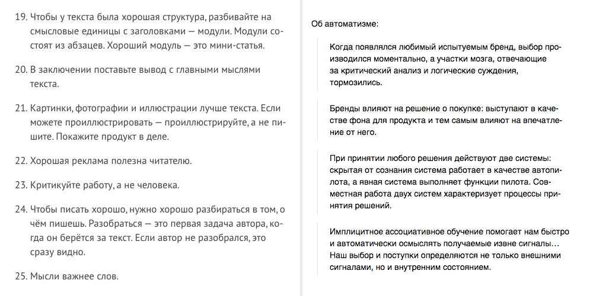
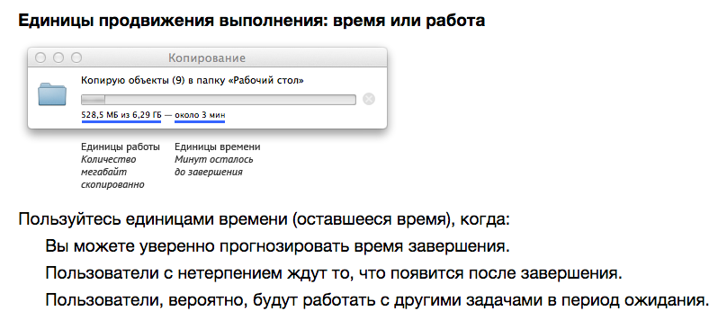

+++
date = 2017-01-30T11:44:57Z
description = "Есть куча способов сделать плохой конспект книги, и только один — хороший."
image = "/summary/cover.png"
slug = "summary"
tags = ["book", "writing"]
title = "Конспект курильщика"
+++

Есть куча способов сделать плохой конспект книги, и только один — хороший.

## Плохие способы

- *Выделить желтым &thinsp;ключевые фразы&thinsp;* и благополучно забить на них. Выделяя маркером слова, вы чувствуете, будто уловили самое важное. Этим польза и ограничивается: больше никогда в жизни вы к выделенному не вернётесь.
- *Надергать цитат*. Надежда здесь на то, что перечитывая цитаты, по ассоциации вспомните что-то дельное. Не вспомните.
- Написать длинный *список выводов без структуры и примеров*. Польза абстрактных идей околонулевая: если перечитывать их, придёте к выводу «ну да, и чего теперь».

<figure>
  
  <figcaption>Плохо: бесконечный список голых выводов или свалка из цитат.</figcaption>
</figure>

## Хороший способ

1. Записывайте выводы, но только те, что близки лично вам. Если с чем-то не согласны или не видите применения — в топку.
2. К каждому выводу добавляйте пример из жизни. Совсем хорошо, если не возьмете пример из книги, а по аналогии придумаете, как выглядела бы ситуация у вас.
3. Добавляйте осмысленные картинки.
4. Выделяйте разделы. Если считаете, что книга структурирована плохо (это часто бывает с американской бизнес-литературой) — придумайте свою структуру.
5. Поставьте в туду-лист задачи по записанному.

<figure>
  
  <figcaption>Хорошо: структура + выводы + примеры</figcaption>
</figure>

Последний пункт — *поставить задачи в туду-лист* — самый важный. Даже идеальный конспект бесполезен, если в результате вы ничего не сделаете.

Придумайте, как изменить жизнь к лучшему, опираясь на прочитанное, и сформулируйте конкретное следующее действие:

> Проверить, чтобы текст ошибок на форме заказа отвечал на вопросы «что случилось» и «что мне с этим делать».

> Показать макет страницы с тарифными планами Вике и Олегу и спросить, что им непонятно в описании тарифов.

> Установить на телефон приложение Seven и опробовать завтра с утра.

⌘&nbsp;⌘&nbsp;⌘

Конспект здорового человека:

<blockquote class="big">Книга → конспект с примерами → задачи в туду-листе</blockquote>

<em>Заметка из телеграм-канала <i class="far fa-star color-sin"></i> «<a href="https://t.me/dangry">Интерфейсы без шелухи</a>»</em>

