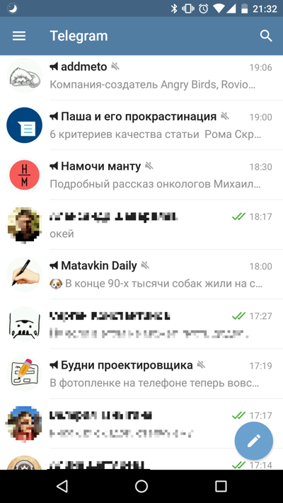
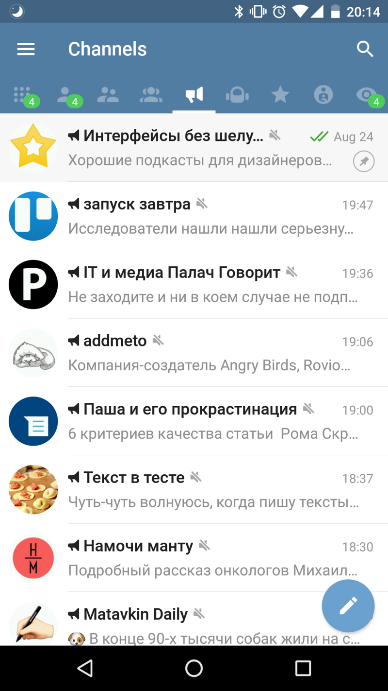
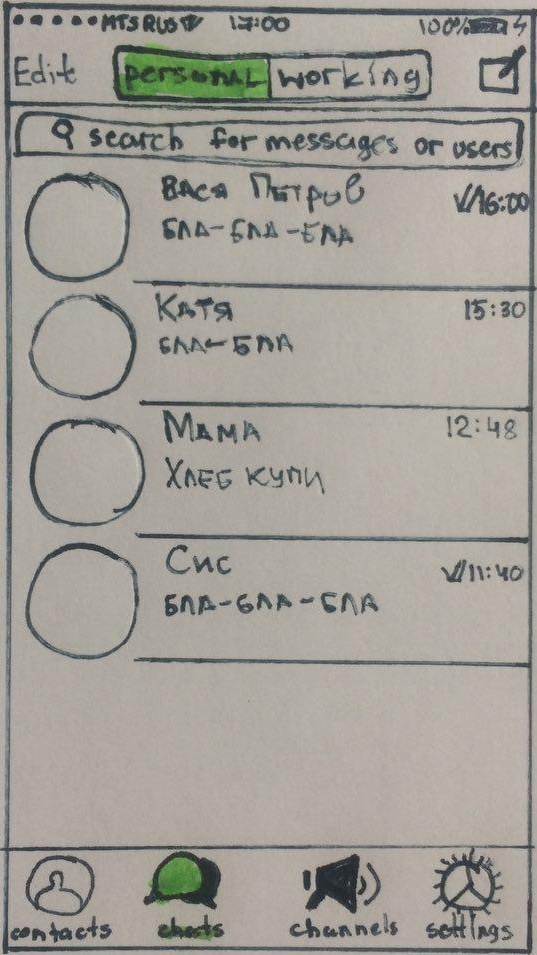
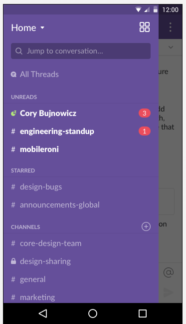

+++
date = 2017-09-06T07:02:05Z
description = "Как помочь Телеграму избавиться от месива каналов, групп и диалогов."
image = "/telegram-puzzle/cover.jpg"
slug = "telegram-puzzle"
tags = ["interface", "puzzle", "telegram"]
title = "Задачка: бардак в телеграме"
subscribe = "dangry"
+++

Я предложил читателям телеграм-канала «<a href="https://t.me/dangry" class="nowrap">интерфейсов без шелухи</a>» такую задачку:

<h3>Бардак в Телеграме</h3>

Утром вы просматривали любимые каналы, как телеграм вдруг зазвонил. Внезапно, это был Павел Дуров. Не знаю, что на него нашло, но он хочет предложить вам работу. Точнее, разовый проект.

Павел сказал, что гордится идеей каналов в телеграме. «Это как СМИ, только лучше», — сказал он. И продолжал:

<em>— Когда каналов становится много, работать с ними неудобно. Приходится массово мьютить, но это не спасает — всё равно засоряют список контактов и мешаются с чатами.</em>

<em>— Больше того, если рабочие чаты ведутся в телеграме — они мешаются с личной перепиской, и всё это превращается в неуправляемое месиво.</em>

Павел просит вас решить проблему бардака с чатами и каналами в интерфейсе. Дополнительно пожелание: придумать простое и изящное решение, без масштабных переделок. «Не хочу тратить на это много денег», — пояснил он.

Давайте поможем Павлу и сделаем телеграм лучше! Для простоты ограничимся клиентом для мобильных, веб и десктоп не трогаем.

Спасибо всем, кто прислал свои варианты! Давайте разберём решение. Сразу скажу, что единственно верного варианта тут не вижу. Решения упорядочил по степени вмешательства в интерфейс.

## Большой брат

«Пессимизировать» чаты и каналы, которые пользователь изо дня в день игнорирует. Сначала отключать для них оповещения, затем не поднимать в ленте, несмотря на наличие новых сообщений и, наконец, тихо удалять.

Анализировать активность человека в группах и диалогах в привязке к времени и месту, выявлять рабочую переписку. Глушить рабочие чаты в нерабочее время. В рабочее время глушить каналы.

Не обязательно делать это принудительно. Большой брат может ограничиться советами человеку:

- вот явно рабочие чаты — хочешь глушить их, когда находишься не в офисе и по выходным?
- вот унылые каналы, которые ты не читаешь — хочешь отписаться?
- в этой группе очень много флуда — хочешь заглушить её с 10 до 18?

Сомневаюсь, что Дурову понравилось бы такое решение — так и до Фейсбука с его «умной лентой» недалеко. Но зато отделяет важное от неважного, вообще не трогая интерфейс.

## «Избранное» и «непрочитанное»

<em>Избранное</em> 
Отдельная вкладка или пункт меню. Всё важное в избранное, остальное — в общую кучу. При желании хоть целый день можно провести в избранном, не отвлекаясь на флуд в каналах и группах.

<em>Непрочитанное</em> 
Отдельная вкладка или пункт меню. Спасает от проблемы «потеряшек», когда чат с непрочитанными сообщениями сполз далеко вниз из-за обилия более новых, но прочитанных.

Оба решения простые, отлично сочетаются друг с другом и прочими вариантами.

## Диалоги, группы и каналы

Сделать отдельные вкладки для каждой сущности: диалоги, группы, каналы, боты. Это уже реализовано в альтернативном клиенте Plus Messenger и неплохо работает:

Plus Messenger зачем-то разделяет группы и супергруппы (хотя это чисто техническое деление), но в остальном устроен весьма разумно. Количество непрочитанных показывает отдельно по каждой вкладке.

Заодно использует отдельные вкладки «избранное» и «непрочитанное».

## Личные и рабочие

Разновидность «избранного»: отделяем не важное от второстепенного, а рабочее от личного. Соня Яковчук нарисовала скетч для айфона:

Как видите, разделение на личные и рабочие прекрасно сочетается с делением на чаты и каналы.

А Никита Лаптев предложил вместо переключения по вкладкам сделать отдельные экраны и переходить туда-сюда свайпами влево-вправо.

При переключении на «личные» можно автоматически отключать оповещения от «рабочих», и наоборот. Или оставить это на усмотрение человека — главное, чтобы можно было заглушить раздел целиком.

## Категории или теги

Отмечать чаты произвольными тегами: друзья, родственники, работа, секретный проект, новости, интерфейсы, всё что душе угодно. А дальше переключаться между ними или мьютить прямо группами.

Это Slack, но возьмите любой почтовый клиент или RSS-ридер, и увидите такую же логику: папки, категории, теги.

Самый популярный вариант — его предложили 40% участников.

## Приятные мелочи

Читатели прислали несколько механик, которые хоть и не относятся напрямую к задаче, пригодились бы в телеграме:

> _Денис Токарев_
> Отмечать чат прочитанным по свайпу вправо.

Удобно, если я просто хочу убрать кучу непрочитанных с глаз долой, не заходя в переписку.

> _Анонимус_
> Каналы должны быть по умолчанию замьючены

Полностью поддерживаю. Добросовестные авторы каналов и так публикуют в режиме Silent Broadcast, а недобросовестных надо к этому принуждать. Больше того, я бы и группы по умолчанию глушил (у меня все группы вручную замьючены — ни разу об этом не пожалел).

> _Анонимус_
> Это мессенджер, и главное — переписка, люди, общение. Поэтому: собеседники всегда в топе, а каналы и чаты — всегда ниже переписок с людьми.

Согласен, если речь идёт только о непрочитанных. Я бы даже более строгий порядок ввёл: диалоги > группы > каналы.

⌘ ⌘ ⌘

Было ещё несколько решений, но там такие космолёты, что я не готов всерьёз их обсуждать.

Ещё раз спасибо всем участникам! Мы продолжим ツ
