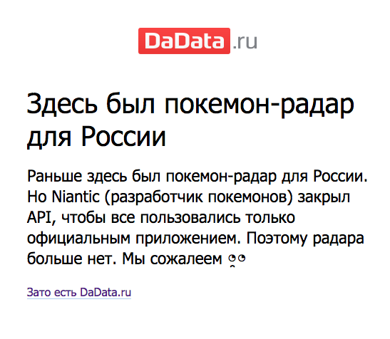

+++
date = 2017-07-26T12:41:03Z
description = "URL — часть интерфейса. Поэтому он должен быть хорош."
featured = true
image = "/url-as-interface/cover.png"
slug = "url-as-interface"
tags = ["interface", "development"]
title = "Урл как интерфейс"
+++

Для меня урл (URL) на сайте или в веб-приложении — часть интерфейса. Поэтому он должен быть хорош.

Понимаю, что нормальные люди не задумываются об урлах, а в идеале вовсе не знают, что это такое. Но я гик, поэтому хочу красивые и информативные адреса. Если у вас так же — оставайтесь, поговорим о плохих и хороших урлах.

## Плохие урлы

Начнём с характеристик плохого урла.

### Урл не зависит от состояния

Пусть есть список клиентов с адресом */customers*. Если при поиске, фильтрации и переходе по страницам списка адрес не меняется — это плохой урл. Такой не сохранишь в закладках и не пришлёшь коллеге.

Лучше, если урл отражает состояние списка:

```
/customers?channel=facebook&sort-by=ltv&page=3
```

### Урл шифрует состояние

Допустим, программист осознал проблему с урлом из предыдущего примера, и добавил в него состояние:

```
/customers?state=eyAiZmlsdGVyIjogeyAiY2hhbm5lbCI6ICJmYWNlYm9vayIsICJuYW1lIjogbnVsbCwgInBob25lIjogbnVsbCwgImVtYWlsIjogbnVsbCB9LCAic29ydC1ieSI6IHsgImZpZWxkIjogImx0diIsICJkaXJlY3Rpb24iOiAiYXNjIiB9LCAicGFnZSI6IDMgfQ==
```

Это всё равно плохой адрес. Во-первых, он уродлив. Во-вторых, непонятно, что в нём зашифровано — вдруг там мой пароль, а я поделюсь ссылкой?

### В урле мусор

Вот адрес поискового запроса в Гугле:

```
https://www.google.ru/search?newwindow=1&site=&source=hp&q=who+am+i&oq=who+am+i&gs_l=psy-ab.3..0l4.563.2744.0.2962.8.8.0.0.0.0.73.547.8.8.0....0...1.1.64.psy-ab..0.8.546...0i131k1._To1c908Z2U
```

Большая часть в нём — мусор:

```
newwindow=1&site=&source=hp&oq=who+am+i&gs_l=psy-ab.3..0l4.563.2744.0.2962.8.8.0.0.0.0.73.547.8.8.0....0...1.1.64.psy-ab..0.8.546...0i131k1._To1c908Z2U
```

Лучше убрать служебные параметры, бесполезные для человека, и оставить только то, что по делу:

```
https://www.google.com/search?q=who+am+i
```

### Урл содержит кириллицу

Добавил этот пункт ради Медиума, который делает такие ссылки, если вовремя не словить его за хвост:

```
https://medium.com/russian/%D0%BE-%D1%86%D0%B5%D0%BB%D1%8F%D1%85-%D0%BF%D1%80%D0%BE%D0%B5%D0%BA%D1%82%D0%B0-%D0%B8-%D0%B4%D1%80%D1%83%D0%B3%D0%B8%D1%85-%D1%80%D0%B8%D1%82%D0%BE%D1%80%D0%B8%D1%87%D0%B5%D1%81%D0%BA%D0%B8%D1%85-%D0%B2%D0%BE%D0%BF%D1%80%D0%BE%D1%81%D0%B0%D1%85-c6c1aa6c32
```

Задумка хорошая: включить заголовок статьи в урл и повысить информативность. А получился мусор. Решить проблему несложно — автоматически транслитерировать кириллицу, которая идёт в адрес:

```
https://medium.com/russian/o-celyah-proekta-i-drugih-ritoricheskih-voprosah-c6c1aa6c32
```

### Урл спрятан за сокращателем ссылок

Сокращатели превращают нормальные ссылки:

```
https://explainshell.com/?utm_source=twitter.com&utm_medium=social
https://dangry.ru/sona/interface/
https://antonz.ru/choice/
```

в такие:

```
https://amp.gs/mgYs
https://goo.gl/QspV62
https://t.co/JCZGu9SelO
```

Тут плохо всё. Потерялись не только параметры, но и сам сайт. Теперь я совсем не понимаю, куда заведёт ссылка.

Конечно, я знаю, зачем нужны сокращатели. Маркетологи прячут за ними utm-метки — параметры, которые говорят владельцу сайта, откуда пришёл посетитель. Я даже понимаю, почему нужны эти метки — соцсети не сообщают источник перехода (это большое зло и тема для отдельной статьи).

Но для меня как для пользователя сети — сокращатели чистейшее зло.

## Хорошие урлы

Перейдём к хорошему.

### Урл однозначно идентифицирует конкретный объект

Для магазина значимые объекты — товары, для журнала — статьи и комментарии, для системы контроля версий — каждая строка кода:

```
https://market.yandex.ru/product/8478688
https://habrahabr.ru/company/hflabs/blog/267997/#comment_8598021
https://github.com/hflabs/suggestions-jquery/blob/master/less/suggestions.less#L40
```

Хороший урл ведёт прямо на идентифицируемый объект, без промежуточных страниц и попапов.

### Урл информативный

По хорошему урлу примерно понятно, о чём он. Например, клиенты с единственным заказом за последний год:

```
/customers?order-count=1&order-date=last-year
```

Урл может быть уникальным и при этом информативным:

```
https://wpdev.uservoice.com/forums/257854-universal-windows-platform/suggestions/6509607-stop-internet-explorer-development

https://www.citilink.ru/catalog/mobile/cell_phones/393683/
```

Ссылка должна оставаться рабочей, даже если объект переместят в другую категорию или раздел сайта. Пока в урле есть идентификатор, этого достаточно.

Более того, «текстовую» часть можно убрать, а адрес продолжит работать:

```
https://wpdev.uservoice.com/forums/257854/suggestions/6509607

https://www.citilink.ru/catalog/393683/
```

Такой подход хорошо показал себя на форумах, в блогах и каталогах.

### Урл читается как обычное предложение

Это высший пилотаж:

```
http://yasobe.ru/na/obed
```

Так редко получается, но если видите возможность — не упустите.

<div class="boxed">
<h3>Красота и иерархичность</h3>
<p>Важно, чтобы адрес оставался иерархичным: каждый кусочек от слэша до слэша не просто «создаёт красоту», а имеет самостоятельный смысл:</p>

<ul>
  <li><em>/na/obed</em> — конкретный сбор;</li>
  <li><em>/na/</em> — список всех сборов (а Яндекс отдаёт 404, ататат);</li>
  <li><em>/</em> — главная страница.</li>
</ul>

<p>Каждый слэш создаёт уровень иерархии. Если убирать уровни один за одним справа налево, ссылка каждый раз должна отдавать что-то логичное, пока не дойдём до главной страницы.</p>

<p>Не пренебрегайте иерархией ради красоты. Но если получается сделать иерархичный адрес красивым — отлично.</p>
</div>

### Урл живёт вечно

Сайты меняются, сливаются в один и разбиваются на несколько. Урлы страниц при этом изменяются, и это нормально. Главное — оставлять со старых адресов редирект на новые:

```
weather.yandex.ru → yandex.ru/pogoda
designpreppy.ru/interface.html → dangry.ru/sona/interface/
antonz.ru/2016/04/12/laws/ → antonz.ru/laws/
```

Единожды опубликованный урл должен жить вечно. Даже если страница по ссылке удалена, на её месте оставляют заглушку с пояснением:

<figure>
  
  <figcaption>RIP, <a href="http://dadata.ru/pokemon">покемон-радар</a></figcaption>
</figure>

<p class="align-center">⌘ ⌘ ⌘</p>

Делать хорошие урлы нелегко, а оценит их мало кто. Но если у вас получится — знайте, я вами горжусь ツ

Спасибо коллегам:

- [Ване Акулову](https://iamakulov.com), который вдохновил меня написать эту заметку, прислав ссылку на статью Скотта Хансельмана [URLs are UI](https://www.hanselman.com/blog/URLsAreUI.aspx).
- [Павлу Дорофееву](https://www.facebook.com/dorofeev.pavel22), который обратил внимание на устойчивость урлов к изменению текстовой части.
- [Никите Прокопову](http://tonsky.me), который поднял проблему красоты и иерархичности урлов.
- Андрею Лёзову, который напомнил о редиректах.


<div class="row">
<div class="col-xs-12 col-sm-10 col-md-8"><p><em>Больше таких статей — на канале <span class="nowrap"><i class="far fa-star color-sin"></i> «<a href="tg://resolve?domain=dangry">Интерфейсы без шелухи</a>»</span></em></p></div>
</div>

