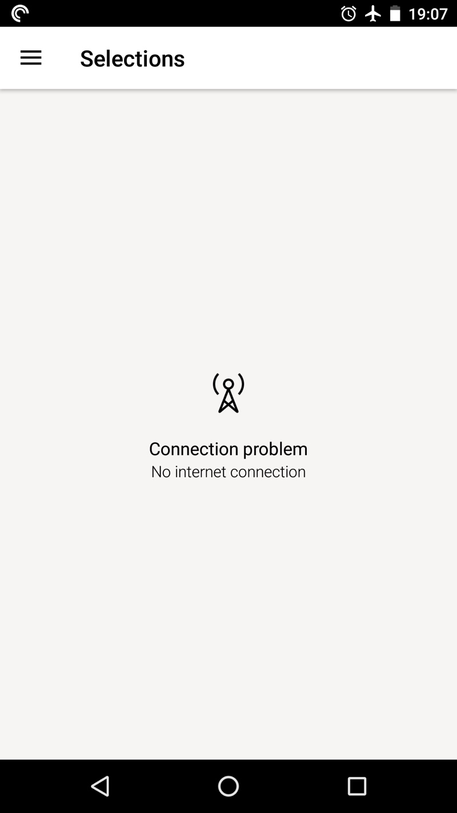
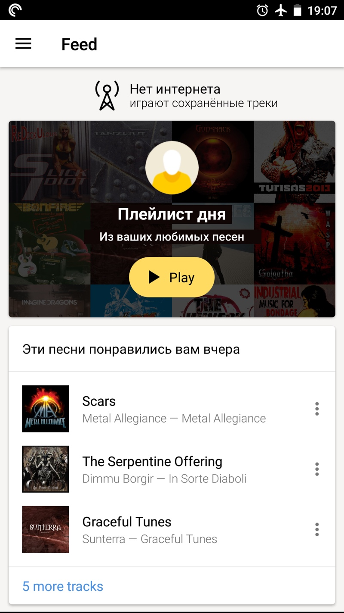

+++
date = 2017-08-07T11:57:22Z
description = "Как сервису стриминга музыки действовать при медленном интернете."
image = "/yandex-music-puzzle/cover.jpg"
slug = "yandex-music-puzzle"
tags = ["interface", "puzzle"]
title = "Задачка: Яндекс-музыка и медленный интернет"
subscribe = "dangry"
+++

На днях я предложил читателям телеграм-канала «<a href="https://t.me/dangry" class="nowrap">интерфейсов без шелухи</a>» такую задачку:

<div class="boxed">
<h3>Яндекс-музыка и медленный интернет</h3>
<div class="row">
<div class="col-xs-12 col-sm-8">
<p>Мобильное приложение Яндекс-музыки пребывает в иллюзии, что всегда и везде есть хороший интернет. Когда запускаешь приложение, оно хочет показать персональные рекомендации («плейлист дня»). Если связь плохая, или телефон подключился к вайфай-сети без интернета, то приложение долго тупит, после чего сообщает, что «не смогла».</p>
<p>Давайте поможем Яндекс-музыке и предложим, что делать при запуске приложения, если интернет медленный или его вовсе нет. Чем больше при этом пользы для человека — тем лучше ツ</p>
</div>
<div class="col-xs-12 col-sm-4 col-md-offset-1 col-md-3">

</div>
</div>
</div>

Спасибо всем, кто прислал свои варианты! Давайте разберём решение.

## Запоминать прошлое состояние

Главный провал приложения вне зависимости от наличия интернета — оно каждый раз начинает жизнь с чистого листа и пытается открыть «плейлист дня». При этом закончить сеанс человек мог на конкретной песне, исполнителе или в сохранённых треках — Яндекс-музыке плевать. Она всегда открывает рекомендации.

На проблему обратил внимание [Матвей Правосудов](http://pravosudov.com), и я полностью разделяю его боль:

> Не понимаю, почему Я.Музыка, когда у меня есть интернет, все равно переключает на рекомендации, хотя я использую только свои треки.

Это как если бы приложение «часы» при запуске всегда предлагало установить часовой пояс. Очень удобно.

Правильный вариант — начинать оттуда, где закончили в предыдущий раз. Это настолько базовый сценарий, что удивительно, как ребята из Яндекса его проморгали.

## Не теряться, когда нет интернета

Когда нет интернета, «Музыка» сообщает «нет соединения». Мужчина, вы что, не видите — у нас обед.

Формально всё правильно, интернета нет. Но неужели это всё, что можно предложить пользователю?

Вместо бесполезного «нет соединения» можно:

- Сохранять 20 прослушанных вчера треков, и предлагать послушать ещё раз, в первую очередь — понравившиеся.
- Если у человека много сохранённых треков — построить плейлист дня по ним.

Конечно, сообщение об отсутствии связи останется. Но займёт более скромное место:

<div class="row">
<div class="col-xs-12 col-sm-6">
<figure>
  
  <figcaption>Было: у нас обед</figcaption>
</figure>
</div>
<div class="col-xs-12 col-sm-6">
<figure>
  
  <figcaption>Стало: интернета нет, но это ничего</figcaption>
</figure>
</div>
</div>

[Андрей Чирков](https://t.me/achirkof) предлагает, что делать, если сохранённых треков совсем нет:

> Если и локальных плейлистов нет, то показать какую-нибудь забавную картинку потерявшегося интернета и дать совет на будущее сохранять любимые плейлисты локально.

## Медленный интернет = нет интернета

Медленная связь вводит «Музыку» в ступор. Она бесконечно крутит индикатором загрузки, надеясь что-то получить от сервера. Такая же беда, если телефон подключился к вайфай-сети без интернета.

Это бесполезно. Понятно ведь, что для стриминга музыки есть минимальные требования к каналу. Значит, можно сформулировать правило:

```
ЕСЛИ за X времени не удалось скачать Y Кб данных
ТО   интернета нет
```

А раз нет интернета, вести себя, как описано в предыдущем разделе — предлагать сохранённые треки.

## Снизить качество, но продолжать работать

Допустим, пропускной способности канала хватает, чтобы обмениваться данными с сервером. Но стриминг в высоком качестве не тянет.

[Владимир Бирюков](https://vk.com/wow1k) предлагает:

> Подгружать треки в урезанном качестве, сообщив об этом пользователю. Лучше пусть что-то играет, чем совсем ничего.

Логично.
