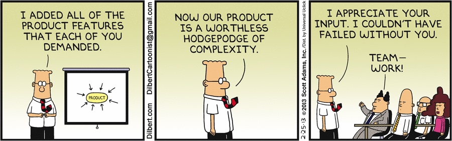

+++
date = 2018-07-30T17:44:01Z
description = "Только потому, что вы их начали."
image = "/abandoned-features/cover.png"
slug = "abandoned-features"
tags = ["productology"]
title = "Не надо заканчивать фичи"
+++

Вредный совет продакту: «Надо заканчивать фичи». Вредный совет вообще: «Надо заканчивать то, что начал».

- Я не заканчиваю читать начатую книгу, если понимаю, что она пустая.
- Я не заканчиваю и не публикую текст, если получилась фигня.
- Я не заканчиваю тренировку, если чувствую себя плохо.

И вам не советую.

<figure>
  
  <figcaption>Говорить «нет» стоит как новым, так и начатым фичам // <a href="http://dilbert.com/strip/2013-02-25">Dilbert</a></figcaption>
</figure>

В применении к фичам:

**Что значит не заканчивать фичу?** Это значит, прекратить её улучшать, если видишь, что отдача (деньги, транзакции — любые попугаи, в которых меряете) меньше, чем затраты (деньги, человеко-часы, душевные силы).

Лучше вообще выпилить такую фичу из продукта, чем убиваться с доработкой или бесконечно тащить её с собой, теряя деньги на сопровождение и тестирование.

**Почему важно не заканчивать фичи?** Потому что время команды ограничено, а потенциальные фичи — нет. И лучше тратить ресурсы на фичи с хорошим соотношением «отдача/затраты», чем заканчивать плохие только потому, что когда-то начал их делать.

**Что происходит с продуктом, в котором все фичи заканчивают?** Он развивается мучительно медленно, а пользователи недоумевают, какого чёрта в продукт запихали все эти никому не нужные возможности.

Фичи надо заканчивать. Но только если игра стоит свеч.

*P.S. Это ответ на заметку «[Надо заканчивать фичи](https://medium.com/@mdubakov/157278331672)» Михаила Дубакова, основателя Targetprocess*

<em>И подписывайтесь на <i class="far fa-star color-sin"></i> «<a href="tg://resolve?domain=dangry">Интерфейсы без шелухи</a>»</em>

